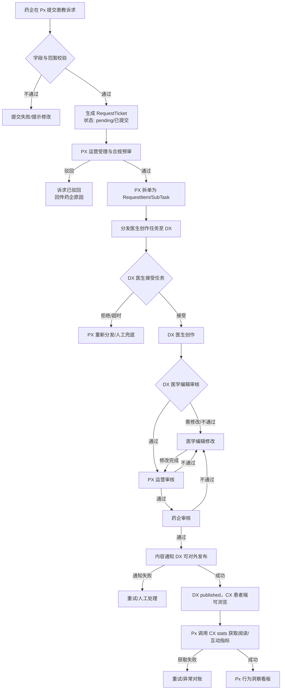
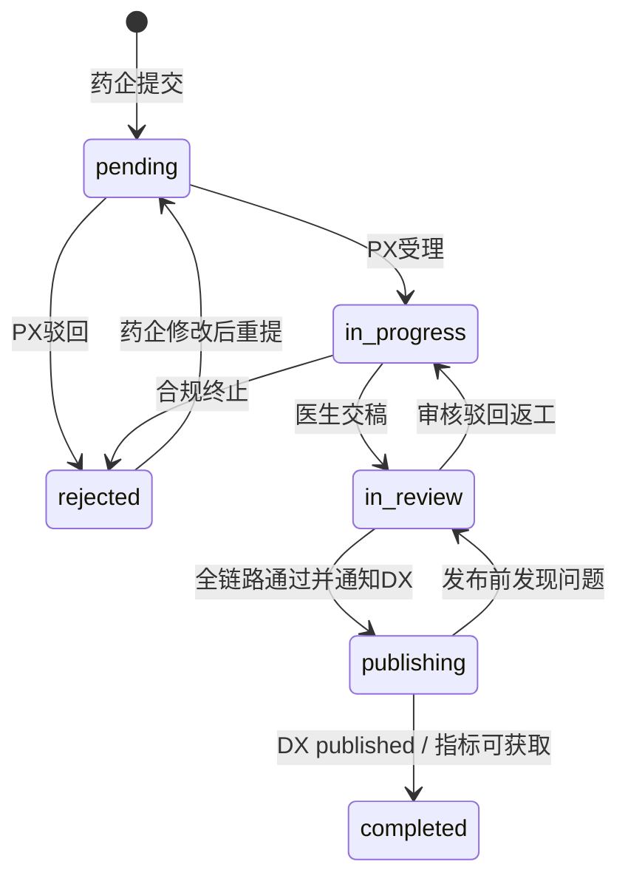
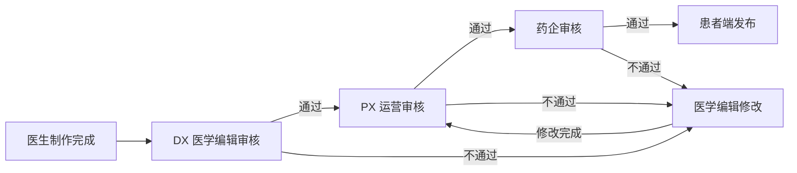

# Px Lite 业务确认版 PRD

> 文档版本：v0.1（业务确认版）  
> 更新日期：2026-05-19  
> 适用对象：药企业务方、PX 运营方、DX/CX 对接方、项目管理与验收人员  
> 文档性质：**业务范围与流程确认文档**，不是研发技术概要。本文会把资料冲突按标签标明，供业务方逐项确认。

---

## 0. 文档说明

### 0.1 文档目标

| 目标 | 说明 | 确认方式 |
|---|---|---|
| 明确三端闭环 | 明确 Px / Dx / Cx 在患教内容生产、审核、DX 对外发布通知、CX 指标获取中的职责边界 | 业务方确认流程图与状态机 |
| 明确 Lite 范围 | 基于 P0 与 Lite 约束，界定本期做什么、不做什么 | 业务方确认本期范围与不在范围 |
| 反推原型需求 | 结合前端原型源码反推页面、按钮、表单、状态、权限、mock 数据口径 | 业务方确认原型参考是否纳入本期 |
| 暴露资料冲突 | 对 P0/P1/P2/P3 中不一致内容明确标注，不把冲突混入“已确认” | 业务方逐条回复待确认问题 |
| 支撑验收 | 输出业务流程、数据、合规、跨端对接的验收标准 | QA/业务 UAT 按表验收 |

### 0.2 资料优先级

| 优先级 | 资料 | 本文处理规则 |
|---|---|---|
| P0 | `requirements/doc_E9ved9FXwod3B0xauGQcsMCRn9g.md` | **最高优先级**。决定 Px / Dx / Cx 三端核心闭环、DX 功能/数据诉求、CX 功能/数据诉求。 |
| P0.5 | `requirements/doc_DaOndYwFao5ljbxms5McLXhEnhf.md` | **首期 Lite 页面功能范围冻结依据**。该文档由 Manus 基于 `px-lite-main` 原型导出，用于确定本期 Px SaaS 最先落地的 Lite 菜单、页面和权限边界；若与 P0 核心三端闭环或业务补充逻辑冲突，以 P0/业务补充为准。 |
| P0.6 | `requirements/doc_MwPddmxEtohzpuxaTmtcjTe3nvf.md` | **原型字段口径参考**。该文档基于原型代码导出，用于收敛枚举、实体关系和页面读写字段；若字段口径与业务闭环冲突，以 P0/P0.5/业务补充为准，并在本文标明“原型字段参考”。 |
| P1 | `requirements/px-lite-main` 前端原型源码 | 用于反向提炼业务页面、按钮、表单、状态、权限、mock 数据、审批/分发逻辑。若与 P0 冲突，以 P0 为准。 |
| P2 | `requirements/px-lite-main/docs/px_lite_scope.md` | 作为 Lite 版边界约束。若与 P0 冲突，以 P0 为准；若与当前源码不一致，标为“待业务确认”。 |
| P3 | `requirements/px-lite-main/docs/*` 其他文档 | 仅补充参考。若超出 Lite 或与 P0/P2 冲突，标为“后续版本 / 待确认 / 不在范围”。 |

### 0.3 冲突处理规则

| 冲突类型 | 处理规则 | 示例 |
|---|---|---|
| P0 与其他资料冲突 | 以 P0 为准 | P0 明确 CX 只承载长图文/海报/手册 3 种形式，则短视频/语音仅作后续版本。 |
| P1 当前源码与 P2 Lite 清单冲突 | 标注“原型参考 / 待业务确认”，不默认纳入 | P2 有“设置”，当前源码无 `/settings` 路由，仅 AppShell 底部有账号/团队 Toast。 |
| P1 当前源码与 P3 文档冲突 | 以当前源码为“原型参考”，P3 仅补充 | 总览源码已移除趋势/行为流，但 P2 仍提到趋势/热门内容。 |
| 原型已实现但超首期边界 | 标为“原型参考 / 后续版本 / 不在范围” | 财务管理、患者列表、独立 AIGC、字段级权限。平台管理已被 Manus 首期 PRD 收敛为本期最小能力。 |
| 业务必需但原型缺失 | 标为“本期确认（需补原型）/ 待业务确认” | DX 医生端创作与医学编辑审核是 P0 必需，但当前仓库仅 Px 原型。 |
| Manus 极简页面 PRD 与本地业务补充冲突 | 以本地业务补充为准，Manus 仅冻结页面范围 | Manus 写到审批弹窗可“打回指定节点”，本期按业务补充统一打回“医学编辑修改”。 |
| 字段口径文档与业务流程冲突 | 满足业务流程优先，字段口径作为工程命名和兼容参考 | 字段文档保留 `Project.ticketId` 首条诉求冗余字段，但首期关系真值为 `Project 1:N RequestTicket`。 |

### 0.4 标签说明

| 标签 | 含义 | 是否进入本期需求 |
|---|---|---|
| **本期确认** | 根据 P0 或本 PRD 建议，应纳入本期 Px Lite 业务闭环 | 默认纳入，待业务签字确认 |
| **原型参考** | 当前前端 Demo 已出现或 mock 已具备，但业务范围需确认 | 不自动纳入，需结合 Lite 边界判断 |
| **待业务确认** | 资料冲突、范围不清或影响排期/合规，需要业务明确 | 未确认前不作为研发承诺 |
| **后续版本** | 有价值但超出本期 Lite 闭环 | 不进入本期验收 |
| **不在范围** | 本期明确不做，避免误解 | 不进入本期研发与验收 |

### 0.5 本次业务补充口径（2026-05-15）

| 模块 | 补充口径 | 文档落点 |
|---|---|---|
| 分发策略 | 指定分发是在职称命中的候选池中勾选医生，并为每位医生填写本人负责篇数 | 第 7、21、22 章 |
| 分发策略 | 策略分发的互动分 = 医生历史内容点赞数 + 收藏数；候选池按互动分 desc 排序后平均派发剩余篇数，余数优先给互动分更高医生；已指定医生不再参与策略分发 | 第 7、22 章 |
| 主题/形式分配 | 本期分发时不支持手动选择“本批分发哪些主题/形式”；只选择分发篇数，系统从诉求剩余主题×形式池随机抽取 | 第 6、7、21、22 章 |
| 任务颗粒度 | 一篇文章 = 一个医生任务；任务包含医生 ID、主题、形式、病种、药品（如有） | 第 7、11、22 章 |
| 审核流程 | 医生制作完成后按“医学编辑审核 → 医学编辑修改（如需） → PX 运营审核 → 药企审核 → Px 通知 DX 可对外发布”流转；所有节点审核不通过均打回至医学编辑修改，修改完成后继续流转 | 第 8、14、21、23 章 |
| 内部识别 | 租户是药企入驻初始能力；PX 新建项目必须关联租户；药企新建诉求必须关联已有项目；策略分发按诉求维度执行；支持多次少量分发 | 第 2、6、22 章 |

### 0.6 最新三端协同修订口径（本次确认）

| 模块 | 最新确认口径 | 影响范围 |
|---|---|---|
| 内容权威源 | DX 持有患教内容正文、素材、版本、医生署名与对外发布状态。 | 所有内容详情、审批预览、CX 展示。 |
| Px 审批完成动作 | PX 运营审核与药企审核均通过后，Px **只向 DX 发送“患教内容已审批通过，可以对外发布”消息**。 | 替代旧“Px 同步/推送 CX 发布计划”口径。 |
| Cx 内容获取 | Cx 可以查看/获取 DX 端所有已审批通过、可浏览的患教内容。 | Cx 与 DX 自行完成内容浏览/展示联通；Px 不参与 Cx 内容发布计划。 |
| Px 与 Cx 接口 | Px 与 Cx 之间**不存在内容推送、发布计划、触达计划接口**。 | 删除/降级所有 Px→Cx 发布、下架、触达策略能力。 |
| Px 获取 Cx 数据 | Px 仅通过 Cx 提供的指标接口获取患教内容埋点统计。 | 患者行为洞察、总览、内容详情 KPI。 |
| 分发策略范围 | Px 分发策略本期仅指“医生任务分发”；患者触达/灰度/渠道策略属于 Cx 内部能力或后续版本。 | 第 22 章按此收敛。 |

> 凡本文历史章节出现“通知 DX 发布 / 发布计划 / Px→Cx 发布 / 患者触达策略”的表述，均按本节最新口径解释：**本期不做 Px→Cx 发布链路，只做 Px→DX 发布通知与 Px→Cx 指标获取**。

#### 0.6.1 三端需提供能力边界（本期确认）

| 端 | 本期需提供能力 | Px 侧使用方式 | 不在本期/不得误解为 |
|---|---|---|---|
| Px | 药企诉求承接、项目/租户绑定、医生任务分发、PX/药企审批、通知 DX 可对外发布、拉取 CX 指标并展示 | 作为流程编排与业务看板中心 | 不保存 DX 内容正文权威副本；不向 Cx 下发发布计划、触达计划或内容正文 |
| Dx | 医生池、医生接单创作、医学编辑审核/修改、内容预览/版本、任务状态同步、接收 Px 最终审批结果并控制 published | Px 下发任务、读取预览、接收状态、最终调用可发布通知 | 不由 Px 直接修改正文；不要求 Cx 从 Px 获取内容 |
| Cx | 浏览/展示 DX published 内容、记录阅读/互动埋点、提供按内容/医生维度的 stats 指标查询 | Px 只查询 PV/UV/点赞/收藏/点踩等统计 | 不接收 Px 发布计划；不承担 Px 触达策略执行接口 |

### 0.7 Manus 极简页面 PRD 收敛口径（首期 Lite 范围）

| 范围项 | Manus 极简 PRD 结论 | 本文收敛结论 |
|---|---|---|
| 首期一级菜单 | 总览、患教内容工坊、患者行为洞察、分发策略、审批中心、平台管理 | **本期确认**：作为 Px SaaS Lite 首批落地页面范围。 |
| 药企视图菜单 | 总览、患教内容工坊、患者行为洞察、审批中心 | **本期确认**：药企不可见分发策略与平台管理。 |
| 运营视图菜单 | 可见全部首期菜单；平台管理仅平台管理员可见 | **本期确认**：按 Ops View + RBAC 控制。 |
| 平台管理 | 租户管理、账号管理、项目管理、审批流配置 | **本期确认（最小能力）**：保留为首期管理后台；不做复杂字段级权限自定义。 |
| 设置模块 | Manus 首期菜单未包含独立设置 | **收敛为不在首期**：我的账号/团队成员不做独立一级菜单；账号治理进入平台管理。 |
| 财务管理 | Manus 首期菜单未包含 | **不在范围**。 |
| 患者列表/详情 | Manus 首期菜单未包含 | **不在首期**：仅做行为洞察聚合看板。 |
| AIGC 独立工坊 | Manus 首期菜单未包含独立 AIGC | **不在首期主链路**：如保留仅为内部辅助草稿，默认不作为编码范围。 |
| 多租户 | Manus 明确多租户 SaaS 与视图隔离 | **本期确认**：核心实体必须具备 `tenantId`；药企锁定本租户，运营按权限切租户。 |
| 患者明文 | Manus 文案提到 Ops View 可见患者明文 | **首期编码收敛**：因首期无患者列表/详情，药企端绝不展示患者明文；运营端仅做聚合、异常对账所需最小字段，明文能力需另行合规确认。 |
| 项目与诉求关系 | Manus 更新为“一条药企诉求对应一个项目，一个项目多个诉求” | **本期确认**：`Project 1:N RequestTicket`；每条诉求必须有且仅有一个 `projectId`；分发策略按项目进入、按诉求单独配置与执行。 |
| 字段枚举 | 字段口径文档给出病种、8 大主题、3 种形式唯一真值 | **本期确认**：首期编码病种枚举仅 `breast_cancer/乳腺癌`；主题与形式以字段口径文档为准，不预留短视频/音频/直播枚举。 |

---

## 1. 产品概述

### 1.1 产品名称

| 项 | 内容 |
|---|---|
| 产品名称 | Px Lite 患教内容运营与行为洞察平台 |
| 文档名称 | Px Lite 业务确认版 PRD |
| 版本定位 | Lite 版 / 三端闭环 MVP / 业务确认版 |

### 1.2 产品定位

**Px Lite** 是面向药企患教业务的轻量化运营平台，核心承接：

1. 药企在 Px 提交患教内容诉求；
2. PX 运营将诉求拆解为医生创作任务并分发至 DX；
3. DX 医生创作患教内容，DX 医学编辑审核/二次编辑；
4. PX 运营审核，药企审核；
5. Px 通知 DX 内容已审批通过，DX 将内容置为可对外发布；
6. CX 从 DX 浏览可发布内容并记录阅读、互动等埋点；
7. Px 通过 CX 指标接口获取内容埋点统计；
8. Px 面向药企与运营提供脱敏聚合的行为效果洞察。

### 1.3 Cx / Dx / Px 三端关系

| 端 | 业务角色 | 主要职责 | 输出给其他端 | 接收自其他端 | 标签 |
|---|---|---|---|---|---|
| Px | 药企诉求与运营枢纽 | 收集药企诉求、拆单、分发、PX/药企审核、通知 DX 可发布、看板 | 任务给 DX；审批通过/驳回结果给 DX；结果给药企 | DX 内容与审核状态；CX 指标数据 | 本期确认 |
| Dx | 医生创作与医学审核平台 | 医生接收任务并创作，医学编辑审核/二次编辑，回传任务节点 | 内容稿件、审核结果、制作时长、完成状态给 Px | Px 下发的医生任务 | 本期确认（P0） |
| Cx | 患者内容展示与行为采集平台 | 从 DX 获取/展示已审批可浏览内容，展示医生署名并采集行为指标 | 阅读/互动等指标查询结果给 Px | DX 已发布/可浏览内容 | 本期确认（P0） |

### 1.4 核心业务价值

| 价值对象 | 业务价值 | 价值说明 |
|---|---|---|
| 药企 | 可提交、跟踪、审核患教内容诉求 | 将药企的项目化患教诉求转化为可生产、可审核、可分发的内容资产。 |
| PX 运营 | 统一调度内容生产与审核 | PX 作为合规枢纽，控制医生任务分发、审核链路，并在通过后通知 DX 可对外发布。 |
| DX 医生/编辑 | 获取清晰任务并闭环创作审核 | 医生知道做什么、何时完成、由谁审核；医学编辑可二次编辑并回传节点。 |
| CX 患者端 | 获得医生署名的原生患教内容 | 患者端以长图文/海报/手册形式展示合规患教内容。 |
| 业务管理者 | 看清触达、阅读、互动效果 | 行为指标只来自患者内容行为，不引入临床、用药、AE、归因。 |

### 1.5 Lite 版产品边界

| 边界项 | Lite 版口径 | 标签 | 说明 |
|---|---|---|---|
| 内容类型 | 长图文 / 海报 / 手册 | 本期确认 | 来自 P0 CX 功能诉求与源码 `PHARMA_FORMATS/AIGC_FORMATS`。 |
| 病种 | 首期编码枚举仅 `breast_cancer / 乳腺癌`；租户范围字段保留数组结构便于后续扩展 | 本期确认 | 字段口径文档明确当前仅 1 个病种；Manus 极简 PRD 的病种/品牌/区域配置作为租户 scope 结构保留。 |
| 数据口径 | 触达 / 阅读 / 互动 | 本期确认 | 不引入临床、用药、依从性、AE、归因。 |
| 患者数据 | 脱敏聚合为主 | 本期确认 | 药企不可下钻个体；首期不建设患者列表/详情，运营明文能力后续合规确认。 |
| 内容生产 | 医生创作为主，AIGC 不作为首期主入口 | 本期确认 | P0 强调 DX 医生创作；Manus 首期菜单无独立 AIGC 工坊；AIGC 仅可作为后续/内部辅助。 |
| 审核 | DX 医学编辑 → PX 运营 → 药企审核 | 本期确认 | P0 明确 DX 医学编辑审核，源码默认审批流支持。 |
| 分发 | 医生任务分发 | 本期确认 | 本期 Px 分发策略仅面向 DX 医生任务；患者触达/渠道策略不由 Px 控制。 |
| 多租户 | 多租户 SaaS + 运营/药企视图隔离 | 本期确认 | Manus 极简 PRD 明确多租户与视图隔离；工程部署可单租户，但数据模型必须保留 `tenantId`。 |

### 1.6 本期纳入范围

| 模块 | 本期范围 | 业务说明 | 标签 |
|---|---|---|---|
| 总览 | 项目/内容/推送/阅读/互动聚合总览 | 展示业务健康状况与入口 | 本期确认 |
| 患教内容工坊 | 内容列表、筛选、详情、药企发起诉求 | 药企发起诉求与内容状态追踪 | 本期确认 |
| 医生任务分发 | PX 运营按诉求拆单，生成医生任务 | 对接 DX 任务平台 | 本期确认 |
| 分发策略 | 项目入口、诉求级配置、医生候选池、人工指定、策略推荐、混合分发、批次扣减 | 合规枢纽专属触达/任务执行入口，按项目聚合、按诉求执行 | 本期确认 |
| 审批中心 | DX 医学编辑、PX 运营、药企审核；按诉求分组；SLA 提醒 | 内容合规流转 | 本期确认 |
| DX 对外发布通知 | 将审核通过结果通知 DX，DX 将内容置为 Cx 可浏览 | 支持医生署名与三种形式 | 本期确认 |
| 患者行为洞察 | 按内容/项目展示推送、阅读、互动 | 聚合、脱敏、行为数据 | 本期确认 |
| 平台管理 | 租户/账号/项目/审批流配置 | 首期 Lite 管理后台；仅运营平台管理员可见 | 本期确认（最小能力） |

### 1.7 不在本期范围

| 能力 | 结论 | 原因 |
|---|---|---|
| AE 管控、不良事件上报、药监对接 | 不在范围 | Px Lite 只做患教内容与行为洞察，不做 AE 流程。 |
| 临床/用药/依从性/复诊/处方归因 | 不在范围 | P2 明确数据仅三类；P0 CX 仅要求内容行为数据。 |
| ROI、销售转化、处方归因 | 不在范围 | 超出患教行为效果观察。 |
| 短视频、音频、直播、互动问答 | 不在范围 / 后续版本 | P0 确认 CX 展示长图文/海报/手册 3 种。 |
| AI 模型选择、Prompt 管理、参考资料库、模型版本追溯 | 后续版本 / 待确认 | AIGC 能力存在冲突，本期不建议作为核心闭环必需项。 |
| 财务管理 | 不在范围 | 源码财务路由保留但菜单关闭，P3 明确隐藏。 |
| 独立设置菜单 | 不在首期 | Manus 首期页面范围不包含独立设置；账号/团队治理由平台管理承载。 |
| AIGC 独立工坊/药企 AI 生成入口 | 不在首期 | 首期主链路为药企诉求 + DX 医生创作 + 医学编辑审核。 |
| 数据导出与明细患者下载 | 待确认 / 默认不在范围 | 涉及合规与脱敏策略。 |

---

## 2. 用户角色与权限边界

### 2.1 角色总表

| 角色 | 所属端 | 核心诉求 | 主要操作 | 主要不可做 | 标签 |
|---|---|---|---|---|---|
| 药企人员 | Px 药企视图 | 提交患教诉求、查看进度、审核内容、查看聚合效果 | 发起诉求、查看本租户内容与聚合行为、药企审核 | 不可直接分发患者、不可查看患者明文、不可配置医生派单 | 本期确认 |
| PX 运营人员 | Px 运营视图 | 受理诉求、拆单、派发医生任务、审核与发布通知 | 受理/驳回诉求、配置医生分发策略、审批、通知 DX 可发布 | 不应越权查看药企外敏感数据，需留痕 | 本期确认 |
| DX 医生 | Dx 医生端 | 接收任务、创作内容 | 接收/拒绝任务、提交稿件、查看任务要求 | 不直接触达患者，不绕过医学编辑审核 | 本期确认（P0） |
| DX 医学编辑 | Dx 医生端/运营端待定 | 审核医生内容、二次编辑、超时提醒 | 审核通过/驳回、修改稿件、回传审核时间 | 不直接发布至 CX，不替代药企终审 | 本期确认（P0）/ 端归属待确认 |
| CX 患者 | Cx 患者端 | 浏览患教内容并产生行为 | 浏览、阅读、点赞、收藏、点踩预留 | 不参与 Px 审批，不暴露隐私给药企 | 本期确认（P0） |
| 系统管理员 | Px 管理视图 | 管理租户、账号、项目、审批流 | 首期保留租户/账号/项目/审批流四类最小平台管理能力 | 不替代业务审批，不向药企开放平台管理 | 本期确认（运营平台管理员） |

### 2.2 药企人员

| 权限项 | 说明 | 标签 |
|---|---|---|
| 发起诉求 | 在内容工坊发起选题诉求，选择已有项目、诉求名称、主题×形式篇数、优先级、期望上线日、备注 | 本期确认 |
| 查看内容 | 查看本租户范围内内容列表、内容详情、内容状态、阅读/互动指标 | 本期确认 |
| 药企审核 | 在审批中心处理药企审核节点，可通过/不通过，驳回需填写意见和修改建议 | 本期确认 |
| 查看行为洞察 | 仅看脱敏聚合数据，不看患者真实身份 | 本期确认 |
| 不可配置分发策略 | 分发策略由 PX 运营托管，药企不可直接指定医生或患者 | 本期确认 |
| 不可患者触达 | 药企不可直接向 CX 患者端发送内容 | 本期确认 |

### 2.3 PX 运营人员

| 权限项 | 说明 | 标签 |
|---|---|---|
| 诉求受理 | 接收药企提交的诉求，合规预审，通过后进入拆单 | 本期确认 |
| 拆单与派发 | 将诉求拆为子项/任务，选择医生或策略分发至 DX | 本期确认 |
| 审核处理 | 处理 PX 运营审核节点，支持批量通过/驳回、按诉求分组 | 本期确认 |
| 通知 DX 可发布 | 审核完成后通知 DX 内容已通过，可对外发布 | 本期确认 |
| 分发策略 | 配置医生候选池、人工指定、策略推荐、混合分发 | 本期确认；患者触达不在 Px 本期范围 |
| 平台管理 | 首期保留租户/账号/项目/审批流配置，仅运营平台管理员可见 | 本期确认 |

### 2.4 DX 医生

| 权限项 | 说明 | 标签 |
|---|---|---|
| 接收任务 | 接收 Px 下发的医生创作任务 | 本期确认（P0） |
| 接受/拒绝任务 | 医生可接受或拒绝任务；拒绝需回传原因 | 本期确认 / 待 DX 确认 |
| 内容创作 | 在 DX 端进行患教内容创作 | 本期确认（P0） |
| 提交稿件 | 完成后提交至 DX 医学编辑审核 | 本期确认 |
| 查看任务状态 | 查看任务节点、制作时间、截止时间、修改意见 | 本期确认 |

### 2.5 DX 医学编辑

| 权限项 | 说明 | 标签 |
|---|---|---|
| 医学审核 | 对医生生成的患教内容进行审核 | 本期确认（P0） |
| 二次编辑 | 对医生稿件进行二次编辑 | 本期确认（P0） |
| 超时提醒 | 对超时未处理的医生/编辑任务产生提醒 | 本期确认（P0） |
| 回传节点数据 | 回传医学编辑审核时间、修改时间、制作完成时间 | 本期确认（P0） |

### 2.6 CX 患者

| 权限项 | 说明 | 标签 |
|---|---|---|
| 浏览内容 | 在 CX 患者端浏览患教内容平台内容 | 本期确认（P0） |
| 内容浏览 | 在 CX 浏览 DX 已审批可浏览的长图文、海报、手册内容 | 本期确认（P0）；定向触达不由 Px 配置 |
| 医生署名 | 内容需展示创作医生署名 | 本期确认（P0） |
| 行为互动 | 阅读、点赞、收藏；点踩预留 | 本期确认 |
| 隐私保护 | 患者真实身份不回流给药企 | 本期确认 |

### 2.7 Lite 版权限模型

| 权限域 | 当前原型 | Lite 业务建议 | 冲突/说明 |
|---|---|---|---|
| 视图权限 | `RoleContext` 只有 `ops` 与 `pharma` 两个视图 | 保留“运营视图 / 药企视图”作为业务权限主线 | 本期确认 |
| 角色细分 | Manus 极简 PRD 给出运营平台管理员、内容审核员、分发执行员等预置角色 | 首期至少区分 `px_admin`、`px_reviewer`、`px_distributor`、`pharma_submitter`、`pharma_reviewer`、`viewer` | 本期确认（RBAC 初始矩阵） |
| P2 三档角色 | P2 提到管理员/编辑/查看者三档 | 不作为首期主模型，仅可映射到上述业务角色 | 后续版本/兼容 |
| 路由权限 | 分发、平台管理、审批流配置仅 ops；审批中心 ops/pharma 均可 | 按 Manus 首期菜单矩阵执行：药企只见总览/工坊/洞察/审批中心 | 本期确认 |
| 患者明文 | Manus 文案称 Ops View 可见患者明文，但首期无患者列表/详情 | 首期编码不实现患者明文页面；药企永不见明文，运营仅看聚合与必要异常对账信息 | 本期确认/合规待扩展 |

### 2.8 药企数据隔离 / 单租户边界冲突与待确认点

| 事项 | P2 Lite 说法 | P1 原型说法 | PRD 建议 | 需业务确认 |
|---|---|---|---|---|
| 部署形态 | 单租户、无组织树、无字段级权限 | Manus/原型均体现多租户与租户切换 | 本期按“多租户 SaaS 数据模型 + 运营可切租户 + 药企锁租户”设计；部署形态可由技术架构另行决定 | 否 |
| 药企可见范围 | 不展示真实患者信息 | 原型支持租户 scope：病种、品牌、区域、灰度上限、k 匿名 | 保留“本租户 + 合同范围 + k 匿名”业务规则 | 是 |
| 平台管理 | P2 极简版移除多租户管理 | Manus 首期明确平台管理含租户/账号/项目/审批流 | 首期保留平台管理最小能力；不对药企开放，仅运营平台管理员可见 | 否 |
| 患者列表/详情 | P2 曾列患者列表/详情 | Manus 首期菜单未包含，当前 `App.tsx` 无 `/patients` 路由 | 本期不保留患者列表/详情，仅行为看板 | 否 |

### 2.9 系统内部识别与业务对象绑定逻辑

| 业务对象 | 内部识别规则 | 本期业务结论 |
|---|---|---|
| 租户 | 药企入驻平台时创建的初始能力与数据隔离边界 | **本期确认**：药企必须先有租户，后续项目、诉求、内容、审批、行为数据均归属租户。 |
| 项目 | PX 运营新建项目时必须关联租户 | **本期确认**：项目不能脱离租户存在；项目用于承载药企后续多条诉求。 |
| 诉求 | 药企新建诉求时必须关联已有项目 | **本期确认**：一条药企诉求对应一个项目；药企不可在发起诉求时临时新建项目；无项目时需先由 PX 运营创建。 |
| 项目-诉求层级 | `Project 1:N RequestTicket` | **本期确认**：一个项目可包含多条诉求；`Project.ticketId` 如存在仅作首条诉求兼容冗余，不作为关系真值。 |
| 分发策略 | 项目入口、诉求维度执行 | **本期确认**：运营从项目进入分发详情，对项目下每条诉求单独配置/执行分发。 |
| 多次分发 | 一条诉求的总篇数可分多次消化 | **本期确认**：支持一次分发少量，后续继续从诉求剩余额度池分发直至完成。 |

---

## 3. 端到端业务闭环

### 3.1 核心流程

### 3.2 阶段说明

| 阶段 | 业务动作 | 主责方 | 输入 | 输出 | 关键状态 | 标签 |
|---|---|---|---|---|---|---|
| 1 | 药企提交患教诉求 | 药企人员 | 项目、诉求名、主题×形式矩阵、优先级、期望上线日 | 诉求工单 | `pending` / 需求已提交 | 本期确认 |
| 2 | PX 运营受理/驳回 | PX 运营 | 诉求工单 | 受理结果、驳回原因 | `pending → in_progress / rejected` | 本期确认 |
| 3 | PX 拆单分发 | PX 运营 | 诉求、子项、医生策略 | 医生子任务 | `todo → assigned` | 本期确认 |
| 4 | DX 医生创作 | DX 医生 | 任务要求、形式、参考说明 | 内容稿件 | 医生制作中 | 本期确认 |
| 5 | DX 医学编辑审核/二次编辑 | DX 医学编辑 | 医生稿件 | 审核结果/修改稿 | 医学编辑审核/修改/制作完成 | 本期确认 |
| 6 | PX 运营审核 | PX 运营 | DX 完成稿 | 通过/驳回 | PX 审核中 | 本期确认 |
| 7 | 药企审核 | 药企审核人 | 待药企审内容 | 通过/不通过 | 药企审核中 | 本期确认 |
| 8 | 通知 DX 可对外发布 | PX/DX | 审核通过内容 | DX 可发布通知结果 | 未通知/已通知/发布失败 | 本期确认 |
| 9 | 指标获取 | PX/CX | Cx stats 指标 | Px 指标快照/聚合 | 阅读/互动指标；推送待接入 | 本期确认 |

### 3.3 关键业务规则

| 规则 | 说明 | 标签 |
|---|---|---|
| 内容必须先审核后发布 | 默认链路：医生制作完成 → DX 医学编辑审核 →（如需）医学编辑修改 → PX 运营审核 → 药企审核 → Px 通知 DX 可对外发布；CX 从 DX 可浏览内容池展示 | 本期确认 |
| 药企不可绕过合规链路触达患者 | 药企不可直接触达患者；Px 本期不配置 Cx 患者触达，Cx 若存在定向展示/渠道策略由 Cx 内部控制 | 本期确认 |
| CX 内容形式仅三种 | 长图文、海报、手册 | 本期确认（P0） |
| 医生任务一篇一任务 | 每篇文章生成一个任务，任务字段至少包含医生 ID、主题、形式、病种、药品（如有） | 本期确认 |
| 主题/形式随机分配 | 分发时不支持手动选择本批主题/形式，系统从诉求剩余额度池随机抽取 | 本期确认 |
| 医生署名必需 | CX 展示内容需带创作医生 | 本期确认（P0） |
| 患者端指标只含阅读/互动，触达/推送待接入 | 不引入临床、用药、AE、归因；触达/推送不由 Px 生成，只有 CX 提供指标后才展示 | 本期确认 / 待接入 |
| 正向互动数默认口径 | 点赞 + 收藏 | 本期确认（P0/P3/源码收敛） |
| 点踩单列 | 负向互动数包含点踩，本期可预留不强制展示 | 本期确认 / 后续扩展 |
| 分享指标 | 源码有 shares，P0 未列入正向互动 | 待业务确认 |
| 审批驳回回到医学编辑修改 | 所有审核节点不通过均打回至“医学编辑修改”，修改完成后继续流转至 PX 运营审核及后续节点 | 本期确认 |
| 超时动作 | 源码收敛为飞书提醒，P0 要求超时提醒 | 本期确认 |

---

## 4. 功能模块总览

### 4.1 Lite 建议一级菜单

| 一级菜单 | 子能力 | 主要用户 | 本期建议 | 当前原型情况 |
|---|---|---|---|---|
| 总览 | 项目/内容/推送/阅读/互动总览 | 药企、PX 运营 | 本期确认 | `/` 已有，源码为按项目聚合总览 |
| 患教内容工坊 | 内容列表、内容详情、药企发起诉求 | 药企、PX 运营 | 本期确认 | `/content`、`/content/:id` 已有 |
| 分发策略 | 项目清单、诉求分发详情、医生分发策略 | PX 运营 | 本期确认（仅 PX） | `/distribute/*` 已有，药企路由保护 |
| 审批中心 | 审批任务、按诉求分组、批量审批、审批历史 | 药企审核人、PX 运营 | 本期确认 | `/approvals` 已有 |
| 患者行为洞察 | 行为看板、内容 TopN、项目筛选 | 药企、PX 运营 | 本期确认 | `/audience` 已有 |
| 平台管理 | 租户管理、账号管理、项目管理、审批流配置 | 运营平台管理员 | 本期确认（仅 PX 管理） | `/admin/*` 已有；药企不可见 |

### 4.2 当前原型中出现的扩展菜单

| 菜单/路由 | 当前原型 | 业务处理建议 | 标签 |
|---|---|---|---|
| 平台管理 `/admin/*` | 运营可见；租户管理、账号管理、项目管理、审批流配置 | 按 Manus 极简 PRD 收敛为首期范围；仅运营平台管理员可见，不对药企开放 | 本期确认 |
| 财务管理 `/finance/*` | 路由和页面保留，但 `ENABLE_FINANCE_MENU=false` 隐藏 | 本期不纳入 | 不在范围 |
| 患者列表/详情 `/patients` | P2 文档提及，但 Manus 首期菜单未包含、当前源码无路由 | 本期不保留，只做聚合行为看板 | 不在首期 |
| AIGC 工坊 | mock 有 AIGC 配置；当前内容工坊 CTA 已改为“发起选题需求” | 本期不作为独立菜单；默认不进入编码范围 | 不在首期 / 后续版本 |
| 设置 `/settings` | P2 曾提及，但 Manus 首期菜单未包含、当前源码无路由 | 本期不做独立设置；账号治理由平台管理承载 | 不在首期 |

### 4.3 分发策略、审批中心、平台管理、财务管理处理方式

| 模块 | 是否本期 | 处理方式 | 业务理由 |
|---|---|---|---|
| 分发策略 | 是 | PX 运营可见；药企不可见；支持医生任务分发 | P0 三端闭环必须由 PX 拆解并分发给 DX；患者触达策略不在 Px 本期范围。 |
| 审批中心 | 是 | 独立菜单，药企/PX 均可进入，但看到不同节点与数据 | Manus 极简 PRD 已将其纳入首期六大菜单。 |
| 平台管理 | 是 | 仅 PX 运营平台管理员可见；租户/账号/项目/审批流配置按最小能力开放 | Manus 极简 PRD 已将其纳入首期六大菜单。 |
| 财务管理 | 否 | 隐藏，不验收 | 与患教闭环无关，源码也关闭菜单。 |
| 设置 | 否 | 不设独立一级菜单；我的账号/团队/操作日志后置或并入平台管理/审计日志 | Manus 首期菜单未包含。 |

---

## 5. 总览模块

### 5.1 页面定位

| 项 | 说明 |
|---|---|
| 页面目标 | 快速了解当前租户/项目范围下患教内容的发布、阅读、互动效果；推送/触达仅在 CX 提供指标后展示。 |
| 主要用户 | 药企管理者、PX 运营负责人、CS/项目负责人。 |
| 数据边界 | 仅使用 CX stats 可查询到的阅读、互动聚合数据；不使用 Px 自行推算的触达/推送数据。 |
| 当前原型 | `Overview.tsx` 已从 P2 旧版“趋势+热门+行为流”改为“按项目聚合的列表”。 |

### 5.2 KPI

| KPI | 业务口径 | 当前源码口径 | 本期建议 | 标签 |
|---|---|---|---|---|
| 项目数 | 当前租户范围内项目数量 | 当前源码暂以 `domain` 聚合为项目 | 改为真实 `Project` 数 | 待确认 / 需改造 |
| 已发布内容 | `ContentItem.status = published` | 已实现 | 保留 | 本期确认 |
| 推送人数/触达人数 | Cx 内部触达患者去重人数；当前 CX 接口未提供 | `Σ reach` 仅为原型 mock | 不作为首期必验；隐藏或标记“待接入” | 待接入 / 原型参考 |
| 阅读人数 | 阅读过内容的患者去重人数 | `floor(reads × 0.78)` 近似 | 正式版由 CX 指标接口返回阅读人数，不用估算 | 本期确认 |
| 阅读次数 | 内容被阅读次数 | `Σ reads` | 保留 | 本期确认 |
| 互动数 | 点赞 + 收藏，点踩单列 | 源码有处使用 likes+dislikes+favorites 或 likes+favorites+shares | 统一为点赞+收藏；点踩/分享单列 | 本期确认 / 需统一 |
| 平均完读率 | 加权完读率 | P2 旧版提及，当前 Overview 源码已移除 | 可作为二级指标，待确认是否回加 | 待业务确认 |

### 5.3 趋势图

| 图表 | P2 旧范围 | 当前源码 | PRD 处理 |
|---|---|---|---|
| 近 14 天阅读/互动趋势 | P2 旧版包含触达/阅读/互动 | Manus 总览首期采用“KPI + 项目卡片”，当前 `Overview.tsx` 已移除 | **首期不在总览恢复**：趋势放在内容详情/行为洞察；触达趋势待 CX 扩展。 |
| 内容产能趋势 | P3 文档提及 | 当前源码无 | 后续版本 |

### 5.4 热门内容

| 能力 | 说明 | PRD 处理 |
|---|---|---|
| 热门内容榜 | 按阅读次数 TopN，可跳内容详情 | 当前总览已移除，行为洞察有内容 TopN；建议放在“患者行为洞察”，总览仅保留入口。 |
| 排序维度 | 阅读次数、互动数、完读率 | 本期至少支持阅读次数/互动数；完读率待确认。 |

### 5.5 最近患者行为流

| 能力 | 风险 | PRD 处理 |
|---|---|---|
| 最近患者行为流 | 即使脱敏，也可能让药企感知个体行为轨迹 | 默认不在总览展示给药企；可在 PX 运营内部视图作为合规审计参考。 |
| 患者代号 | P2 支持 `P-xxxx` 脱敏代号 | 本期默认行为洞察聚合，不做逐条行为流；如需保留需合规确认。 |

### 5.6 当前原型参考

| 原型区域 | 源码表现 | 业务含义 | 标签 |
|---|---|---|---|
| 页头 | 显示“患者教育内容运营总览”、数据更新时间、视图标签 | 让用户明确数据口径与视图 | 原型参考 |
| CTA | 药企视图“提交选题需求”；运营视图“进入内容工坊” | 角色差异化入口 | 本期确认 |
| 汇总信息条 | 项目数、已发布内容、阅读人数、阅读次数、互动数；推送/触达人数待 CX 接入后再展示 | 核心业务 KPI | 本期确认 |
| 项目概览列表 | 按项目一行展示 5 KPI，点击进入内容工坊筛选 | 当前以病种占位项目 | 原型参考 / 需接真实项目 |

### 5.7 验收标准

| 编号 | 验收项 | 标准 |
|---|---|---|
| OV-01 | KPI 展示 | 药企/PX 进入总览可看到当前权限范围内 KPI，数值与内容/CX 指标接口返回数据一致。 |
| OV-02 | 权限隔离 | 药企仅看到本租户数据；运营按权限可看到相应租户/项目。 |
| OV-03 | 指标口径 | 互动数统一为点赞+收藏；点踩/分享不得混算。 |
| OV-04 | 跳转 | 点击内容/项目入口可进入内容工坊或行为洞察对应筛选视图。 |
| OV-05 | 首期范围 | 总览首期仅验收 KPI 卡片、项目卡片、角色入口与权限拦截；不验收趋势图、热门内容、最近行为流。 |

---

## 6. 患教内容工坊

### 6.1 页面定位

| 项 | 内容 |
|---|---|
| 页面目标 | 统一展示患教内容资产、内容状态、生产流程，并作为药企发起患教诉求入口。 |
| 主要用户 | 药企人员、PX 运营人员。 |
| 当前源码 | `ContentList.tsx`、`ContentDetail.tsx`、`SubmitRequestDialog.tsx`。 |
| 本期重点 | 药企发起诉求 → PX 运营承接 → DX 创作 → PX/药企审核 → 通知 DX 可对外发布 → Cx 可浏览的内容主链路。 |

### 6.2 内容列表

| 功能 | 说明 | 当前原型 | 标签 |
|---|---|---|---|
| 内容管理列表 | 展示内容标题、编号、项目/诉求、形式、项目、流程、状态、阅读、互动 | 已有 | 本期确认 |
| 药企发起诉求入口 | 药企视图显示“发起选题需求”CTA | 已有 | 本期确认 |
| 运营诉求受理入口 | Manus 明确运营在内容工坊承接需求，并通过分发策略进入诉求分发 | 部分组件存在 | 本期确认：内容工坊查看诉求，分发策略执行任务分发 |
| 效果洞察 Tab | P2 旧版提及 | 当前源码未保留 | 待确认 / 建议跳转行为洞察 |
| AIGC 生成入口 | P2 旧版有；当前 CTA 已下架；Manus 首期菜单无独立 AIGC | mock 配置存在，按钮当前不显 | 不在首期 |

### 6.3 搜索 / 筛选 / 分页

| 控件 | 字段 | 业务规则 | 当前原型 | 标签 |
|---|---|---|---|---|
| 状态筛选 | 全部 / 草稿 / 已发布 / 已下架 | 过滤 `ContentStatus` | 已有 | 本期确认 |
| 项目筛选 | 当前源码以 `domain` 作为项目 | 正式版应按 `projectId/projectName` | 源码占位 | 需改造 |
| 项目流程筛选 | 需求已提交、医生分发中、医生制作中、三方审核中、内部审核中、已发布 | 过滤 `WorkshopExtra.flowStatus` | 已有 | 本期确认 |
| 搜索 | 标题或内容编号 | 模糊匹配 | 已有 | 本期确认 |
| 分页 | 20/50/100 条 | 列表数量大时分页 | 已有 | 本期确认 |

### 6.4 列表字段

| 字段 | 业务口径 | 药企视图 | 运营视图 | 标签 |
|---|---|---|---|---|
| 内容标题 | 内容名称 | 可见 | 可见 | 本期确认 |
| 内容编号 | `CNT-xxxx` | 可见 | 可见 | 本期确认 |
| 所属项目/诉求 | `projectName` + `requestName` | 可见本租户 | 可见权限范围 | 本期确认 |
| 类型/形式 | 长图文/海报/手册 | 可见 | 可见 | 本期确认 |
| 项目/病种 | 当前仅乳腺癌 | 可见 | 可见 | 本期确认 / 病种扩展待确认 |
| 项目流程 | 药企仅显示已上架/已下架/—，运营显示完整流程 | 药企受限 | 运营完整 | 本期确认 |
| 内容状态 | 草稿/已发布/已下架 | 可见 | 可见 | 本期确认 |
| 阅读 | 草稿为 —；发布后显示阅读次数 | 可见聚合 | 可见聚合 | 本期确认 |
| 互动 | 统一点赞+收藏；草稿为 — | 可见聚合 | 可见聚合 | 本期确认 |
| 作者/医生 | 创作医生署名 | 药企列表视图可按合规策略屏蔽；药企审核详情是否展示由合规配置决定；CX 必须展示医生署名 | 可见 | 本期确认 / 合规配置 |

### 6.5 流程状态

| 流程状态 | 含义 | 可进入条件 | 下一步 | 标签 |
|---|---|---|---|---|
| 需求已提交 | 药企诉求已提交，等待 PX 受理 | 表单校验通过 | PX 受理/驳回 | 本期确认 |
| 医生分发中 | PX 正在拆单并选择医生/策略 | PX 受理通过 | 下发 DX | 本期确认 |
| 医生制作中 | DX 医生已接受任务并创作 | DX 接单 | 提交 DX 医学编辑审核 | 本期确认 |
| 三方审核中 | 涉及 DX/PX/药企多方审核 | DX 交稿 | 审核通过/驳回 | 本期确认 |
| 内部审核中 | PX 内部审核节点 | DX 医学审核通过 | 药企审核或发布 | 本期确认 |
| 已发布 | 内容全链路审核通过并已通知 DX 可对外发布 | 全链路审核通过且 DX 接收发布通知 | DX published、Cx 可浏览、Px 可拉取 Cx 指标 | 本期确认 |

### 6.6 内容状态

| 内容状态 | 含义 | 业务约束 |
|---|---|---|
| 草稿 `draft` | 需求或内容仍在生产/审核中 | 不对 CX 患者展示；指标为空。 |
| 已发布 `published` | 已通知 DX 发布且 DX 可对外展示 | 可产生阅读/互动数据；推送/触达仅在 Cx 提供指标后展示。 |
| 已下架 `offline` | 曾发布但当前下架 | CX 不再新展示；历史数据保留。 |

### 6.7 药企发起患教诉求

| 表单区域 | 字段 | 必填 | 当前原型 | 业务规则 |
|---|---|---|---|---|
| 项目 | 所属项目 | 是 | 从当前租户可用项目选择；不支持当场新建 | **本期确认**：药企新建诉求必须关联已有项目；如无项目，由 PX 运营先创建项目并关联租户。 |
| 项目 | 本次诉求名称 | 是 | 文本输入 | 区分于项目名称，每次提交独立。 |
| 基础 | 优先级 | 否 | P0/P1/P2，默认 P1 | P0 加急，触发更短 SLA 或运营提醒。 |
| 基础 | 期望上线日 | 是 | 日期选择，默认今天+21 天 | 不得早于提交日；如早于标准 SLA，提示风险。 |
| 内容 | 主题大类 | 是 | 8 个主题卡片多选 | 至少选择 1 个主题。 |
| 内容 | 主题×形式×数量矩阵 | 是 | 每主题下长图文/海报/手册数字输入 | 合计 > 0；用于后续拆单与分发额度。 |
| 补充 | 备注 | 否 | 文本域 | 可填合规口径、目标人群偏好、参考资料等。 |

**表单校验与防重复补充（业务确认口径）**

| 校验/分支 | 业务规则 | 失败/提示方式 | 标签 |
|---|---|---|---|
| 诉求名称为空 | 不允许提交 | 提示“请填写本次诉求名称” | 本期确认 |
| 未选项目 | 药企诉求必须挂载已有项目 | 提示“请先选择所属项目” | 本期确认 |
| 无可选项目 | 当前药企租户下无可用项目 | 阻止提交，提示联系 PX 运营创建项目 | 本期确认 |
| 项目已归档 | 已归档项目不接收新诉求 | 阻止提交，提示更换项目 | 本期确认 |
| 项目与租户不匹配 | 药企只能选择本租户项目 | 阻止提交并记录越权 | 本期确认 |
| 项目未关联租户 | PX 新建项目时必须关联药企租户 | 阻止项目创建或阻止诉求挂载 | 本期确认 |
| 期望上线日为空/早于提交日 | 上线日用于排期与 SLA；不得早于当前日期 | 阻止提交或提示确认调整 | 本期确认 |
| 备注过长 | 备注长度上限需产品/业务确认 | 超限阻止提交，避免自动截断造成口径丢失 | 待业务确认 |
| 同名诉求 | 同一项目下存在同名诉求 | 提示确认是否继续，避免重复诉求 | 待业务确认 |
| 连续点击提交 | 提交中按钮置灰，后端按幂等键避免重复生成诉求 | 成功只生成 1 条诉求 | 本期确认 |
| 关闭/取消弹窗 | 未提交即关闭或取消 | 不生成诉求；是否保存草稿另行确认 | 本期确认 / 待业务确认 |
| 药企诉求草稿 | 支持未完成诉求暂存 | 建议本期不做，降低链路复杂度 | 后续版本 |

### 6.8 主题 × 形式 × 数量矩阵

| 规则项 | 说明 | 标签 |
|---|---|---|
| 矩阵维度 | 行 = 主题大类；列 = 长图文/海报/手册；单元格 = 期望篇数 | 本期确认 |
| 总篇数 | 所有单元格求和，自动计算，不单独手填 | 本期确认 |
| 分发扣减 | 每次医生任务分发仅选择本批分发篇数；系统从诉求剩余主题×形式池随机抽取对应任务并扣减 | 本期确认 |
| 零值处理 | 0 表示该主题/形式不生产 | 本期确认 |
| 负数/小数 | 不允许，输入后取非负整数 | 本期确认 |
| 超额分发 | 本批分发篇数不得超过诉求剩余总篇数；不校验具体主题/形式人工选择，因为本期不支持手选主题/形式分发 | 本期确认 |

### 6.9 8 个主题大类

| Key | 主题 | 说明 |
|---|---|---|
| awareness | 疾病认知 | 病因、机制、分型与流行病学等基础认知 |
| screening | 早筛与诊断 | 高危人群识别、症状预警、检查项目解读 |
| treatment | 规范治疗 | 治疗方案、用药指导、依从性提升 |
| adverse | 不良反应应对 | 副作用识别、应对处理与就医提示 |
| followup | 康复与随访 | 术后/疗后康复要点、复诊与随访节点 |
| lifestyle | 生活方式 | 饮食、运动、睡眠、戒烟限酒等日常管理 |
| psychology | 心理与家属 | 情绪支持、心理调适与家属照护 |
| timely | 节点与热点 | 疾病日/节日/行业热点等时令选题 |

### 6.10 三种内容形式

| Key | 形式 | 业务说明 | CX 展示要求 |
|---|---|---|---|
| longtext | 长图文 | 深度科普类长文，约 1500 字 + 配图 | 支持正文、配图、医生署名 |
| poster | 海报 | 单张快传播，信息高度提炼 | 支持图片预览与收藏/点赞 |
| manual | 手册 | A5 多页可打印手册，约 6-12 页 | 支持多页阅读、完读统计 |

### 6.11 AIGC 生成能力是否保留的冲突说明

| 资料 | 说法 | PRD 结论 |
|---|---|---|
| P0 | 未要求 AIGC，强调 DX 医生端创作与医学编辑审核 | AIGC 不是核心必需闭环。 |
| P2 | 明确“患教内容工坊包含 AIGC 生成与医生制作两条生产链路” | 作为历史 Lite 清单参考。 |
| P1 当前源码 | AIGC mock/字典保留，但 `ContentList` 注释写明 AI 生成在某批次下架，药企 CTA 改为“发起选题需求” | 当前可见原型不再提供 AI 生成入口。 |
| PRD 建议 | 本期以“药企诉求 + DX 医生创作”作为主链路；AIGC 不作为独立首期入口，内部辅助草稿后续确认 | **不在首期 / 后续版本** |

### 6.12 内容详情

| 模块 | 说明 | 当前原型 | 标签 |
|---|---|---|---|
| 内容头部 | 标题、摘要、编号、形式、病种、发布时间、作者 | 已有 | 本期确认 |
| KPI | 阅读人数、阅读次数、互动数；推送/触达人数待 CX 接入 | 已有 | 本期确认 |
| 发布后趋势 | 阅读/互动趋势；触达趋势待 CX 扩展 | 已有 | 本期确认 / 待接入 |
| 医生/患者定向分发按钮 | 仅运营、仅已发布内容 | 已有 | 原型参考；医生任务分发应优先在诉求维度，患者定向触达不在 Px 本期范围 |
| 只读提示 | 药企视图显示“只读” | 已有 | 本期确认 |
| 互动明细 | P2 旧版有点赞/收藏/分享 | 当前详情已移除 | 首期仅展示核心 KPI，明细后续版本 |
| 渠道分布/完成度分桶 | P2 旧版有 | 当前详情已移除 | 不在首期 |

### 6.13 内容 KPI 与图表

| 指标/图表 | 口径 | 备注 |
|---|---|---|
| 推送人数/触达人数 | CX 当前接口未提供；若后续提供则展示 | 待接入，不得用估算冒充。 |
| 阅读次数 | CX 指标接口返回内容阅读次数 | 当前支持累计；按天趋势需 CX 扩展日期维度。 |
| 阅读人数 | CX 指标接口返回内容阅读去重人数 | 当前支持累计；按天趋势需 CX 扩展日期维度。 |
| 正向互动数 | 点赞 + 收藏 | P0 明确。 |
| 负向互动数 | 点踩 | 本期可预留，后续用于医生负向评分。 |
| 阅读/互动趋势 | 按天展示阅读与互动变化 | 需 CX 提供日期维度；未提供时仅展示累计。 |
| 完读率 | 阅读完成度 | P0 未强制，P2 提及；如 CX 可提供则保留。 |

---

## 7. 医生任务分发与 DX 协同

### 7.1 PX 运营拆解诉求

| 拆解对象 | 说明 | 例子 |
|---|---|---|
| 诉求 `RequestTicket` | 药企一次提交的业务需求 | “12 周随访节点提醒 · 多子项诉求” |
| 子项 `RequestItem` | 诉求下可被医生单独承接的内容单元 | “HER2+ 术后辅助靶向适用人群科普” |
| 子任务 `SubTask` | PX 派给具体医生的任务 | `ST-001` 指派给 `doc_1001` |
| 分发批次 | 本次仅选择“分发篇数”，不支持在分发时手动选择主题/形式；系统从诉求剩余的主题×形式池中随机抽取并生成任务 | 诉求剩余 70 篇，本次分发 10 篇，系统随机生成 10 个“主题+形式”任务 |

### 7.2 分发给 DX 的任务信息

| 字段 | 说明 | 必填 | 来源 |
|---|---|---|---|
| 任务 ID | Px 生成的医生任务主键 | 是 | Px |
| 诉求 ID | 所属药企诉求 | 是 | Px |
| 项目 ID/名称 | 所属项目 | 是 | Px |
| 子项 ID | 诉求内子项 ID | 是 | Px |
| 主题 | 8 大主题之一或子项主题；由系统按诉求剩余池随机分配到单篇任务 | 是 | Px |
| 内容形式 | 长图文/海报/手册；由系统按诉求剩余池随机分配到单篇任务 | 是 | Px |
| 病种 | 取自诉求关联项目的 `Project.disease`；首期枚举为乳腺癌 | 是 | Px |
| 药品/品牌 | 取自诉求关联项目的 `Project.drug/brand`，可能为空；如有则随任务下发 | 否 | Px/药企 |
| 目标受众 | 受众分层描述 | 是 | Px |
| 参考证据/备注 | 指南、说明书、高频问题等 | 否 | Px/药企 |
| 指派医生 ID | DX 医生主键；一篇文章对应一个任务，任务必须绑定一个医生 ID | 是 | Px/DX 映射 |
| 期望完成时间 | 根据 SLA 与上线日计算 | 是 | Px |
| 审核链路 | DX 医学编辑审核要求 | 是 | Px/DX |

### 7.3 医生候选数据

| 字段 | P0 是否要求 | 当前原型 | 本期口径 |
|---|---|---|---|
| 医生 ID | 是 | `doc_1001` 等 | 必填，作为 Px/DX 映射主键 |
| 医生姓名 | 是 | 有 | 必填 |
| 医生科室 | 是，期望固定枚举 | 有：乳腺外科、肿瘤内科等 | 必填，建议 DX 提供枚举 |
| 医生职称 | 是，期望固定枚举 | 主任医师、副主任医师、主治医师等 | 必填，建议 DX 提供枚举 |
| 所属医院 | P0 未要求 | mock 有 | 可选，用于运营判断 |
| 历史患教次数 | P0 未要求 | mock 有 | 可选/原型参考 |
| 互动分 | P0 未要求 | `interactionScore` | 分发策略参考，非医生评价唯一依据 |
| 待写文章数 | P0 未要求 | `pendingCount` | 策略分发默认过滤待写>0医生 |

### 7.4 分发策略概要

| 策略 | 业务定义 | 适用场景 | 标签 |
|---|---|---|---|
| 指定分发 | 在“职称命中的候选池”中勾选医生，并为每位医生填写本人负责篇数 | 指定 KOL、指定合作医生、特殊主题 | 本期确认 |
| 策略分发 | 互动分 = 医生历史内容点赞数 + 收藏数；系统按互动分 desc 排序后，将剩余篇数平均派发给前 N 位医生，余数优先给互动分更高医生 | 大批量、常规主题 | 本期确认 |
| 混合分发 | 先指定分发部分医生与篇数，剩余篇数进入策略分发；已被指定医生不再参与策略分发 | 既有指定 KOL 又需快速分摊 | 本期确认 |

---

## 8. 审核流

### 8.1 原始审核流程

| 节点 | 业务含义 | 处理人 | 默认 SLA | 是否内置 |
|---|---|---|---|---|
| N1 DX 医学审核 | DX 医学编辑审核医生内容 | DX 医学编辑 | 8h（租户可配） | 是，源码 locked |
| N1.5 医学编辑修改 | 审核不通过后的统一修改节点；不是独立审批节点，而是返修处理态 | DX 医学编辑 | 按任务 SLA | 否，固定业务处理态 |
| N2 PX 运营审核 | PX 运营对内容合规、表达、业务规则审核 | PX 运营 | 8h（租户可配） | 是，源码 locked |
| N3 药企审核 | 药企医学/品牌/合规对内容确认 | 药企审核人 | 8h（租户可配） | 可配置 |

### 8.2 DX 医学编辑审核

| 动作 | 规则 | 状态变化 | 通知对象 |
|---|---|---|---|
| 通过 | 内容医学表达合规、可进入 PX 审核 | DX 审核中 → PX 审核中 | PX 运营 |
| 不通过 | 必须填写原因和修改建议；进入统一“医学编辑修改”节点 | DX 审核中 → 医学编辑修改 | DX 医学编辑、DX 医生、PX 运营 |
| 二次编辑 | DX 医学编辑可直接修改稿件并提交；修改完成后继续向 PX 运营审核流转，不回到医生重新接单 | 医学编辑修改中 → PX 审核中 | PX 运营 |
| 超时 | 触发提醒，不自动通过 | 状态不变，标记超时 | DX 编辑、PX 运营 |

### 8.3 PX 运营审核

| 动作 | 规则 | 状态变化 | 通知对象 |
|---|---|---|---|
| 通过 | PX 运营确认内容生产与合规流程完整 | PX 审核中 → 药企审核中 | 药企审核人 |
| 不通过 | 所有节点审核不通过均打回至“医学编辑修改”，由医学编辑修改后继续流转 | PX 审核中 → 医学编辑修改 | DX 医学编辑、DX 医生 |
| 批量通过/驳回 | 仅当前节点属于 PX 可处理时生效 | 多任务推进或驳回 | 相关处理人 |

### 8.4 药企审核

| 动作 | 规则 | 状态变化 | 通知对象 |
|---|---|---|---|
| 通过 | 药企确认内容可发布 | 药企审核中 → 待发布/已发布 | PX 运营、CX |
| 不通过 | 必填驳回原因与修改建议；打回至“医学编辑修改”，修改完成后继续流转 | 药企审核中 → 医学编辑修改 | PX 运营、DX 医学编辑 |
| 我审过的 | 药企视图可查看自身历史通过/驳回 | 不改变内容状态 | 无 |

### 8.5 药企审核可配置多节点

| 配置项 | 说明 | 标签 |
|---|---|---|
| 药企医学审核 | 默认节点 `pharma_med` | 本期确认 |
| 药企市场部审核 | 源码保留 `pharma_mkt` 兼容旧流 | 待业务确认 |
| 多节点顺序 | 可在审批流配置中增删/调整非内置节点 | 原型参考 / 待确认 |
| 跳过药企节点 | 是否允许某些通识内容跳过药企医学审核 | 待业务确认 |

### 8.6 审核超时提醒

| 项 | 说明 |
|---|---|
| 默认动作 | 飞书提醒（源码已收敛为唯一动作） |
| 不支持 | 超时自动通过、自动升级、自动驳回（本期不建议） |
| 提醒对象 | 当前节点处理人、PX 运营负责人，必要时抄送管理员 |
| 口径 | 从进入当前节点时间开始计算，超过节点 SLA 即超时 |

### 8.7 审批中心独立菜单结论

| 方案 | 优点 | 风险 | 建议 |
|---|---|---|---|
| 独立菜单 | 审核任务集中、药企/PX 都有清晰待办 | 菜单数量增加 | **本期确认保留**，因 P0 闭环必需审核，且 Manus 首期菜单已包含审批中心。 |
| 合并内容工坊 | 菜单更少 | 审批待办和批量处理能力弱，药企审核不清晰 | 不建议。 |

---

## 9. 患者行为洞察

### 9.1 数据边界

| 数据类型 | 是否使用 | 说明 |
|---|---|---|
| 内容触达/推送 | 否/待接入 | CX 当前接口未提供；本期不作为 Px 必验指标。 |
| 内容阅读 | 是 | CX 指标接口当前返回阅读次数、阅读人数；阅读时长/完读率需 CX 扩展。 |
| 正向互动 | 是 | 点赞 + 收藏。 |
| 负向互动 | 预留 | 点踩，为后续医生负向评分准备。 |
| 分享 | 待确认 | 源码有 shares，P0 未列入互动数。 |
| 临床数据 | 否 | 不展示病程、检验、诊断、处方等临床信息。 |
| 用药/依从性 | 否 | 不做用药指导或依从性管理。 |
| AE/不良事件 | 否 | 不做 AE 上报或药监对接。 |
| 归因/ROI | 否 | 不关联处方、复诊、销售转化。 |

### 9.2 行为看板

| 模块 | 指标 | 当前原型 | 标签 |
|---|---|---|---|
| KPI | 阅读人数、阅读次数、互动数；推送/触达人数待 CX 接入 | 已有 | 本期确认 |
| 项目筛选 | 当前按 domain 占位 | 已有 | 需接真实项目 |
| 内容 TopN | 按阅读次数/互动数排序 | 已有 | 本期确认 |
| 趋势/分布 | P2 旧版有完成度/渠道分布 | 当前源码已移除 | 待业务确认 |
| 数据导出 | 文档提及运营专用 | 当前页面未明显开放 | 待业务确认，默认不做 |

### 9.3 患者列表 / 患者详情是否保留

| 能力 | P2 | P1 当前源码 | PRD 建议 |
|---|---|---|---|
| 患者列表 | 有 `/patients` | `App.tsx` 无路由 | 本期默认不保留，避免个体下钻合规风险。 |
| 患者详情 | 有 `/patients/:id` | 当前源码无路由 | 后续版本或运营内部合规专用。 |
| 行为时间线 | P2 有 | mock 有 `generateActivities` | 药企视图不展示；运营是否展示待合规确认。 |

### 9.4 脱敏要求

| 要求 | 说明 |
|---|---|
| 药企视图仅聚合 | 不展示患者姓名、手机号、身份证、医院等。 |
| k 匿名 | 小于阈值的分组显示“<阈值”或合并展示。 |
| 患者代号 | 若未来展示个体，也仅用 `P-xxxx` 代号，且需合规批准。 |
| 行为事件 | 不得包含诊疗、用药、处方、AE 等敏感信息。 |

---

## 10. 平台管理与设置收敛

### 10.1 首期范围结论

| 能力 | Manus 极简 PRD | 本期处理 |
|---|---|---|
| 独立设置一级菜单 | 未纳入首期菜单 | **不在首期**，不建设 `/settings`。 |
| 我的账号 | AppShell 仅原型 Toast，无正式页面 | 首期不做独立页面；如接入统一登录，仅展示当前用户信息。 |
| 团队成员 | 由平台管理/账号管理承载 | 仅运营平台管理员在账号管理中邀请/启停/分配角色。 |
| 操作日志 | 非功能合规要求 | 首期作为审计日志能力建设，可不做独立普通设置入口。 |
| 平台管理 | Manus 明确纳入首期 | **本期确认**：租户管理、账号管理、项目管理、审批流配置。 |

### 10.2 平台管理子菜单

| 子菜单 | 路径 | 主要能力 | 可见角色 | 标签 |
|---|---|---|---|---|
| 租户管理 | `/admin/tenants` | 开通租户、启停租户、维护租户可见范围（病种/品牌/区域）、初始管理员 | 运营平台管理员 | 本期确认 |
| 账号管理 | `/admin/accounts` | 邀请账号、启停账号、分配运营/药企角色、查看最近登录 | 运营平台管理员 | 本期确认 |
| 项目管理 | `/admin/projects` | 新建项目、关联租户、病种、品牌、负责人、期望上线日；项目承载多条诉求 | 运营平台管理员/授权运营 | 本期确认 |
| 审批流配置 | `/admin/approval-flows` | 按租户配置 DX 医学审核、PX 运营审核、药企审核节点、SLA、超时提醒 | 运营平台管理员 | 本期确认 |

### 10.3 审计日志

| 记录内容 | 示例 | 首期要求 |
|---|---|---|
| 诉求提交 | 谁在何时提交了哪个诉求 | 本期确认 |
| 诉求驳回 | 谁驳回、原因、建议 | 本期确认 |
| 分发操作 | 谁提交了哪个分发批次、指定/策略篇数 | 本期确认 |
| 审批动作 | 通过/驳回、节点、意见 | 本期确认 |
| 发布同步 | 通知 DX 发布 成功/失败、重试记录 | 本期确认 |
| 平台管理 | 租户启停、账号邀请/冻结、角色调整、审批流修改 | 本期确认 |

### 10.4 不纳入首期的设置能力

| 能力 | 结论 |
|---|---|
| 独立 `/settings` 页面 | 不在首期 |
| 药企自助邀请团队成员 | 不在首期，统一由运营平台管理员管理 |
| 复杂组织树 | 不在范围 |
| 字段级权限自定义 | 后续版本；首期仅 RBAC 菜单/按钮级权限 |
| SSO 配置 | 后续版本 |
| 消息模板配置 | 后续版本 |

---

## 11. DX 对接需求

### 11.1 DX 功能诉求

| 功能诉求 | 业务说明 | 优先级 | 标签 |
|---|---|---|---|
| 接收 PX 医生创作任务 | DX 任务平台需接收 Px 下发的任务，并能分发给医生 | P0 | 本期确认 |
| 医生患教内容创作 | 医生在 DX 端完成长图文/海报/手册创作 | P0 | 本期确认 |
| DX 医学编辑审核 | DX 自身医学编辑审核医生内容 | P0 | 本期确认 |
| 超时提醒 | 医生创作、医学编辑审核/修改超时需提醒 | P0 | 本期确认 |
| 二次编辑能力 | DX 医学编辑可对医生内容二次编辑 | P0 | 本期确认 |

### 11.2 DX 医生数据

| 字段 | 字段解释 | 口径要求 | 标签 |
|---|---|---|---|
| 医生 ID | 主键 | Px/DX 之间唯一映射，不可变更 | 本期确认 |
| 医生姓名 | 医生姓名 | 用于任务展示与 CX 医生署名 | 本期确认 |
| 医生科室 | 所在科室 | 期望固定枚举 | 本期确认 |
| 医生职称 | 医生职称 | 期望固定枚举 | 本期确认 |

### 11.3 DX 三端互通流程数据

| 字段 | 字段解释 | 业务口径 | 标签 |
|---|---|---|---|
| 任务 ID | 主键 | Px 下发或双方映射的任务 ID | 本期确认 |
| 任务节点 | 医生制作、医学编辑审核、医学编辑修改、制作完成 | DX 制作完成 = 医生制作完成，且医学编辑审核通过或医学编辑修改完成后可继续流转 | 本期确认 |
| 医生制作时间 | 流转至医生制作时间，以及医生已花费制作时间 | 用于 SLA 与运营跟踪 | 本期确认 |
| DX 医学编辑审核时间 | 流转至医学编辑审核时间，以及审核耗时 | 用于 SLA | 本期确认 |
| DX 医学编辑修改时间 | 流转至医学编辑修改时间，以及修改耗时 | 用于驳回返工跟踪 | 本期确认 |
| DX 制作完成时间 | 任务完成时间与总体耗时 | 提供给 Px 推进审批 | 本期确认 |

### 11.4 DX 状态建议

| DX 状态 | 含义 | 映射 Px 状态 |
|---|---|---|
| task_received | DX 已收到任务 | 医生分发中 |
| doctor_pending_accept | 待医生接收 | 医生分发中 |
| doctor_rejected | 医生拒绝 | 医生分发异常，需 PX 重新分发 |
| doctor_timeout | 医生超时未接收/未提交 | 医生制作异常，提醒/重派 |
| doctor_drafting | 医生制作中 | 医生制作中 |
| doctor_submitted | 医生已提交稿件 | 三方审核中 / DX 医学审核中 |
| editor_reviewing | 医学编辑审核中 | 三方审核中 |
| editor_rejected | 医学编辑不通过 | 进入医学编辑修改 |
| editor_editing | 医学编辑二次编辑中 | 医学编辑修改 |
| dx_completed | DX 制作完成 | 进入 PX 运营审核 |
| dx_failed | DX 任务失败 | 异常，PX 人工处理 |

### 11.5 DX 提供给 Px 的最小数据包

| 字段 | 是否必填 | 说明 |
|---|---|---|
| taskId | 是 | 任务 ID |
| requestId | 是 | 诉求 ID |
| itemId | 是 | 子项 ID |
| doctorId | 是 | 创作医生 ID |
| doctorName | 是 | 创作医生姓名 |
| doctorDept | 是 | 科室 |
| doctorTitle | 是 | 职称 |
| taskNode | 是 | 当前任务节点 |
| contentId | 条件必填 | DX 产出内容 ID 或 Px 内容 ID 映射 |
| contentTitle | 条件必填 | 内容标题 |
| contentFormat | 是 | 长图文/海报/手册 |
| doctorStartedAt | 否 | 医生开始制作时间 |
| doctorSubmittedAt | 否 | 医生提交时间 |
| editorReviewStartedAt | 否 | 医学编辑开始审核时间 |
| editorEditedAt | 否 | 医学编辑修改时间 |
| dxCompletedAt | 条件必填 | DX 完成时间 |
| reviewResult | 条件必填 | 通过/不通过 |
| rejectReason | 条件必填 | 不通过原因 |
| editSuggestion | 条件必填 | 修改建议 |
| attachmentUrl/contentUrl | 条件必填 | 内容稿件链接或结构化内容 |

### 11.6 DX 需提供 / 确认的对外发布能力（本次修订）

| 能力 | Px 依赖方式 | 本期确认口径 | 待确认点 |
|---|---|---|---|
| 内容预览接口 | Px 审批与药企审核时按 `contentId/posterId + version` 读取 | Px 不保存正文权威副本，仅用于审批预览 | 是否支持版本冻结查询与过期签名 URL |
| 审批结果回写接口 | Px/P药企均通过后调用 DX `review pass` 或等价接口 | 该调用语义为“已审批通过，可对外发布” | DX 接收后是否立即置为 `published`、失败重试幂等键 |
| 驳回回写接口 | PX 或药企驳回时通知 DX 进入医学编辑修改 | 任一节点不通过均回 DX 医学编辑修改 | 驳回原因分类、修改完成后的状态回到 Px 方式 |
| 可浏览内容池 | Cx 从 DX 获取所有已审批通过、可浏览内容 | Cx-DX 之间完成内容列表/详情联通，Px 不参与发布计划 | Cx 的鉴权、分页、内容可见范围由 DX/CX 确认 |
| 内容状态查询 | Px 可查看 DX 是否已 published | 用于展示“已通知/已发布/失败” | 是否由轮询接口返回或后续 webhook 推送 |

---

## 12. CX 对接需求（按最新口径修订）

### 12.1 CX 功能诉求

| 功能诉求 | 业务说明 | 标签 |
|---|---|---|
| 内容展示平台 | Cx 从 DX 端获取/展示所有已审批通过、可浏览的患教内容 | 本期确认（P0） |
| 长图文/海报/手册 | 原生展示三种内容形式 | 本期确认（P0） |
| 医生署名 | 展示 DX 内容中携带的创作医生署名 | 本期确认（P0） |
| 行为埋点 | 记录内容浏览、阅读、点赞、收藏、点踩等指标 | 本期确认（P0） |
| Px 指标查询接口 | 向 Px 提供按内容 ID 查询埋点统计的接口 | 本期确认（P0） |
| 定向触达/渠道策略 | 若存在，属于 Cx 内部能力；Px 本期不配置、不下发 | 后续版本 / 不在 Px 范围 |

### 12.2 Px 不推送给 CX 的数据

| 数据/接口 | 本期结论 | 说明 |
|---|---|---|
| 内容正文/素材 | 不推送 | DX 是内容权威源，Cx 从 DX 获取。 |
| 发布计划 / 触达计划 | 不存在 | Px 不向 Cx 下发计划、渠道、灰度、频控。 |
| 下架同步 | 不存在 | 如需下架，应由 DX 发布状态控制，Cx 按 DX 可浏览状态展示。 |
| targetPolicy | 不存在 | 患者分群、渠道、触达策略不由 Px 本期控制。 |

### 12.3 Px 从 CX 获取的患教内容指标数据

| P0 字段 | CX 当前字段/建议字段 | 本期口径 |
|---|---|---|
| 患教内容 ID | `itemId`，当前等于医生端内容 `poster_id` | 必须可匹配 Px `ContentRef.contentId/posterId`。 |
| 阅读次数 | `pvCount` | 详情打开/阅读次数。 |
| 阅读人数 | `uvCount` | 详情打开用户数去重。 |
| 点赞数 | `likeCount` | 正向互动组成。 |
| 收藏数 | `favoriteCount` | 正向互动组成。 |
| 正向互动数 | `likeCount + favoriteCount` | Px 统一口径。 |
| 负向互动数 | `dislikeCount` | 单列展示或预留。 |
| 医生维度统计 | `stats/by-doctor` | 可辅助计算医生历史互动分，需确认医生 ID 映射。 |
| 日期维度 | 当前未提供 | 如需趋势图，CX 需扩展 `date/from/to`。 |
| 推送次数/推送人数 | 当前未提供 | 未提供前不展示或标记“待接入”。 |

### 12.4 CX 行为事件建议

| 事件 | 触发条件 | 是否本期强制 | 说明 |
|---|---|---|---|
| content_open | 患者打开内容 | 是（聚合即可） | 当前可由 `pvCount/uvCount` 聚合表示。 |
| content_like | 点赞 | 是（聚合即可） | 当前可由 `likeCount` 表示。 |
| content_favorite | 收藏 | 是（聚合即可） | 当前可由 `favoriteCount` 表示。 |
| content_dislike | 点踩 | 预留/当前可接 | 当前可由 `dislikeCount` 表示。 |
| content_push | 主动推送 | 否 | 当前 CX 文档未提供；Px 不控制触达计划。 |
| content_finish/read_progress | 完读/进度 | 否 | CX 支持后再展示。 |
| content_share | 分享 | 否 | 后续扩展。 |

### 12.5 CX 数据获取维度

| 维度 | 本期要求 | 药企可见 |
|---|---|---|
| 内容维度 | `itemId/posterId/contentId` 必需 | 是，聚合可见 |
| 时间维度 | 当前可仅累计；如需趋势则 CX 扩展 | 是 |
| 医生维度 | by-doctor 接口需稳定 | 是，聚合可见 |
| 渠道维度 | 非本期必需 | 仅聚合可见 |
| 患者匿名 ID | 本期不要求给 Px | 药企不可见 |
| 项目/诉求维度 | 可由 Px 根据 ContentRef 映射 | 是，聚合可见 |

---

## 13. 数据模型与字段口径

### 13.0 字段口径参考规则

| 事项 | 口径 |
|---|---|
| 字段来源 | 首期工程字段命名优先参考 `requirements/doc_MwPddmxEtohzpuxaTmtcjTe3nvf.md`；若原型字段与业务闭环冲突，以本文第 25 章冻结口径为准。 |
| 核心层级 | `Tenant 1:N Project 1:N RequestTicket 1:N RequestItem 1:N SubTask`；`ContentItem.ticketId` 回指 `RequestTicket.id`。 |
| 病种枚举 | 首期仅 `breast_cancer / 乳腺癌`；不得预留短视频、音频、直播等非 P0 内容形式枚举。 |
| 主题枚举 | `awareness / screening / treatment / adverse / followup / lifestyle / psychology / timely`。 |
| 形式枚举 | `longtext / poster / manual`。 |
| ThemeFormatMatrix | 主题×形式篇数矩阵是诉求额度池核心结构；每个单元格存放非负整数篇数。 |
| totalCount 口径 | 原型中 `RequestTicket.totalCount` 是 `themeFormatMatrix` 当前求和缓存；用于剩余额度时会随分发扣减。为满足业务追溯，正式实现应同时保留原始总量与剩余额度。 |
| Demo 估算字段 | 原型中 `阅读人数 ≈ floor(reads × 0.78)` 仅为演示估算；正式业务以 CX 指标接口返回阅读人数为准。 |
| 作者字段 | `ContentItem.author` 存储主笔医生；药企列表视图可按合规策略屏蔽，CX 患者端必须展示医生署名。 |

### 13.1 核心实体

| 实体 | 说明 | 关键关系 |
|---|---|---|
| Tenant | 租户 | 药企/PX 数据隔离边界 |
| Account/Role | 账号与角色 | 控制视图与能力 |
| Project | 运营项目 | `Tenant 1:N Project`；一个项目可包含多条诉求；`ticketId` 如存在仅为首条诉求兼容冗余。 |
| RequestTicket | 药企诉求 | `Project 1:N RequestTicket`；一条诉求必须关联一个项目。 |
| RequestItem | 诉求子项 | `RequestTicket 1:N RequestItem`；由运营拆解或由随机任务池展开。 |
| SubTask / DoctorTask | 医生子任务 | `RequestTicket 1:N SubTask`；一篇文章一个任务，下发至 DX 医生。 |
| ContentItem / ContentRef | 患教内容引用 | 关联 `ticketId/taskId`、DX 内容 ID/版本、审批、DX 发布通知与 CX 指标数据；正文权威源仍在 DX。 |
| WorkshopExtra | 工坊流程态扩展 | 承载工坊 6 桶流程状态、优先级、期望上线、驳回轨迹。 |
| ApprovalFlow/Node/Task/History | 审批流与审批任务 | 控制审核节点、当前节点、SLA 与历史。 |
| DistributionBatch | 医生任务分发批次 | 记录诉求级医生任务分发、随机任务明细、DX 下发结果。 |
| DxPublishNotice | DX 可发布通知记录 | 记录 Px 审批通过后通知 DX 可对外发布的状态、重试与结果。 |
| CxMetricSnapshot / CxMetricDaily | CX 指标快照/汇总 | Px 从 Cx stats 接口拉取后的累计或日汇总指标。 |
| DistributionRecord / PatientItem / ActivityRecord | 原型分发流水与脱敏行为事件 | 不作为首期事实源；患者触达流水和事件级行为后续版本再确认。 |

### 13.1.1 数据域划分（原型字段参考）

| 数据域 | 核心实体 | 首期说明 |
|---|---|---|
| 内容域 | ContentItem/ContentRef、WorkshopExtra、DxPublishNotice | 内容列表/详情、流程态、DX 对外发布通知。 |
| 患者行为域 | CxMetricSnapshot、CxMetricDaily；PatientItem/ActivityRecord 仅原型兼容 | 首期仅使用 CX stats 聚合指标，不建设患者列表/详情和事件级行为明细。 |
| 项目与诉求域 | Project、RequestTicket、RequestItem、SubTask | `Project 1:N RequestTicket 1:N RequestItem 1:N SubTask`。 |
| 审批域 | ApprovalFlow、ApprovalNode、ApprovalTask、ApprovalHistoryItem | 租户级审批流、任务流转、节点轨迹。 |
| 平台管理域 | Tenant、Account、RoleDef、DoctorOption、ReviewDoctor | 租户、账号、角色、医生池；医生池供分发策略使用。 |
| 财务域 | Fin* | 前端隐藏，不在首期交付范围。 |

### 13.1.2 项目字段

| 字段 | 说明 | 必填 | 标签 |
|---|---|---|---|
| projectId/id | 项目 ID，`PRJ-xxxx` | 是 | 本期确认 |
| tenantId | 所属租户 | 是 | 本期确认 |
| name | 项目名 | 是 | 本期确认 |
| brand | 品牌 | 否 | 本期确认 |
| disease | 病种，首期 `breast_cancer/乳腺癌` | 是 | 本期确认 |
| owner | 运营负责人 | 是 | 本期确认 |
| status | intake / producing / distributing / completed / archived | 是 | 原型字段参考 |
| expectGoLive | 项目期望上线日 | 否 | 原型字段参考 |
| snapshot.themeFormatMatrix | 项目级主题×形式矩阵快照 | 否 | 原型字段参考 |
| snapshot.totalCount | 项目快照总篇数 | 否 | 原型字段参考 |
| doctorPolicy | 项目级医生分发策略，诉求无独立策略时继承 | 否 | 本期确认 |
| patientPolicy | 项目级患者触达策略 | 否 | 不在 Px 本期范围，仅原型兼容字段；不得驱动 Px→Cx 接口。 |
| contentIds | 项目关联内容 ID 列表 | 否 | 原型字段参考 |
| ticketId | 首条诉求兼容冗余字段 | 否 | 不作为关系真值 |

### 13.2 药企诉求字段

| 字段 | 说明 | 必填 | 标签 |
|---|---|---|---|
| requestId | 诉求 ID | 是 | 本期确认 |
| projectId/projectName | 所属项目 | 是 | 本期确认 |
| requestName | 本次诉求名称 | 是 | 本期确认 |
| pharma/tenantId | 药企归属 | 是 | 本期确认 |
| brand | 品牌/药品 | 否 | 本期确认 |
| disease | 病种 | 是 | 本期确认 |
| priority | P0/P1/P2 | 是 | 本期确认 |
| expectGoLive | 期望上线日 | 是 | 本期确认 |
| themeFormatMatrix | 主题×形式篇数矩阵 | 是 | 本期确认 |
| totalCount | `themeFormatMatrix` 当前求和缓存；分发扣减后代表剩余额度 | 是 | 原型字段参考；正式建议另存原始总量 |
| status | 诉求状态 | 是 | 本期确认 |
| owner | PX 受理人 | 否 | 本期确认 |
| rejectReason | 驳回原因 | 条件必填 | 本期确认 |
| submittedAt | 提交时间 | 是 | 原型字段参考 |
| formats | 由矩阵派生的期望形式集合 | 否 | 原型字段参考 |
| audience | 受众分层文本 | 否 | 原型字段参考 |
| slaHours | 诉求级 SLA 小时 | 否 | 原型字段参考 |
| progressNote | 进度备注 | 否 | 原型字段参考 |
| kpi | reachTarget / reached / readRate 等目标与回填 | 否 | 原型字段参考 |
| items | RequestItem 子项数组 | 否 | 原型字段参考 |
| doctorPolicy | 诉求级医生分发策略 | 否 | 不存在时可继承项目策略 |

### 13.3 内容字段

| 字段 | 说明 | 必填 |
|---|---|---|
| contentId | 内容 ID | 是 |
| title | 标题 | 是 |
| excerpt | 摘要 | 否 |
| type/format | 长图文/海报/手册 | 是 |
| domain/disease | 病种 | 是 |
| drug/brand | 药品/品牌 | 否 |
| status | 草稿/已发布/已下架 | 是；发布态来自 Px 审批 + DX 可发布通知结果 |
| author/doctor | 创作医生 | 是 |
| publishedAt | DX 对外发布时间 | 条件必填；以 DX published 时间为准 |
| ticketId | 所属诉求 | 是 |
| reach/reachTimes | 触达人数/次数 | 可选；当前 CX 未提供则为空 |
| reads/readPeople | 阅读次数/人数 | CX stats 提供后填充 |
| likes/favorites/dislikes/shares | 互动字段 | 点赞/收藏/点踩由 CX stats 提供；分享待确认 |
| author | 主笔医生姓名 | 是，运营/CX 可见；药企列表可按合规屏蔽 |
| ticketId | 所属诉求 ID | 是 |
| taskId | 所属医生任务 ID | 条件必填 |
| finishRate/avgReadSec | 完读率/平均阅读时长 | 可选，CX 支持时填充 |
| channelBreakdown | 渠道拆解：wechat/sms/miniapp | 可选；Cx 内部渠道能力，不由 Px 下发 |

### 13.4 行为指标字段

| 指标 | 口径 | 是否按天 | 是否总计 |
|---|---|---|---|
| 推送次数 | CX 当前未提供 | 否 | 待接入 |
| 触达人数 | CX 当前未提供 | 否 | 待接入 |
| 阅读次数 | 内容打开/阅读次数，映射 `pvCount` | 当前累计；按天需扩展 | 是 |
| 阅读人数 | 阅读患者去重人数，映射 `uvCount` | 当前累计；按天需扩展 | 是 |
| 阅读时长 | 阅读持续秒数 | 待确认 | 待确认 |
| 完读率 | 完成阅读比例 | 待确认 | 待确认 |
| 点赞数 | 点赞次数，映射 `likeCount` | 当前累计；按天需扩展 | 是 |
| 收藏数 | 收藏次数，映射 `favoriteCount` | 当前累计；按天需扩展 | 是 |
| 正向互动数 | 点赞 + 收藏 | 当前累计；按天需扩展 | 是 |
| 点踩数 | 点踩次数 | 预留 | 预留 |
| 分享数 | 分享次数 | 待确认 | 待确认 |

### 13.5 指标口径统一

| 指标 | 统一口径 | 需修正点 |
|---|---|---|
| 互动数 | 默认 = 点赞 + 收藏 | 当前源码不同页面存在 `+dislikes` 或 `+shares`，需统一。 |
| 负向互动 | 点踩单列，不计入互动数 | P0 明确负向互动主要为后续准备。 |
| 分享 | 单列或归入传播指标 | 待业务确认，不默认计入正向互动。 |
| 阅读人数 | CX 指标接口返回去重人数 | 不使用 `reads × 0.78` 估算。 |
| 推送次数/人数 | CX 当前未提供 | 待接入；提供前不展示，不由 Px 估算。 |

### 13.6 数据质量与幂等口径

| 场景 | 统一口径 | 业务处理 | 标签 |
|---|---|---|---|
| 药企提交诉求重复请求 | 同一用户、同一表单、同一提交幂等键只生成 1 条诉求 | 重复请求返回原诉求结果，不重复通知 PX | 本期确认 |
| 分发批次重复提交 | 同一 `batchId` / 幂等键不可重复生成 DX 任务 | 若已成功，展示原批次；若失败，进入重试流程 | 本期确认 |
| DX 任务节点重复 | 同一 `taskId + node + actionAt` 重复同步 | 幂等去重，不重复推进状态 | 本期确认 |
| CX stats 快照重复 | 同一 `contentId/posterId + pulledAt/source` 或同一累计版本重复拉取 | 覆盖或去重，不按差量重复增加指标 | 本期确认 |
| CX 日汇总重复 | 仅在 CX 后续扩展日维度时适用：同一 `contentId + date + metricType` 重复提供 | 以最新批次覆盖或按差量补数，需 CX 对接确认 | 后续版本 / 待确认 |
| 内容 ID 无法匹配 | CX/DX 返回的 `contentId/posterId` 不存在或未发布 | 入异常队列，不进入业务看板 | 本期确认 |
| 任务 ID 无法匹配 | DX 返回的 `taskId` 不存在或与医生不匹配 | 阻断状态推进，通知 PX 与 DX 对接人 | 本期确认 |
| 患者 ID 为空 | CX 无法提供脱敏患者 ID | 可计入 PV/阅读次数，不计入 UV/阅读人数 | 本期确认 |
| 指标拉取延迟/补数 | CX stats 延迟更新或返回修正后的累计值 | 更新最新快照；若后续有日期维度，再按日期重算 | 本期确认 |
| 事件时间异常 | 仅在后续事件级数据接入时适用 | 标记异常，待数据运营核查 | 后续版本 / 待确认 |
| 指标异常突增 | 单日阅读/互动突增超阈值 | 标记异常，不自动删除，待人工确认 | 待业务确认 |

---

## 14. 状态机

### 14.1 药企诉求状态

| 状态 | 含义 | 可流转至 |
|---|---|---|
| pending / 已提交 | 药企提交，等待 PX 受理 | in_progress / rejected |
| in_progress / 制作中 | PX 已受理并分发医生任务 | in_review / rejected |
| in_review / 审核中 | 医生稿件进入审核 | distributing / in_progress / rejected |
| publishing / 发布通知中 | 已通过审核并通知 DX 可对外发布 | completed / offline/异常 |
| completed / 已完成 | 触达周期完成或 KPI 达成 | archived（后续） |
| rejected / 已驳回 | PX 或审核方拒绝诉求/内容 | 重新提交 / 终止 |

### 14.2 医生任务状态

| 状态 | 含义 | 异常处理 |
|---|---|---|
| assigned | 已指派医生，等待接收 | 超时提醒/重派 |
| accepted | 医生已接受 | 进入制作 |
| rejected | 医生拒绝 | PX 重新分发 |
| drafting | 医生制作中 | 超时提醒 |
| submitted | 医生已提交 | 进入医学编辑审核 |
| editor_reviewing | 医学编辑审核中 | 超时提醒 |
| editor_editing | 医学编辑二次编辑 | 超时提醒 |
| done | DX 制作完成 | 提供给 Px 推进审批 |
| failed | 任务失败 | 人工介入 |

### 14.3 内容审核状态

| 状态 | 含义 | 下一步 |
|---|---|---|
| submitted | 作者/医生提交 | DX 医学审核 |
| dx_reviewing | DX 医学编辑审核 | 通过到 PX，驳回到医学编辑修改 |
| editor_editing | 医学编辑修改 | 修改完成后继续流转至 PX 运营审核 |
| px_reviewing | PX 运营审核 | 通过到药企，驳回到医学编辑修改 |
| pharma_reviewing | 药企审核 | 通过后通知 DX 可对外发布，驳回到医学编辑修改 |
| approved | 全链路通过 | 通知 DX 可对外发布 |
| rejected | 被驳回 | 修改后重提 |

### 14.4 DX 对外发布通知状态

| 状态 | 含义 | 数据影响 |
|---|---|---|
| not_notified / 未通知 | Px 尚未通知 DX 可发布 | Cx 不应看到该内容。 |
| notifying / 通知中 | 正在调用 DX 审核回写/发布通知接口 | 暂不展示发布成功。 |
| notified / 已通知 | DX 已接收 Px 审批通过消息 | 等待 DX 状态变为 published。 |
| dx_published / DX 已发布 | DX 已将内容置为可浏览 | Cx 可浏览，Px 可拉取 Cx 指标。 |
| failed / 通知失败 | 调用 DX 失败 | 需重试/人工处理。 |
| offline / 已下架 | DX 已停止对外展示 | 保留历史指标。 |

---

## 15. 合规与数据安全

| 领域 | 要求 | 验收关注 |
|---|---|---|
| 患者数据 | 药企只看脱敏聚合，不看患者明文 | 无姓名、手机号、身份证、医院等字段出现在药企视图。 |
| 内容合规 | 医生署名、医学审核、PX 审核、药企审核全链路留痕 | 每条发布内容可追溯审核历史。 |
| 操作留痕 | 诉求、拆单、分发、审批、DX 发布通知、CX 指标获取异常均记录 | 操作日志可查询。 |
| 数据隔离 | 药企只能访问本租户/合同范围数据 | 越权访问被拒绝并记录。 |
| k 匿名 | 小样本分组不展示具体数 | 药企分组数据低于阈值时遮罩。 |
| 患者触达 | 药企不可直接触达患者 | Px 本期也不发起 Cx 患者触达；如有触达由 Cx 内部控制。 |
| 异常补偿 | DX 发布通知失败、CX 指标获取失败需重试和对账 | 不丢失状态与指标。 |

---

## 16. 原型源码反推需求摘要

### 16.1 已反推的 Lite 相关页面

| 页面/组件 | 反推需求 | 标签 |
|---|---|---|
| `App.tsx` | 路由与权限守卫，分发/平台管理/审批流/财务受能力控制 | 原型参考 |
| `RoleContext.tsx` | ops/pharma 双视图能力矩阵 | 本期确认 / 待角色细分 |
| `TenantSwitcherContext.tsx` | 租户决定数据范围与视图；药企可锁定租户 | 本期确认多租户隔离 |
| `AppShell.tsx` | 菜单：总览、内容工坊、行为洞察、分发策略、审批中心、平台管理；财务隐藏 | 本期确认 / 原型参考 |
| `data/mock.ts` | 内容、患者行为、诉求、项目、分发、审批、租户、账号、医生池等实体 | 原型参考 |
| `ContentList.tsx` | 药企发起诉求、流程筛选、状态筛选、分页 | 本期确认 |
| `SubmitRequestDialog.tsx` | 项目+诉求、主题×形式矩阵、提交后生成工单与草稿 | 本期确认 |
| `DistributionStrategy.tsx` | 项目清单、项目状态、主题/形式摘要、审批进度 | 本期确认（PX） |
| `RequestDistributionDetail.tsx` | 诉求级分发批次、随机主题/形式任务生成、额度扣减、医生策略、历史批次 | 本期确认 |
| `DoctorPolicyEditor.tsx` | 指定/策略/混合分发、职称筛选、互动分排序、配额 | 本期确认 |
| `Approvals.tsx` | 审批中心、按诉求分组、批量通过/驳回、药企“我审过的” | 本期确认 |
| `AudienceDashboard.tsx` | 行为看板、项目筛选、TopN | 本期确认 |
| `admin/*` | 租户/账号/项目/审批流配置 | 本期确认（运营平台管理员） |

### 16.2 原型中超出 Lite 边界的页面

| 页面/能力 | 超出原因 | 处理 |
|---|---|---|
| 财务管理 | 与患教闭环无关 | 不在范围 |
| 复杂平台管理 | 字段级权限、组织树、合同细项等超出首期 | 首期仅保留租户/账号/项目/审批流最小能力 |
| 字段级权限矩阵 | Lite 不建议复杂化 | 后续版本/待确认 |
| 患者个体下钻 | 合规风险 | 默认不在本期 |
| AIGC 独立生成向导 | 与 P0 主链路不一致，当前 CTA 下架 | 可选/待确认 |

### 16.3 当前原型中的关键字段枚举

| 枚举 | 取值 |
|---|---|
| 内容状态 | draft / published / offline |
| 内容形式 | longtext / poster / manual |
| 渠道 | wechat / sms / miniapp |
| 诉求状态 | pending / in_progress / in_review / distributing / completed / rejected |
| 子项状态 | todo / assigned / drafting / reviewing / done |
| 子任务状态 | assigned / drafting / reviewing / done |
| 项目状态 | intake / producing / distributing / completed / archived |
| 优先级 | P0 / P1 / P2 |
| 审批角色 | dx_editor / px_ops / pharma_med，ai_pre/pharma_mkt 旧兼容 |
| 超时动作 | feishu_remind |
| 打回策略 | to_dx_editor |
| 主题 | 8 大主题 |
| 病种 | 当前仅乳腺癌 |

---

## 17. 不在本期范围清单

| # | 能力 | 说明 |
|---|---|---|
| 1 | AE 管控/AE 上报/药监对接 | 明确不做。 |
| 2 | 临床、用药、依从性、处方、复诊数据 | 不采集、不展示、不回传药企。 |
| 3 | 归因转化、ROI、销售线索 | 不做。 |
| 4 | 短视频、音频、直播、互动问答内容 | 不做，后续可扩展。 |
| 5 | 财务管理 | 不做。 |
| 6 | 复杂组织树/字段级权限自定义 | 默认不做；平台管理仅保留菜单/按钮级 RBAC 与四个基础子菜单。 |
| 7 | 药企直接患者触达 | 不允许。 |
| 8 | 药企查看患者明文或个体行为时间线 | 不允许，除非另行合规审批。 |
| 9 | AI 模型选择、Prompt 编辑、模型版本追溯 | 后续版本。 |
| 10 | 数据导出明细 | 默认不做，聚合导出待确认。 |

---

## 18. 待业务确认问题

### 18.1 产品范围确认

| 编号 | 问题 | 推荐答案 |
|---|---|---|
| Q1 | 本期是否仅支持乳腺癌？ | 推荐：是，先按原型落地，后续扩病种。 |
| Q2 | 设置模块是否作为一级菜单保留？ | **已按 Manus 极简 PRD 收敛：不保留独立设置一级菜单。** |
| Q3 | 平台管理是否本期开放给 PX 管理员？ | **已按 Manus 极简 PRD 收敛：保留租户/账号/项目/审批流最小能力，仅运营平台管理员可见。** |
| Q4 | 总览是否恢复趋势图/热门内容/最近行为流？ | **已按 Manus 极简 PRD 收敛：总览不恢复；热门内容放行为洞察，趋势放内容详情/行为洞察，最近行为流不展示。** |
| Q5 | 患者列表/详情是否保留？ | **已按 Manus 极简 PRD 收敛：不保留，仅做聚合行为洞察。** |

### 18.2 诉求与内容生产确认

| 编号 | 问题 | 推荐答案 |
|---|---|---|
| Q6 | 药企发起诉求是否必须关联已有项目？ | **已按业务补充收敛：是，药企新建诉求必须关联已有项目。** |
| Q7 | 是否允许药企当场新建项目？ | **已按业务补充收敛：否；项目由 PX 运营新建，且必须关联租户。** |
| Q8 | AIGC 能力是否保留？ | **首期收敛：不做独立 AIGC 工坊/药企 AI 生成入口；内部辅助草稿后续确认。** |
| Q9 | 医生拒绝任务后是否自动重派？ | 推荐：先提醒 PX 人工重派，后续自动化。 |
| Q9-1 | 药企诉求备注长度上限是多少？ | 推荐：先设 500/1000 字，并超限阻止提交，避免截断合规口径。 |
| Q9-2 | 同一项目同名诉求是否允许提交？ | 推荐：允许二次确认后提交，但必须提示避免重复。 |
| Q9-3 | 诉求草稿是否纳入本期？ | 推荐：不纳入本期；关闭弹窗不生成诉求。 |
| Q9-4 | 随机分发是否需要可复现审计种子？ | 推荐：记录批次随机明细；`randomSeed` 由研发确认。 |

### 18.3 审核与合规确认

| 编号 | 问题 | 推荐答案 |
|---|---|---|
| Q10 | 药企审核是否只需一个节点？ | 推荐：默认一个药企医学审核；市场审核作为可配置旧兼容。 |
| Q11 | 驳回是否统一回医学编辑修改？ | **已按业务补充收敛：是，所有审核节点不通过均打回至医学编辑修改；修改完成后继续流转。** |
| Q12 | 超时是否只提醒不自动通过？ | 推荐：是。 |
| Q13 | CX 医生署名展示哪些字段？ | 推荐：医生姓名 + 科室/职称可选，需合规确认。 |
| Q13-1 | 医学编辑修改完成后是否默认进入 PX 运营审核？ | **已按业务补充收敛：是，后续继续 PX 运营审核 → 药企审核。** |
| Q13-2 | 多次驳回超过阈值是否允许 PX 关闭任务或重派医生？ | 推荐：先仅升级提醒，关闭/重派需业务确认。 |
| Q13-3 | 药企多节点审核本期是否启用？ | 推荐：本期默认单节点；多节点配置作为后续版本。 |

### 18.4 数据与报表确认

| 编号 | 问题 | 推荐答案 |
|---|---|---|
| Q14 | 分享是否计入互动数？ | 推荐：不计入正向互动，单列传播指标。 |
| Q15 | 点踩是否本期展示？ | 推荐：数据预留，前台可暂不展示。 |
| Q16 | 数据更新频率 | 推荐：首期按 Cx stats 累计指标定时拉取；若需要趋势，需 CX 扩展日维度。 |
| Q17 | 药企是否可导出数据？ | 推荐：仅可导出聚合报表，需 k 匿名。 |
| Q18 | CX stats 是否需要扩展日期维度或未来主动提供数据？ | 推荐：首期 Px 主动拉取累计 stats；日期维度/主动提供/事件级数据均作为后续增强并需幂等。 |
| Q19 | 完读率阈值如何定义？ | 推荐：若 CX 暂不提供 finish/阅读时长，本期不展示完读率。 |
| Q20 | 患者 ID 为空的行为是否计入 UV？ | 推荐：只计 PV/次数，不计 UV/人数。 |
| Q21 | 指标异常突增阈值由谁定义？ | 推荐：先标记异常并人工核查，阈值由数据运营确认。 |

---

## 19. 验收标准

### 19.1 业务流程验收

| 编号 | 验收项 | 标准 |
|---|---|---|
| BF-01 | 药企提交诉求 | 必填校验、矩阵总量、提交成功后生成诉求与内容草稿。 |
| BF-02 | PX 受理拆单 | 可将诉求拆为子项并指派医生，生成 DX 任务。 |
| BF-03 | DX 状态同步 | 医生制作、编辑审核、编辑修改、制作完成节点可同步给 Px。 |
| BF-04 | 审核流 | 默认链路完整流转，驳回回 DX 医学编辑。 |
| BF-05 | DX 可发布通知 | 审核通过内容可通知 DX 对外发布，失败可重试/记录。 |
| BF-06 | CX 指标获取 | Px 可按内容 ID 从 CX 获取阅读/互动指标并回填看板；推送/触达未提供前不验收。 |
| BF-07 | 随机任务分发 | PX 只填写本批篇数与医生承担方式，系统随机生成主题/形式任务并可追溯。 |
| BF-08 | 异常兜底 | 医生拒绝/超时、素材失败、审批已处理、CX 指标接口返回异常均有提示、留痕和人工处理路径。 |

### 19.2 数据验收

| 编号 | 验收项 | 标准 |
|---|---|---|
| DA-01 | ID 匹配 | requestId、taskId、contentId 在 Px/DX/CX 可匹配。 |
| DA-02 | 互动口径 | 互动数 = 点赞 + 收藏，点踩/分享不混算。 |
| DA-03 | 累计指标与趋势 | 首期至少支持 Cx stats 累计指标；按天趋势为 CX 扩展项，未提供时不得伪造日维度。 |
| DA-04 | 数据隔离 | 药企只看到本租户范围。 |
| DA-05 | 幂等去重 | 重复的诉求提交、分发批次、DX 状态同步、CX stats 重复拉取不会造成重复记录或重复计数。 |
| DA-06 | 指标补拉/修正 | CX stats 延迟更新或补数时，Px 可更新快照并保留拉取批次；有日期维度后再按日期重算。 |
| DA-07 | 异常队列 | ID 无法匹配或关键字段缺失的数据进入异常队列，不进入正式业务看板。 |

### 19.3 合规验收

| 编号 | 验收项 | 标准 |
|---|---|---|
| CO-01 | 患者隐私 | 药企视图无患者明文。 |
| CO-02 | 内容留痕 | 每条发布内容可追溯医生、DX 审核、PX 审核、药企审核。 |
| CO-03 | 操作日志 | 提交、受理、分发、审批、发布、同步失败均留痕。 |
| CO-04 | 越权访问 | 药企访问分发策略/平台管理/其他租户数据被拒绝。 |

---

## 20. 业务确认表

| 模块 | 是否确认 | 业务确认人 | 日期 | 备注 |
|---|---|---|---|---|
| 产品定位与 Lite 边界 | □确认 □调整 |  |  |  |
| 三端闭环流程 | □确认 □调整 |  |  |  |
| 角色与权限边界 | □确认 □调整 |  |  |  |
| 患教内容工坊 | □确认 □调整 |  |  |  |
| 医生任务分发 | □确认 □调整 |  |  |  |
| 审批流 | □确认 □调整 |  |  |  |
| DX 发布通知与 CX 指标获取 | □确认 □调整 |  |  |  |
| 行为洞察 | □确认 □调整 |  |  |  |
| 平台管理范围 | □确认 □调整 |  |  |  |
| 独立设置不纳入首期 | □确认 □调整 |  |  |  |
| 不在范围清单 | □确认 □调整 |  |  |  |
| 待确认问题回复 | □确认 □调整 |  |  |  |

---

## 21. 业务分支流程详解

### 21.1 药企发起诉求流程

| 分支 | 触发条件 | 系统处理 | 状态变化 | 通知对象 |
|---|---|---|---|---|
| 正常提交 | 药企填写项目、诉求名、期望上线日、矩阵总量>0并提交 | 校验通过，生成 `RequestTicket` 与草稿内容占位 | 无 → pending / 需求已提交 | PX 运营、药企提交人 |
| 字段校验失败 | 缺项目/诉求名/上线日/矩阵为0 | 阻止提交并提示具体字段 | 状态不变 | 当前提交人 |
| 期望上线日异常 | 为空、早于当前日期或明显短于标准制作周期 | 阻止提交或提示 SLA 风险并要求确认 | 状态不变 | 当前提交人、PX 运营（风险确认时） |
| 备注过长 | 备注超过系统限制 | 阻止提交并提示删减；不建议静默截断 | 状态不变 | 当前提交人 |
| 同名诉求 | 同一项目下已有同名诉求 | 提示确认继续/返回修改，避免重复提交 | 状态不变或 pending | 当前提交人 |
| 药企提交失败 | 网络/服务异常或 ID 生成失败 | 不生成工单；提示重试；记录失败日志 | 状态不变 | 当前提交人、系统管理员（严重时） |
| 连续点击提交 | 用户重复点击提交按钮或网络超时后重试 | 提交中按钮置灰；系统按幂等键只生成 1 条诉求 | 状态不变或 pending | 当前提交人 |
| 无可选项目 | 当前租户无项目 | 提示先创建/联系 PX | 状态不变 | 药企提交人、PX CS |
| 项目已归档 | 药企选择归档项目提交诉求 | 阻止提交，提示更换项目 | 状态不变 | 药企提交人 |
| 越权选择项目 | 药企尝试提交到非本租户项目 | 拒绝提交并记录越权 | 状态不变 | 系统管理员、PX 运营 |
| 项目未关联租户 | 项目数据缺少租户归属 | 阻止提交并提示联系 PX 修复项目 | 状态不变 | 药企提交人、PX 运营 |
| 关闭/取消弹窗 | 未提交直接关闭或取消 | 不生成诉求；草稿暂存本期建议不做 | 状态不变 | 当前提交人 |
| 暂存草稿 | 业务要求保存未完成表单 | 标记为药企草稿，不进入 PX 待处理；本期建议后置 | 无 → draft | 当前提交人 |

### 21.2 PX 运营受理与拆单流程

| 分支 | 触发条件 | 系统处理 | 状态变化 | 通知对象 |
|---|---|---|---|---|
| 受理通过 | PX 判断诉求合规且可生产 | 进入拆单，确定子项、形式、医生候选 | pending → in_progress | 药企提交人、PX 责任人 |
| 诉求信息不完整 | 主题/形式/数量/上线日期等关键项缺失或不清晰 | PX 可退回药企补充，或线下沟通后由 PX 代补并留痕 | pending → pending/待补充 | 药企提交人、PX 责任人 |
| PX 驳回诉求 | 诉求超范围、超适应症、商业对比等 | 填写驳回原因与建议，返回药企 | pending → rejected | 药企提交人、PX 管理者 |
| 诉求重复 | 与同项目已有诉求高度重复 | 提示合并/沿用已有诉求，必要时要求药企二次确认 | pending → pending/rejected | 药企提交人、PX 责任人 |
| 暂不受理 | 等待药企补充资料、商务确认或合规确认 | 保持待处理并记录沟通备注 | pending 保持 | 药企提交人、PX 责任人 |
| 子项不足 | 药企未提供明确子项但有矩阵 | PX 按主题×形式生成子项草案 | pending → in_progress | PX 运营 |
| 子项全部移除 | 拆单时删除所有子项 | 阻止受理，提示至少保留 1 条 | 状态不变 | PX 运营 |
| 医生未指派完整 | 存在子项无医生 | 阻止确认分发 | 状态不变 | PX 运营 |
| 期望上线日紧急 | 距期望上线日过近 | 标记 SLA 风险，提高优先级或要求业务确认排期 | pending → in_progress/风险 | 药企提交人、PX 责任人 |
| 期望上线日已超期 | 当前日期已晚于期望上线日 | 标记红色风险，PX 决定继续、驳回或协商调整 | pending 保持或 rejected | 药企提交人、PX 责任人 |

### 21.3 医生任务分发流程

| 分支 | 触发条件 | 系统处理 | 状态变化 | 通知对象 |
|---|---|---|---|---|
| 指定分发成功 | PX 在职称命中的候选池中勾选医生并填写篇数 | 系统按本批篇数随机生成主题/形式任务，再按指定篇数绑定医生并下发 DX | todo → assigned | DX 医生、DX 任务平台 |
| 策略分发成功 | PX 启用策略且候选池充足 | 系统先随机生成主题/形式任务，再按互动分 desc、待写=0等规则分配医生 | todo → assigned | DX 医生、PX 运营 |
| 混合分发成功 | 指定分发 + 策略剩余 | 指定医生先绑定任务，剩余任务进入策略分发；指定医生不再参与策略池 | todo → assigned | DX 医生、PX 运营 |
| 候选池为空 | 筛选条件无医生 | 阻止策略分发，提示放宽条件/人工指定 | 状态不变 | PX 运营 |
| 剩余额度不足 | 本批分发篇数大于诉求剩余篇数 | 阻止提交，提示剩余额度 | 状态不变 | PX 运营 |
| 重复提交批次 | 运营重复点击提交或刷新后重试 | 按 `batchId`/幂等键识别，不重复下发 DX | 状态不变或沿用原批次 | PX 运营 |
| 下发 DX 失败 | DX 接口失败/超时 | 记录失败，支持重试或人工处理 | 分发失败/部分失败 | PX 运营、DX 对接人 |
| 部分失败 | 部分医生任务创建成功 | 成功任务保持，失败任务待重试 | 部分 assigned | PX 运营、DX 对接人 |
| 医生不可用 | DX 返回医生冻结、无权限或不可接单 | 对应任务失败，PX 重新选择医生或改策略分发 | 状态不变或部分失败 | PX 运营、DX 对接人 |

### 21.4 DX 医生创作流程

| 分支 | 触发条件 | 系统处理 | 状态变化 | 通知对象 |
|---|---|---|---|---|
| 医生接受任务 | 医生在 DX 接收任务 | 标记开始制作 | assigned → drafting | PX 运营 |
| 医生拒绝任务 | 医生拒绝并填写原因 | 回传拒绝原因，PX 重新分发 | assigned → rejected/待重派 | PX 运营 |
| 医生超时未接收 | 超过接收 SLA | 发送超时提醒；PX 可重派 | assigned 保持并标记超时 | 医生、PX 运营 |
| 医生账号不可用 | 医生账号冻结、无权限或 DX 侧不可接单 | 回传不可用原因，PX 重派 | assigned → 待重派 | PX 运营、DX 对接人 |
| 保存草稿 | 医生制作未完成，仅在 DX 保存草稿 | 不进入审核；Px 仅展示制作中/草稿中进度 | drafting 保持 | 医生 |
| 素材上传失败 | 图片、手册附件或素材上传失败 | DX 提示重试，未形成完整稿件前不得提交 | drafting 保持 | 医生、DX 支持 |
| 内容形式不匹配 | 任务要求海报但提交长图文等 | DX 阻止提交；如已提交则医学编辑退回修改 | drafting 保持或 editor_editing | 医生、DX 医学编辑 |
| 医生提交稿件 | 医生完成创作；一篇文章一个任务，任务已包含医生 ID、主题、形式、病种、药品（如有） | 进入 DX 医学编辑审核 | drafting → submitted/editor_reviewing | DX 医学编辑、PX 运营 |
| 医生制作超时 | 超过制作 SLA | 提醒并标记风险 | drafting 保持 | 医生、DX 编辑、PX 运营 |
| 医生主动放弃 | 医生制作中确认无法继续 | 回传放弃原因，PX 重派或关闭该任务 | drafting → 待重派/closed | PX 运营、DX 对接人 |

### 21.5 DX 医学编辑审核流程

| 分支 | 触发条件 | 系统处理 | 状态变化 | 通知对象 |
|---|---|---|---|---|
| 审核通过 | 医学编辑确认内容合规 | 回传通过，进入 PX 运营审核 | editor_reviewing → px_reviewing | PX 运营 |
| 轻微修改后通过 | 医学编辑可在 DX 内完成二次编辑 | 记录编辑痕迹和编辑完成时间，继续进入 PX 运营审核 | editor_reviewing → px_reviewing | PX 运营、DX 医生 |
| DX 审核不通过 | 医学编辑不通过 | 填原因和建议，进入“医学编辑修改”节点 | editor_reviewing → editor_editing | DX 医学编辑、DX 医生、PX 运营 |
| 严重不合规 | 出现明显医学/合规高风险 | 仍统一进入“医学编辑修改”，并标记高风险；是否关闭任务由 PX 决定 | editor_reviewing → editor_editing/高风险 | DX 医学编辑、PX 运营 |
| 二次编辑完成 | 医学编辑修改后提交 | 回传修改时间与完成内容，继续流转至 PX 运营审核 | editor_editing → px_reviewing | PX 运营 |
| 编辑审核超时 | 超过审核 SLA | 提醒，不自动通过 | editor_reviewing 保持 | DX 编辑、PX 运营 |

**DX 医学编辑不通过原因分类建议**

| 分类 | 示例 | 后续处理 |
|---|---|---|
| 医学准确性 | 疾病机制、治疗方案、检查解释不准确 | 医学编辑修改或要求医生补充依据 |
| 患教表达 | 语言过于专业、患者难理解 | 调整为患者可理解表达 |
| 合规风险 | 暗示疗效、夸大收益、越界宣传 | 标记高风险并修改 |
| 品牌/药品口径 | 药品、品牌或适应症表述不符合约定 | 按药企确认口径修改 |
| 格式问题 | 不符合长图文/海报/手册交付要求 | 调整形式或素材 |
| 引用问题 | 缺少依据、引用不规范 | 补充或删除相关描述 |

### 21.6 PX 运营审核流程

| 分支 | 触发条件 | 系统处理 | 状态变化 | 通知对象 |
|---|---|---|---|---|
| PX 审核通过 | PX 运营通过 | 推进药企审核 | px_reviewing → pharma_reviewing | 药企审核人 |
| PX 审核不通过 | 内容不符合平台或合规要求 | 打回至“医学编辑修改”，修改完成后继续流转至 PX 运营审核 | px_reviewing → editor_editing → px_reviewing | DX 医学编辑、DX 医生、PX 审核人 |
| PX 不通过 - 内容质量 | 表达不清、结构不合理或患者可读性差 | 填写原因，统一打回医学编辑修改 | px_reviewing → editor_editing | DX 医学编辑、PX 审核人 |
| PX 不通过 - 不符合诉求 | 与药企主题、形式、数量或备注要求不一致 | 填写修改建议，统一打回医学编辑修改 | px_reviewing → editor_editing | DX 医学编辑、PX 审核人 |
| PX 不通过 - 素材问题 | 图片、版权、手册文件格式或清晰度不合规 | 统一打回医学编辑修改 | px_reviewing → editor_editing | DX 医学编辑、PX 审核人 |
| PX 审核超时 | 超过 SLA | 飞书提醒 | 状态不变 | PX 审核人、PX 管理者 |
| 批量操作 | 多条任务同属当前节点 | 批量通过或驳回 | 多任务流转 | 相关节点处理人 |
| 批量内容包含非当前节点 | 勾选内容中存在非 PX 当前节点任务 | 仅允许处理有权限且处于当前节点的任务，其余提示跳过 | 仅部分任务流转 | PX 审核人 |

### 21.7 药企审核流程

| 分支 | 触发条件 | 系统处理 | 状态变化 | 通知对象 |
|---|---|---|---|---|
| 药企审核通过 | 药企审核人通过 | Px 通知 DX 内容已审批通过、可对外发布 | pharma_reviewing → approved/notifying_dx | PX 运营、DX |
| 药企审核不通过 | 药企提出修改 | 打回至“医学编辑修改”，修改完成后继续流转至 PX 运营审核，再进入药企审核 | pharma_reviewing → editor_editing → px_reviewing | PX 运营、DX 医学编辑 |
| 药企不通过 - 医学口径 | 企业医学口径不一致 | 填写原因并统一打回医学编辑修改 | pharma_reviewing → editor_editing | PX 运营、DX 医学编辑 |
| 药企不通过 - 品牌/市场表达 | 品牌、药品或传播表述不符合企业要求 | 填写修改建议并统一打回医学编辑修改 | pharma_reviewing → editor_editing | PX 运营、DX 医学编辑 |
| 药企不通过 - 合规风险 | 企业合规认为存在风险 | 标记合规风险并统一打回医学编辑修改 | pharma_reviewing → editor_editing/高风险 | PX 运营、DX 医学编辑 |
| 药企审核超时 | 超过 SLA | 提醒药企审核人和 PX CS | 状态不变 | 药企审核人、PX CS |
| 药企无权限 | 非审核角色尝试操作 | 阻止并提示 | 状态不变 | 当前用户、管理员 |
| 多节点药企审核 | 药企启用医学/市场/合规等多节点 | 串行/并行规则需配置；任一节点不通过均统一打回医学编辑修改 | pharma_reviewing 内流转 | 药企审核人、PX CS |

### 21.8 内容对外发布通知 DX 流程

| 分支 | 触发条件 | 系统处理 | 状态变化 | 通知对象 |
|---|---|---|---|---|
| 发布通知成功 | 全链路审核通过，DX 接收 `pass` | Px 记录通知成功，DX 将内容置为 published/可浏览 | approved → notifying_dx → dx_published | 药企、PX 运营、DX |
| 人工确认通知 | 药企审核通过后由 PX 点击“通知 DX 发布” | 推荐 Lite 采用，便于最后确认时点 | approved → notifying_dx | PX 运营 |
| 自动通知 | 药企审核通过后系统自动调用 DX pass | 可作为配置项，默认需业务确认 | approved → notifying_dx | 药企、PX 运营 |
| DX 发布通知失败 | DX 审核回写接口失败、超时或返回错误 | 记录失败，支持重试/人工处理 | notifying_dx → publish_notify_failed | PX 运营、DX 对接人 |
| 发布字段缺失 | `px_task_id/contentId/version/submission_id` 等无法匹配 | 阻止通知并回到待修复 | approved → publish_blocked | PX 运营、DX 医学编辑 |
| Cx 暂不可见 | DX 尚未置为 published 或 Cx-DX 同步延迟 | Px 不直接处理 Cx，展示“DX 已通知/待 Cx 可见” | notified → waiting_dx_published | PX 运营 |
| 下架 | PX 运营需下架内容 | 本期优先通知 DX 变更对外状态；Cx 按 DX 可浏览状态展示 | dx_published → offline_notifying | 药企、DX |

### 21.9 CX 患者行为指标获取流程

| 分支 | 触发条件 | 系统处理 | 状态变化 | 通知对象 |
|---|---|---|---|---|
| 正常获取 | Px 定时或手动调用 CX stats 接口 | Px 按 `itemId/posterId` 聚合到内容/项目/租户看板 | 指标快照更新 | 无或数据运营 |
| 批量查询 | 多个内容需更新指标 | Px 批量传 `itemIds`，保存本次拉取快照 | 指标批量更新 | 数据运营 |
| 医生维度查询 | 需要计算医生互动分 | Px 调用 `stats/by-doctor`，按点赞+收藏计算互动分 | 医生候选池指标更新 | PX 运营 |
| CX 指标接口失败 | 网络/鉴权/格式错误 | 记录失败，重试/告警；不使用 mock 冒充 | 指标暂不更新 | 数据运营、CX 对接人 |
| 内容 ID 无法匹配 | `itemId/posterId` 不存在于 Px ContentRef | 入异常表，不计入看板 | 异常待处理 | 数据运营、PX 运营 |
| 数据重复 | 同一累计快照重复拉取 | 按 `contentId + pulledAt/source` 或自然键去重/覆盖 | 指标不重复增加 | 数据运营 |
| 数据缺失 | 缺少 uv/like/favorite 等字段 | 使用可用字段入库，缺失字段标记 | 部分指标缺失 | 数据运营 |
| 无日期维度 | CX 仅返回累计值 | Px 只能展示累计或用快照差分估算，需标注口径 | 趋势受限 | PX 运营 |
| 指标异常偏高 | 指标突增或疑似重复 | 标记异常，暂停自动解读，待核查 | 异常待处理 | 数据运营 |

### 21.10 患者行为洞察分支流程

| 分支 | 触发条件 | 系统处理 | 状态变化 | 通知对象 |
|---|---|---|---|---|
| 查看全部项目 | 用户进入行为洞察 | 加载权限范围内聚合数据 | 无 | 无 |
| 项目筛选 | 用户选择项目 | 更新 KPI 与 TopN | 无 | 无 |
| 看板加载失败 | 数据接口失败或聚合任务未完成 | 显示重试入口与最近更新时间 | 无 | 当前用户、数据运营 |
| 暂无行为数据 | 内容未发布、尚未拉取 CX stats 或 CX 暂无指标 | KPI 显示 0 或“暂无数据”，不得用模拟数据冒充 | 无 | 当前用户 |
| 药企低样本分组 | 分组人数低于 k | 显示“<k”或合并 | 无 | 无 |
| 完读率不可计算 | CX 未提供 finish/阅读时长 | 隐藏完读率或显示“待接入” | 无 | 当前用户 |
| 越权访问 | 药企访问其他租户数据 | 拒绝并记录 | 无 | 管理员 |

### 21.11 内容列表与内容详情分支

| 分支 | 触发条件 | 系统处理 | 状态变化 | 通知对象 |
|---|---|---|---|---|
| 列表筛选 | 用户选择状态/流程/项目 | 更新列表 | 无 | 无 |
| 搜索无结果 | 无匹配内容 | 显示空状态 | 无 | 无 |
| 列表加载失败 | 接口异常或权限数据异常 | 显示重试与错误提示 | 无 | 当前用户、系统管理员（严重时） |
| 草稿详情 | 用户点击草稿 | 显示基础信息，指标为空 | 无 | 无 |
| 已发布详情 | 用户点击已发布内容 | 显示 KPI 与趋势 | 无 | 无 |
| 内容不存在 | URL ID 无匹配 | 显示未找到并可返回 | 无 | 无 |
| 已发布内容定向触达 | 原型存在相关入口 | 本期不实现 Px 侧患者触达；入口隐藏或标记后续版本 | 无 | PX 运营 |

### 21.12 可选 AIGC 分支流程

| 分支 | 触发条件 | 系统处理 | 状态变化 | 通知对象 |
|---|---|---|---|---|
| AIGC 保留 | 业务确认保留内部辅助 | PX/DX 内部生成草稿，仍需医生/医学编辑审核 | 草稿 → 审核 | PX/DX |
| AIGC 不保留 | 业务确认下架 | 不展示入口 | 无 | 无 |
| AIGC 生成失败 | 模型/服务失败 | 提示失败，不生成内容 | 无 | 操作人 |
| AIGC 合规风险 | 生成内容疑似不合规 | 强制进入医学审核，不得发布 | 审核中 | DX 编辑/PX |

### 21.13 异常与兜底流程矩阵

| 异常 | 发现点 | 兜底处理 | 是否阻断主流程 |
|---|---|---|---|
| 药企提交失败 | 提交诉求 | 重试；失败日志；不生成工单 | 是 |
| 字段校验失败 | 提交诉求 | 前端/后端提示具体字段 | 是 |
| 备注过长/同名诉求 | 提交诉求 | 阻止或二次确认，避免模糊口径和重复诉求 | 是/否，视规则 |
| 项目归档/项目未关联租户 | 提交诉求 | 阻止提交，联系 PX 修复项目 | 是 |
| PX 驳回诉求 | 受理预审 | 回传原因，允许修改重提 | 是 |
| 诉求信息不完整 | PX 受理 | 退回补充或 PX 沟通代补并留痕 | 是 |
| 医生拒绝任务 | DX 接单 | PX 重新分发 | 是，阻断该子任务 |
| 医生超时未接收 | DX SLA | 提醒/重派 | 可阻断 |
| 医生账号不可用/主动放弃 | DX 接单或制作中 | PX 重派或关闭任务 | 是，阻断该子任务 |
| 素材上传失败/形式不匹配 | DX 创作 | 阻止提交或打回医学编辑修改 | 是 |
| DX 审核不通过 | DX 审核 | 返工/二次编辑 | 是 |
| PX 审核不通过 | PX 审核 | 回医学编辑修改，修改完成后继续流转 | 是 |
| 药企审核不通过 | 药企审核 | 回医学编辑修改，修改完成后继续流转 | 是 |
| 审批任务已被他人处理 | 审批中心 | 提示刷新，不覆盖他人结果 | 是，阻断本次操作 |
| 内容通知 DX 发布失败 | 发布通知 | 重试/人工修复 | 是 |
| CX 指标获取失败 | 指标查询/拉取 | 补偿拉取/对账 | 不阻断展示，但影响数据 |
| CX 指标接口返回延迟/补数 | 指标查询/拉取 | 按拉取快照更新；如未来有日期维度则按日期重算并标记补数批次 | 不阻断 |
| 权限越权访问 | 任意页面/API | 拒绝、记录、告警 | 是 |
| 数据缺失或 ID 无法匹配 | DX/CX 指标接口返回 | 入异常表、人工匹配或退回源端 | 视字段而定 |

---

## 22. 分发策略详细需求设计

### 22.1 分发策略业务定义

| 概念 | 定义 |
|---|---|
| 分发策略 | 合规枢纽专属的医生任务执行入口。遵循“一条药企诉求对应一个项目，一个项目多个诉求”的原则；运营在项目下对每条诉求单独配置医生任务分发策略并执行，药企视图不可见。 |
| 医生任务分发策略 | 把药企诉求拆出的内容创作任务分发给 DX 医生。 |
| 患者触达策略（不在 Px 本期范围） | 本期不在 Px 范围；如 CX 内部存在触达策略，由 CX 自行控制。 |
| 分发批次 | 一次在诉求维度选择“分发篇数”的操作；系统从该诉求剩余主题×形式池中随机抽取对应数量，生成一篇一个任务并扣减额度。 |
| 项目-诉求关系 | 项目是分发入口和聚合容器；诉求是分发执行对象。`Project 1:N RequestTicket`，每条 `RequestTicket` 必须关联一个 `Project`。 |

### 22.2 医生任务分发策略 vs 患者触达策略（不在 Px 本期范围）

| 对比项 | 医生任务分发策略 | 患者触达策略（不在 Px 本期范围） |
|---|---|---|
| 目标对象 | DX 医生 | CX 患者/患者分群 |
| 本期范围 | **本期确认** | **不在 Px 本期范围** |
| 发生时点 | 内容生产前 | 内容审核通过后，如有由 CX 内部决定 |
| 主要目的 | 生产患教内容 | 展示/触达内容 |
| PX 是否配置 | 是 | 否 |
| 是否产生 Px→Cx 接口 | 否 | 否，本期不存在发布计划接口 |
| 备注 | 一篇文章一个任务，按诉求多次少量分发 | Cx 从 DX 可浏览内容池获取内容，不由 Px 下发触达计划 |

### 22.3 分发策略入口

| 入口 | 用户 | 说明 | 标签 |
|---|---|---|---|
| 分发策略项目清单 `/distribute` | PX 运营 | 查看项目卡片、项目状态、总量、主题/形式分布、关联诉求条数 | 本期确认 |
| 项目详情 `/distribute/:id` | PX 运营 | 查看该项目下全部诉求列表，并进入单条诉求配置 | 本期确认 |
| 诉求分发详情 `/distribute/request/:ticketId` | PX 运营 | 配置本诉求医生分发策略与批次 | 本期确认 |
| 内容详情分发按钮 | PX 运营 | 原型中存在患者/医生分发入口 | 患者触达不在本期；医生二次分发需另行确认 |

### 22.4 分发策略相关对象

| 对象 | 说明 | 关系 |
|---|---|---|
| Project | 项目容器 | 可包含多条诉求 |
| RequestTicket | 分发策略主对象 | 每条诉求可有专属医生策略 |
| ThemeFormatMatrix | 诉求剩余的主题×形式额度池 | 分发时不由运营指定具体主题/形式，系统随机抽取后扣减 |
| DoctorPolicy | 医生策略 | 可继承项目默认或诉求独立配置 |
| DoctorOption | 医生候选 | 供人工/策略分发选择 |
| HistoryBatch | 历史批次 | 记录本次分发数量和方式 |
| PatientPolicy | 患者策略 | 原型兼容字段；不在 Px 本期范围，不驱动 Cx 接口 |

### 22.5 策略层级与优先级

| 层级 | 优先级 | 规则 |
|---|---|---|
| 诉求级 DoctorPolicy | 最高 | 若诉求有专属策略，则覆盖项目默认策略。 |
| 项目级 DoctorPolicy | 中 | 诉求无专属策略时继承。 |
| 系统默认策略 | 低 | 无项目策略时按病种默认策略生成。 |
| 临时批次配置 | 仅本次 | 本次仅配置“分发篇数”；主题与形式由系统按诉求剩余池随机分配，不改变策略模板本身。 |

### 22.6 医生候选池规则

| 规则 | 当前原型 | 本期建议 |
|---|---|---|
| 职称筛选 | UI 仅保留职称：主任/副主任/主治/住院 | 本期确认 |
| 科室筛选 | 字段存在，UI 已下线 | 后续或待确认 |
| 区域/标签 | 字段存在，UI 已下线 | 后续或待确认 |
| 待写文章数 | 策略分发默认 `pendingCount=0` | 本期确认 |
| 互动分排序 | 按点赞+收藏等历史互动分 desc | 本期确认，但不作为医生质量唯一评价 |
| 排除重复 | 已被人工指定医生不参与策略剩余分发 | 本期确认 |

### 22.7 人工指定分发

| 规则 | 说明 |
|---|---|
| 启用方式 | 打开“指定分发”开关。 |
| 医生选择 | 在**职称命中的候选池**中勾选医生。 |
| 篇数填写 | 为每位医生填写本人负责篇数；系统再为这些篇数随机分配具体主题与形式。 |
| 校验 | 指定总篇数不得超过本批分发篇数。 |
| 适用 | 指定 KOL、特定合作医生、敏感内容。 |

### 22.8 策略自动分发

| 规则 | 说明 |
|---|---|
| 启用方式 | 打开“策略分发”开关。 |
| 候选规则 | 职称命中、待写=0、排除已指定医生。 |
| 互动分 | 互动分 = 该医生历史内容的点赞数 + 收藏数之和。 |
| 排序 | 系统对候选池按互动分 desc 排序。 |
| 分配 | 将剩余篇数平均派发给前 N 位医生；当出现余数时，优先补给互动分更高的医生。 |
| N 的取值 | 当剩余篇数 ≤ 候选医生数时，N = 剩余篇数；当剩余篇数 > 候选医生数时，N = 候选医生数并进行平均分摊。 |
| 排除重复 | 已被指定分发选中的医生不再参与策略分发，避免重复。 |
| 失败 | 候选池为空则不能提交或提示人工指定。 |

### 22.9 混合分发

| 步骤 | 说明 |
|---|---|
| 1 | 先执行人工指定，消耗指定医生篇数。 |
| 2 | 计算剩余篇数 = 本批分发篇数 - 指定篇数。 |
| 3 | 剩余篇数进入策略自动分发。 |
| 4 | 生成分发预览，确认后提交。 |

### 22.10 随机主题 × 形式分发批次

> **本期业务确认规则**：策略分发按“诉求维度”执行。运营只选择本次要分发的**篇数**与医生分发方式，不支持在分发时手动指定“本批分发哪些主题、哪些形式”。系统根据诉求剩余的主题×形式额度池进行随机抽取，抽到的每一篇即生成一个医生任务。

| 字段 | 说明 |
|---|---|
| 批次 ID | 如 `BATCH-REQ-2031-1` |
| 诉求 ID | 所属 RequestTicket；分发策略固定按诉求维度执行 |
| 操作人 | PX 运营 |
| 本批分发篇数 | 运营本次希望分发的文章任务数量，如 10 篇 |
| 随机任务明细 | 系统从诉求剩余池随机生成的 “主题 + 形式 + 病种 + 药品（如有）” 任务列表 |
| 指定分发数 | 指定医生承担的篇数合计 |
| 策略分发数 | 策略派发的篇数合计 |
| 合计 | 指定分发数 + 策略分发数 = 本批分发篇数 |
| 时间 | 分发提交时间 |

**随机分配示例**：某诉求剩余“疾病认知”20 篇（长图文10、海报5、手册5），“规范治疗”50 篇（长图文20、海报20、手册10），合计 70 篇。运营本次分发 70 篇时，不选择具体主题/形式；系统从这 70 个额度中随机生成 70 个任务，每个任务是一篇文章，并自动带上主题、形式、病种、药品（如有）。运营也可以先分发少量，如本次 10 篇，后续多次分发直至 70 篇全部消化。

#### 22.10.1 随机任务池生成与审计规则

| 规则 | 说明 | 标签 |
|---|---|---|
| 任务池展开 | 系统按诉求剩余主题×形式矩阵展开为“一篇一行”的未分发任务池。 | 本期确认 |
| 随机抽取 | 本批分发 N 篇时，仅从当前诉求未分发任务池中随机抽取 N 行，不跨诉求抽取。 | 本期确认 |
| 不支持手选主题/形式 | 分发阶段不提供“本批选择某主题/某形式”的入口。 | 本期确认 |
| 不超额 | 任一主题×形式组合抽取次数不得超过该组合剩余额度。 | 本期确认 |
| 先抽任务再绑医生 | 系统先生成本批随机任务明细，再按指定/策略/混合结果逐篇绑定医生。 | 本期确认 |
| 可审计 | 历史批次需记录抽中的主题、形式、医生、操作人、下发结果；建议记录 `batchNo/randomSeed` 便于复现。 | 本期确认 / 待研发设计 |
| 失败回滚 | 若批次未成功下发 DX，随机抽中但失败的任务不得从剩余额度中永久扣减。 | 本期确认 |

#### 22.10.2 多次分发业务过程

| 步骤 | 操作 | 系统响应 |
|---|---|---|
| 1 | PX 进入诉求分发详情 | 展示总篇数、已分发篇数、剩余篇数、历史批次。 |
| 2 | PX 填写本批分发篇数 | 系统校验不得超过当前诉求剩余篇数。 |
| 3 | PX 配置医生承担方式 | 可指定分发、策略分发或混合分发。 |
| 4 | 系统生成随机任务明细 | 从当前诉求未分发任务池抽取 N 篇主题/形式组合。 |
| 5 | 系统绑定医生 | 指定医生按填写篇数绑定；剩余任务按互动分策略绑定。 |
| 6 | PX 确认提交 | 下发 DX，成功后扣减额度并记录历史批次。 |
| 7 | 本次未分发完 | 诉求保持“部分已分发/进行中”，可后续继续分发。 |
| 8 | 剩余额度为 0 | 诉求进入“已全部分发/医生制作中”，等待任务生产和审核。 |

### 22.11 批次校验

| 校验项 | 规则 | 失败提示 |
|---|---|---|
| 本批分发篇数 | 必须 > 0 且为整数 | 请填写本次分发篇数 |
| 剩余额度 | 本批分发篇数不得超过诉求剩余总篇数 | 本批分发篇数超过诉求剩余额度 |
| 随机池 | 诉求剩余主题×形式池必须存在可分配额度 | 当前诉求无剩余额度可分发 |
| 指定篇数 | 指定分发合计 <= 本批分发篇数 | 指定分发已超出本批总数 |
| 医生承担篇数合计 | 指定分发篇数 + 策略分发篇数需等于本批分发篇数 | 医生承担篇数与本批篇数不一致 |
| 分发方式 | 至少启用一种方式 | 请至少启用指定或策略分发 |
| 候选医生 | 策略分发需候选池非空 | 当前条件无候选医生 |
| ID 匹配 | 医生 ID 必须存在于医生池/DX | 医生不存在或不可用 |
| 任务粒度 | 每 1 篇生成 1 个任务，不允许 1 个任务包含多篇文章 | 任务粒度不符合一篇一任务 |
| 主题/形式入口 | 分发阶段不得出现手动选择主题/形式的必填项 | 当前版本不支持按主题/形式分发 |
| 重复提交 | 同一批次幂等键只能提交一次 | 请勿重复提交，已生成批次请查看历史 |

### 22.12 剩余额度扣减规则

| 场景 | 扣减规则 |
|---|---|
| 下发成功 | 系统按随机抽取结果从 `RequestTicket.themeFormatMatrix` 对应单元格扣减，并更新代表剩余额度的 `totalCount` 求和缓存；原始诉求总量需另行保留用于追溯。 |
| 下发失败 | 不扣减，保留原额度。 |
| 部分成功 | 只按成功生成 DX 任务的随机明细扣减；失败部分保留待重试。 |
| 取消批次 | 未提交前不扣减。 |
| 多次分发 | 支持一次分发少量，后续继续从剩余额度池随机抽取，直至诉求额度为 0。 |
| 重试 | 若上次失败未扣减，重试成功后扣减；若部分成功已扣减，重试仅处理失败剩余部分。 |
| 历史批次查看 | 展示每批分发篇数、随机主题/形式、医生分配、DX 下发状态和扣减结果。 |
| 失败任务保留 | 部分失败时，失败任务回到未分发池或进入失败重试队列；最终不得造成额度丢失。 |

### 22.13 下发 DX 的数据字段

| 字段 | 说明 |
|---|---|
| batchId | 分发批次 ID |
| taskId | 医生任务 ID；**一篇文章对应一个 taskId** |
| requestId | 诉求 ID |
| projectId | 项目 ID |
| tenantId | 药企租户 ID |
| itemId | 子项/随机任务项 ID |
| doctorId | 医生 ID；每个任务必须绑定一个医生 |
| theme | 系统随机分配的主题 |
| format | 系统随机分配的形式：长图文/海报/手册 |
| quantity | 固定为 1；一条任务只代表一篇文章 |
| disease | 病种；取自诉求关联项目，首期为乳腺癌 |
| drug/brand | 药品/品牌；取自项目创建时录入信息，可能为空 |
| deadline | 截止时间 |
| randomSeed/batchNo | 随机抽取依据，建议用于审计与复现 |
| evidence/note | 证据与备注 |
| callbackUrl/回传标识 | DX 回传时用于匹配 |

### 22.14 下发 DX 成功 / 失败 / 部分失败分支

| 分支 | 系统处理 | 状态变化 | 通知对象 |
|---|---|---|---|
| 全部成功 | 按随机任务明细生成所有“一篇一任务”，扣减全部额度 | 子项/任务 assigned | DX 医生、PX 运营 |
| 全部失败 | 不扣减额度，记录失败，可重试 | 仍待分发 | PX 运营、DX 对接人 |
| 部分失败 | 成功部分按随机明细生成任务并扣减；失败部分保留在诉求剩余额度池中 | 部分 assigned/部分待分发 | PX 运营、DX 对接人 |
| DX 返回重复任务 | 幂等识别，不重复创建 | 状态不变 | PX 运营 |
| 医生不可用 | 剔除该医生，提示重选 | 状态不变或部分失败 | PX 运营 |
| DX 返回字段缺失 | 缺少 DX taskId、doctorId 或状态 | 对应任务进入异常待处理，不推进为成功 | PX 运营、DX 对接人 |
| 重试成功 | 失败任务重新下发成功 | 仅扣减本次成功的失败剩余任务 | DX 医生、PX 运营 |

### 22.15 患者触达策略（不在 Px 本期范围 / 原型参考）

| 字段 | 说明 | 标签 |
|---|---|---|
| 病种 | 当前乳腺癌 | 原型参考；不在 Px 触达策略范围 |
| 阶段 | 初诊/复诊/长期管理等 | 原型参考 / 待确认 |
| 区域 | 一线/二三线/农村或大区 | 原型参考 / 待确认 |
| 渠道 | 微信公众号/小程序/短信 | Cx 内部能力；Px 本期不配置 |
| 灰度比例 | 默认 30%，支持 5%-100% | 原型参考；Px 本期不配置 |
| 双人复核 | 若后续 Px 控制患者触达需留痕 | 后续版本 |
| 频控/A/B | mock 有策略模板 | 后续版本 / 待确认 |

### 22.16 独立分发策略页面需求

| 页面区域 | 需求 |
|---|---|
| 项目清单 | 展示项目状态、优先级、总篇数、主题/形式摘要、关联诉求条数、审批进度、关联内容/已发布、患者上限。 |
| 筛选 | 支持项目状态、优先级、搜索项目/品牌/病种。 |
| 项目详情 | 展示该项目下全部关联诉求列表；一个项目可包含多条诉求，每条诉求可进入独立分发配置。 |
| 诉求详情 | 展示诉求矩阵、批次填写、医生策略编辑、分发预览、历史批次。 |
| 权限 | 仅 PX 运营可见，药企访问跳回总览并提示无权。 |

### 22.17 分发策略验收标准

| 编号 | 标准 |
|---|---|
| DS-01 | PX 可按诉求填写本批分发篇数；系统从诉求剩余主题×形式池随机生成一篇一任务的明细。 |
| DS-02 | 人工指定分发可选择医生并填写篇数，超额阻止。 |
| DS-03 | 策略分发按候选池规则与互动分排序产生预览。 |
| DS-04 | 混合分发先指定后策略，分配总数等于本批总数。 |
| DS-05 | 提交成功后正确扣减诉求剩余额度并记录历史批次。 |
| DS-06 | DX 下发失败/部分失败有清晰提示与重试/人工处理路径。 |
| DS-07 | 分发阶段不出现手动选择主题/形式入口；主题/形式由系统从剩余池随机生成。 |
| DS-08 | 重复提交同一分发批次不会重复生成 DX 任务或重复扣减额度。 |
| DS-09 | 历史批次可追溯随机任务明细、医生分配、DX 下发结果和扣减结果。 |

---

## 23. 审批流程详细需求设计

### 23.1 审批流程目标

| 目标 | 说明 |
|---|---|
| 内容合规 | 保证患教内容在发布前经过医学与业务审核。 |
| 多方协同 | 支持 DX、PX、药企不同主体分节点处理。 |
| 可追溯 | 每次通过/驳回/修改建议留痕。 |
| 可配置 | 不同药企可配置药企审核节点与 SLA。 |
| 可运营 | 支持待办、批量审批、按诉求分组、超时提醒。 |

### 23.2 默认审批链路

> 审核流业务确认：**医生制作完成后，进入“医学编辑审核 →（如需）医学编辑修改 → PX 运营审核 → 药企审核 → 患者端发布”。所有审核节点不通过均打回至“医学编辑修改”；医学编辑修改完成后继续流转，不在各审核节点之间反复选择打回目标。**

### 23.3 审批节点定义

| 节点 | 角色 | 是否内置 | 是否可删除/调序 | 业务说明 |
|---|---|---|---|---|
| DX 医学审核 | dx_editor | 是 | 否 | 医学编辑审核/二次编辑。 |
| PX 运营审核 | px_ops | 是 | 否 | PX 运营审核内容与流程。 |
| 药企审核 | pharma_med | 否 | 可配置 | 药企医学/合规审核。 |
| 药企市场审核 | pharma_mkt | 否 | 旧兼容 | 是否保留待确认。 |
| AI 预审 | ai_pre | 否 | 旧兼容 | 本期不建议作为默认节点。 |

### 23.4 审批流配置字段

| 字段 | 说明 | 规则 |
|---|---|---|
| flowId | 审批流 ID | 系统生成 |
| tenantId | 所属租户 | 每个药企独立配置 |
| name | 流名称 | 可编辑 |
| description | 流说明 | 可编辑 |
| nodes | 节点列表 | 按顺序执行 |
| rejectStrategy | 打回策略 | 本期仅“医学编辑修改” |
| active | 是否启用 | 同租户建议仅 1 个启用 |
| updatedAt | 更新时间 | 自动更新 |

### 23.5 审批节点配置字段

| 字段 | 说明 | 规则 |
|---|---|---|
| nodeId | 节点 ID | 系统生成 |
| role | 节点角色 | 新建仅暴露 dx_editor/px_ops/pharma_med |
| name | 节点显示名 | 内置节点不可改名 |
| timeoutHours | SLA 小时 | >=0，0 表示不计时 |
| timeoutAction | 超时动作 | 本期仅飞书提醒 |
| locked | 是否内置锁定 | DX 医学审核、PX 运营审核为 true |

### 23.6 审批任务生成规则

| 场景 | 生成规则 |
|---|---|
| 内容提交进入审核 | 按当前租户启用审批流生成 `ApprovalTask`。 |
| 多内容同诉求 | 每条内容可生成一条审批任务，并通过 `ticketId` 归组。 |
| 审批流未配置 | 使用默认审批流。 |
| 审批流停用 | 不应用停用流；如无启用流，提示管理员配置。 |

### 23.7 审批中心页面需求

| 区域 | 需求 |
|---|---|
| 页头 | 显示当前租户、当前流、节点数、打回策略。 |
| 药企 KPI | 待我审批、我已通过、我已驳回、平均处理时长。 |
| Tab | 待我审批、已通过(全流程)、驳回中、我审过的（药企）、全部任务。 |
| 分组 | 支持按诉求分组折叠。 |
| 批量操作 | 当前节点属于本人角色时可批量通过/驳回。 |
| 详情抽屉 | 展示审批链路、历史、处理动作。 |

### 23.8 Tab 过滤规则

| Tab | 过滤规则 |
|---|---|
| 待我审批 | 当前节点角色属于当前用户可处理角色，且未完成/未驳回。 |
| 已通过(全流程) | 任务已走完全部节点。 |
| 驳回中 | `rejected=true` 或等待重提。 |
| 我审过的 | 药企视图，历史中存在药企角色通过/驳回记录。 |
| 全部任务 | 当前租户权限范围内全部审批任务。 |

### 23.9 审批动作规则

| 动作 | 规则 |
|---|---|
| 通过 | 可填写可选意见；推进下一节点。 |
| 不通过 | 必填驳回原因与修改建议；回到“医学编辑修改”，修改完成后继续流转。 |
| 批量通过 | 仅对当前节点属于本人可处理角色的任务生效。 |
| 批量驳回 | 需系统默认批量意见，正式版建议弹窗填写通用意见。 |
| 无权限处理 | 按钮禁用或提交时拒绝。 |

### 23.10 审批意见规则

| 场景 | 意见要求 |
|---|---|
| 通过 | 可选，建议填写。 |
| 驳回 | 驳回原因必填，修改建议必填。 |
| 多次驳回 | 每次均记录独立原因与建议。 |
| 批量驳回 | 至少填写通用原因；如有内容差异建议逐条处理。 |

#### 23.10.1 审批驳回原因分类建议

| 审批节点 | 原因分类 | 示例 | 标签 |
|---|---|---|---|
| DX 医学编辑审核 | 医学准确性 | 疾病机制、治疗方案、检查解读不准确 | 本期确认 |
| DX 医学编辑审核 | 患教表达 | 语言专业、患者理解困难 | 本期确认 |
| DX 医学编辑审核 | 合规风险 | 暗示疗效、夸大收益、越界宣传 | 本期确认 |
| DX 医学编辑审核 | 格式/引用问题 | 海报尺寸、手册页数、参考依据不满足要求 | 本期确认 |
| PX 运营审核 | 不符合诉求 | 主题、形式、病种、药品或备注要求不一致 | 本期确认 |
| PX 运营审核 | 平台展示问题 | 标题、封面、摘要、素材质量不符合 CX 展示 | 本期确认 |
| PX 运营审核 | 流程/资料缺失 | 医生署名、审核记录或必要字段缺失 | 本期确认 |
| 药企审核 | 医学口径 | 与企业医学口径或适应症边界不一致 | 本期确认 |
| 药企审核 | 品牌/市场表达 | 品牌、药品、传播语不符合企业要求 | 本期确认 |
| 药企审核 | 合规争议 | 企业合规认为存在发布风险 | 本期确认 |

### 23.11 审批历史记录

| 字段 | 说明 |
|---|---|
| 时间 | 审批动作发生时间 |
| 节点 | 节点 ID/名称 |
| 角色 | author/dx_editor/px_ops/pharma_med 等 |
| 操作人 | 姓名或账号 |
| 动作 | submit/pass/reject |
| 意见 | 通过/驳回意见 |
| 修改建议 | 驳回时必填 |

### 23.12 驳回与重新提交规则

| 规则 | 说明 |
|---|---|
| 驳回策略 | 所有审核节点不通过均统一回到“医学编辑修改”。 |
| 状态 | 审批任务进入修改节点，记录驳回原因与修改建议。 |
| 继续流转 | 医学编辑修改完成后继续流转至 PX 运营审核，再进入药企审核与发布。 |
| 历史 | 原审批历史保留，新一轮继续追加。 |

**驳回重新提交步骤**

| 步骤 | 操作 | 状态/结果 |
|---|---|---|
| 1 | 审核人选择“不通过” | 当前审批任务标记 rejected，并锁定本次处理结果。 |
| 2 | 审核人填写原因与修改建议 | 写入审批历史，驳回原因必填。 |
| 3 | 系统通知 DX 医学编辑与 PX 运营 | 内容进入“医学编辑修改”。 |
| 4 | 医学编辑完成二次编辑 | 记录 editedAt/editorEdited=true。 |
| 5 | 系统清除当前驳回待处理态 | 内容继续流转至 PX 运营审核。 |
| 6 | 后续节点继续审核 | 继续 PX 运营审核 → 药企审核 → 患者端发布。 |

### 23.13 多次驳回规则

| 场景 | 处理 |
|---|---|
| 同一节点多次驳回 | 每次记录原因，内容版本需可追溯。 |
| 不同节点驳回 | 均回 DX 医学编辑，避免多入口修改。 |
| 超过次数阈值 | 待确认是否触发升级提醒。 |
| 修改后再次提交 | 新增 `edit_complete/resubmit` 记录，不覆盖旧审批历史。 |
| 多次驳回后关闭 | 是否允许 PX 关闭任务或重新分发医生需业务确认。 |

### 23.14 SLA 与超时提醒

| 节点 | 默认 SLA | 超时动作 |
|---|---|---|
| DX 医学审核 | 8h | 飞书提醒 |
| PX 运营审核 | 8h | 飞书提醒 |
| 药企审核 | 8h 或租户配置 | 飞书提醒 |
| 医生创作 | 按任务截止时间 | DX/PX 提醒，规则待 DX 确认 |

**SLA 计算与展示规则**

| 字段/场景 | 规则 |
|---|---|
| enteredAt | 内容进入当前节点的时间。 |
| timeoutHours | 当前节点配置的 SLA 小时数；0 表示不计时。 |
| elapsedHours | 当前时间 - enteredAt。 |
| overdue | `elapsedHours > timeoutHours` 时标记超时。 |
| 即将超时 | 可显示黄色预警，阈值待业务确认。 |
| 已超时 | 显示红色超时标记并发送提醒。 |
| 自动通过 | 不建议启用，存在合规风险。 |
| 自动升级 | 后续版本能力，可按负责人/管理员升级提醒。 |

### 23.15 按诉求分组审批

| 规则 | 说明 |
|---|---|
| 分组键 | `RequestTicket.id`，缺失时按内容 ID 兜底。 |
| 展示 | 组头展示诉求名、项目名、任务数。 |
| 排序 | 组内建议超时优先，其次按进入当前节点时间倒序。 |
| 选择 | 可全选组内任务。 |
| 适用 | 一条诉求多个内容时，便于批量审核。 |
| 未关联诉求 | 放入“未关联诉求”分组，并提示 PX 补关联。 |
| 组级批量操作 | 仅对当前用户有权限且当前节点匹配的任务生效。 |

### 23.16 权限规则

| 用户 | 可处理节点 |
|---|---|
| PX 运营 | dx_editor（代接可选）、ai_pre（旧）、px_ops |
| 药企审核人 | pharma_med/pharma_mkt |
| 药企非审核人 | 只读或不可见审核动作 |
| 系统管理员 | 配置审批流，不建议代替业务审批 |

### 23.17 审批流配置规则

| 规则 | 说明 |
|---|---|
| 内置节点 | DX 医学审核、PX 运营审核不可删除/改名/调序。 |
| 新增节点 | 默认只能新增药企审核类节点。 |
| 超时动作 | 仅飞书提醒。 |
| 打回策略 | 仅医学编辑修改。 |
| 多流 | 同租户可存在多流，但启用规则需确认。 |

### 23.18 审批与内容状态联动

| 审批状态 | 内容状态 | 说明 |
|---|---|---|
| 未提交审核 | draft | 不展示 CX。 |
| 审核中 | draft | 内容在生产/审核。 |
| 全流程通过 | approved/published | 可发布或已发布。 |
| 医学编辑修改中 | draft/rejected | 任一审核节点不通过后的统一返修态，不可发布；修改完成后继续流转。 |
| 已下架 | offline | 审批历史保留。 |

### 23.19 审批异常分支

| 异常 | 处理 | 通知对象 |
|---|---|---|
| 当前节点不存在 | 标记配置异常，暂停审批 | 管理员、PX 运营 |
| 审批流停用 | 使用默认流或阻断 | 管理员 |
| 处理人无权限 | 拒绝操作并记录 | 当前用户、管理员 |
| 审批任务缺内容 | 标记异常，不可处理 | PX 运营、管理员 |
| 诉求 ID 缺失 | 放入未关联组，提示补关联 | PX 运营 |
| 超时 | 提醒，不自动通过 | 当前处理人、负责人 |
| 驳回未填原因 | 阻止提交，提示填写原因和修改建议 | 当前处理人 |
| 审批时已被他人处理 | 提示刷新，不覆盖已有处理结果 | 当前处理人 |
| 节点 SLA 配置为负数 | 配置保存时阻止 | 管理员 |
| 审批流被停用 | 流程中任务按原流继续；新任务使用启用流或默认流 | 管理员、PX 运营 |

### 23.20 审批流程验收标准

| 编号 | 标准 |
|---|---|
| AP-01 | 默认审批流按 DX 医学编辑 → PX 运营 → 药企审核执行。 |
| AP-02 | 驳回必须填写原因与建议；所有节点不通过均回到“医学编辑修改”，修改完成后继续流转。 |
| AP-03 | 药企只能处理药企节点，PX 只能处理 PX/内部节点。 |
| AP-04 | 按诉求分组、批量通过/驳回可用。 |
| AP-05 | SLA 超时产生提醒，不自动通过。 |
| AP-06 | 审批历史完整记录节点、处理人、动作、意见。 |
| AP-07 | 任一节点驳回均要求原因与修改建议，并统一进入“医学编辑修改”。 |
| AP-08 | 审批任务已被他人处理时，当前用户再次提交会被阻止并提示刷新。 |
| AP-09 | 审批驳回原因分类可被记录并用于后续统计。 |

---

## 24. 附录

### 24.1 P0 功能清单

| 方向 | P0 功能/数据 | 本 PRD 位置 | 标签 |
|---|---|---|---|
| DX 功能 | 接收 PX 医生创作任务并分发给医生 | 第 7、11、22 章 | 本期确认 |
| DX 功能 | 医生在 DX 端进行患教内容创作 | 第 7、11 章 | 本期确认 |
| DX 功能 | DX 医学编辑审核 | 第 8、11、23 章 | 本期确认 |
| DX 功能 | 超时提醒 | 第 8、11、23 章 | 本期确认 |
| DX 功能 | 二次编辑能力 | 第 8、11、23 章 | 本期确认 |
| DX 数据 | 医生 ID/姓名/科室/职称 | 第 7、11、13 章 | 本期确认 |
| DX 数据 | 任务 ID、任务节点、制作/审核/修改/完成时间 | 第 11、13 章 | 本期确认 |
| CX 功能 | 内容展示平台 | 第 12 章 | 本期确认 |
| CX 功能 | 定向内容展示/触达 | 第 12、22 章 | Cx 内部能力确认；Px 本期不配置、不下发 |
| CX 功能 | 长图文/海报/手册 | 第 6、12 章 | 本期确认 |
| CX 功能 | 医生署名 | 第 12 章 | 本期确认 |
| CX 数据 | 内容 ID、创作医生、内容状态 | 第 12、13 章 | 本期确认 |
| CX 数据 | 阅读次数、阅读人数、点赞、收藏、点踩；推送/触达指标待 CX 扩展 | 第 12、13 章 | 本期确认/待接入 |
| CX 数据 | 正向互动=点赞+收藏；负向互动=点踩预留 | 第 12、13 章 | 本期确认 |

### 24.2 后续版本能力

| 能力 | 说明 |
|---|---|
| 多病种扩展 | 从乳腺癌扩展至更多疾病。 |
| AIGC 全流程追溯 | Prompt、模型版本、参考资料、修改痕迹。 |
| 更丰富 CX 事件 | 曝光、阅读进度、分享、分群洞察。 |
| 自动重派医生 | 医生拒绝/超时后自动按策略重派。 |
| 审批升级策略 | 多次驳回或超时升级提醒。 |
| 聚合报表导出 | k 匿名后的聚合导出。 |
| 患者细分运营 | 在合规前提下做更细粒度分群与频控。 |

### 24.3 业务确认清单

| 确认项 | 结论 |
|---|---|
| 本期是否以 P0 三端闭环为最高优先级 | □是 □否 |
| 本期是否仅支持乳腺癌 | □是 □否 |
| 内容形式是否仅长图文/海报/手册 | □是 □否 |
| AIGC 是否不作为药企入口 | □是 □否 |
| 审批中心是否作为独立菜单保留 | □是 □否 |
| 分发策略是否仅 PX 可见 | □是 □否 |
| 药企是否不可直接患者触达，且 Px 本期不配置 Cx 患者触达策略 | □是 □否 |
| 患者列表/详情是否不纳入本期 | □是 □否 |
| 独立设置模块是否不纳入首期 | □是 □否 |
| 平台管理是否作为首期最小能力保留 | □是 □否 |
| 平台管理是否仅 PX 平台管理员可见 | □是 □否 |
| 互动数是否统一为点赞+收藏 | □是 □否 |
| 点踩是否只预留不展示 | □是 □否 |
| 分享是否单列且不计入互动数 | □是 □否 |
| 分发阶段是否不支持手动选择主题/形式 | □是 □否 |
| 分发批次是否需要记录随机明细/审计种子 | □是 □否 |
| 诉求草稿是否不纳入本期 | □是 □否 |
| CX 患者 ID 为空是否只计次数不计人数 | □是 □否 |
| 审批超时是否仅提醒不自动通过 | □是 □否 |

---

> 业务方签字：____________________  日期：____________________  
> PX 产品负责人签字：________________  日期：____________________  
> DX 对接负责人签字：________________  日期：____________________  
> CX 对接负责人签字：________________  日期：____________________

---

## 25. Agentic Coding Spec 首期冻结口径

> 本章用于后续生成 agentic coding / spec-driven development 的**唯一首期工程输入**。前文章节中标注为“待确认 / 原型参考 / 后续版本 / 不在范围”的能力，除非在本章明确列入，否则不进入首期编码范围。

### 25.1 首期必须实现的菜单与路由

| 菜单 | 路由 | 可见角色 | 首期结论 |
|---|---|---|---|
| 总览 | `/` | PX 运营、药企 | 实现 KPI 卡片、项目卡片、角色入口、越权提示。 |
| 患教内容工坊 | `/content`、`/content/:contentId` | PX 运营、药企 | 实现内容列表、筛选、分页、详情、药企提交选题需求。 |
| 患者行为洞察 | `/audience` | PX 运营、药企 | 实现聚合 KPI、内容 TopN、项目筛选、k 匿名展示。 |
| 分发策略 | `/distribute`、`/distribute/:projectId`、`/distribute/request/:requestId` | PX 运营/分发执行员 | 实现项目列表、项目下多诉求列表、诉求级医生任务分发、历史批次。 |
| 审批中心 | `/approvals` | PX 审核、药企审核 | 实现待审、已通过、驳回中、全部任务、按诉求分组、批量审批。 |
| 平台管理-租户 | `/admin/tenants` | PX 平台管理员 | 实现租户列表、新建/启停、可见范围维护。 |
| 平台管理-账号 | `/admin/accounts` | PX 平台管理员 | 实现账号列表、邀请、启停、角色分配。 |
| 平台管理-项目 | `/admin/projects` | PX 平台管理员/授权运营 | 实现项目新建、项目列表、租户/病种/品牌/负责人维护。 |
| 平台管理-审批流 | `/admin/approval-flows` | PX 平台管理员 | 实现租户级审批流查看与基础配置。 |

### 25.2 首期明确不实现

| 能力 | 处理 |
|---|---|
| 独立设置 `/settings` | 不实现；账号/团队治理由平台管理承载。 |
| 财务管理 `/finance/*` | 不实现、不验收。 |
| 患者列表/患者详情 `/patients/*` | 不实现；仅做聚合行为洞察。 |
| 药企直接患者触达 | 不允许；Px 本期也不通过 CX 发布/触达链路直接触达患者。 |
| AIGC 独立工坊/药企 AI 生成入口 | 不实现；内部辅助草稿如需保留，后续单独确认。 |
| AE、临床、用药、依从性、处方归因、ROI | 不采集、不展示、不接入。 |
| 字段级权限自定义、复杂组织树、SSO 配置 | 后续版本。 |

### 25.3 冻结角色与权限

| 角色 Key | 角色名称 | 可访问范围 |
|---|---|---|
| `px_admin` | 运营·平台管理员 | 全部首期菜单；可管理租户、账号、项目、审批流。 |
| `px_reviewer` | 运营·内容审核员 | 总览、内容工坊、行为洞察、审批中心；可处理 PX 审核。 |
| `px_distributor` | 运营·分发执行员 | 总览、内容工坊、行为洞察、分发策略；可执行医生任务分发。 |
| `pharma_submitter` | 药企提交人 | 总览、内容工坊、行为洞察；可提交选题需求。 |
| `pharma_reviewer` | 药企审核人 | 总览、内容工坊、行为洞察、审批中心；仅处理本租户药企审核节点。 |
| `viewer` | 只读查看者 | 总览、内容工坊、行为洞察只读。 |

### 25.4 冻结核心实体

| 实体 | 必备关系/字段 |
|---|---|
| Tenant | `tenantId`、名称、类型、状态、可见病种/品牌/区域；首期病种枚举仅 `breast_cancer`。 |
| Account | `accountId`、`tenantId`、角色集合、状态、最近登录。 |
| Project | `projectId`、`tenantId`、项目名、病种、品牌、负责人、期望上线日、状态、`snapshot.themeFormatMatrix`；一个项目可包含多条诉求。 |
| RequestTicket | `requestId`、`tenantId`、`projectId`、`projectName`、`requestName`、优先级、期望上线日、备注、状态、`themeFormatMatrix`、`totalCount`、`doctorPolicy`。 |
| RequestItem | `itemId`、`requestId`、主题、形式、受众分层、数量/任务描述；来自诉求拆解或随机任务池。 |
| RequestQuotaCell / ThemeFormatMatrix | 逻辑额度单元：`requestId`、主题、形式、`requestedCount`、`assignedCount`、`remainingCount`；工程可存为 `themeFormatMatrix`。 |
| DistributionBatch | `batchId`、`requestId`、本批篇数、指定篇数、策略篇数、状态、幂等键。 |
| DoctorTask / SubTask | `taskId`、`batchId`、`requestId`、`itemId`、`doctorId`、主题、形式、病种、药品、状态；一篇文章一个任务。 |
| ContentItem / ContentRef | `contentId/posterId`、`taskId`、`ticketId/requestId`、医生作者、形式、标题、审核状态、DX 发布通知状态、阅读/互动指标快照；正文/素材/版本权威源在 DX。 |
| WorkshopExtra | `contentId`、`source`、`flowStatus`、`priority`、`expectAt`、`rejectLog`。 |
| ApprovalTask | `approvalTaskId`、`contentId`、`flowId`、当前节点/`currentIdx`、处理角色、状态、SLA、历史记录。 |
| DxPublishNotice | `noticeId`、`contentId/posterId`、`taskId`、`verdict`、通知状态、重试次数、结果；用于记录 Px 通知 DX 可发布。 |
| CxMetricSnapshot / CxMetricDaily | `contentId/posterId`、拉取时间/日期、PV、UV、点赞、收藏、点踩；推送/触达指标仅在 CX 提供时填充。 |
| PatientItem / ActivityRecord | 原型兼容/后续扩展；首期不要求 Cx 向 Px 提供患者级事件，药企端只使用聚合结果。 |
| AuditLog | 操作人、租户、对象、动作、前后状态、时间、结果。 |

### 25.5 冻结状态机

| 对象 | 状态枚举 |
|---|---|
| RequestTicket | `pending`、`in_progress`、`in_review`、`distributing`、`completed`、`rejected`。诉求进度通过篇数统计与子任务状态聚合展示。 |
| DistributionBatch | `draft`、`submitting`、`success`、`partial_success`、`failed`、`retrying`。 |
| DoctorTask | `assigned`、`accepted`、`doctor_rejected`、`drafting`、`submitted`、`editor_reviewing`、`editor_editing`、`dx_completed`、`failed`、`closed`。 |
| ApprovalTask | `dx_reviewing`、`editor_editing`、`px_reviewing`、`pharma_reviewing`、`approved`。 |
| DxPublishNotice | `not_notified`、`notifying`、`notified`、`dx_published`、`failed`、`offline`。 |

### 25.6 冻结业务规则

| 规则 | 冻结口径 |
|---|---|
| 药企诉求 | 必须关联已有项目；药企不可当场新建项目。 |
| 项目 | PX 新建项目必须关联租户；一个项目可包含多条药企诉求。 |
| 项目-诉求关系 | 一条药企诉求必须对应一个项目；分发策略按项目进入、按诉求单独配置与执行。 |
| 医生任务 | 一篇文章 = 一个医生任务。 |
| 主题/形式 | 分发阶段不允许手动选择主题/形式；系统从诉求剩余额度池随机抽取。 |
| 指定分发 | 在职称命中的候选池中勾选医生，并填写每位医生负责篇数。 |
| 策略分发 | 互动分 = 医生历史内容点赞数 + 收藏数；按互动分 desc 平均派发，余数给高分医生；已指定医生不再参与策略分发。 |
| 审批驳回 | 任一审核节点不通过，统一进入 `editor_editing`；医学编辑修改完成后继续到 PX 运营审核。 |
| 发布 | 药企审核通过后由 Px 通知 DX 可对外发布；Px 不向 Cx 发送发布计划。 |
| 互动数 | 正向互动数 = 点赞 + 收藏；点踩单列预留；分享不计入互动数。 |
| 患者数据 | 药企只看 k 匿名聚合数据；首期不实现患者明文页面。 |
| 幂等 | 药企提交、分发批次、DX 轮询/回写、CX 指标拉取快照均必须幂等或可去重。 |

### 25.7 首期接口契约占位

| 方向 | 接口目的 | 必须支持 |
|---|---|---|
| Px → DX | 下发医生创作任务 | `batchId/taskId/requestId/projectId/tenantId/doctorId/theme/format/disease/drug/quantity/deadline`；`quantity` 固定为 1，病种与药品继承自项目，药品可为空。 |
| DX → Px | 回传任务节点 | 接收医生接收/拒绝/提交、医学审核、医学编辑修改、DX 完成、失败。 |
| Px → CX | 指标查询 | 按 `itemIds/posterIds` 查询 PV、UV、点赞、收藏、点踩；不存在发布/下架内容接口。 |
| CX → Px | 非必需 | 本期由 Px 主动调用 Cx 指标接口；若后续改为 Cx 主动提供日汇总/事件数据，再定义 batchId/eventId 幂等。 |
