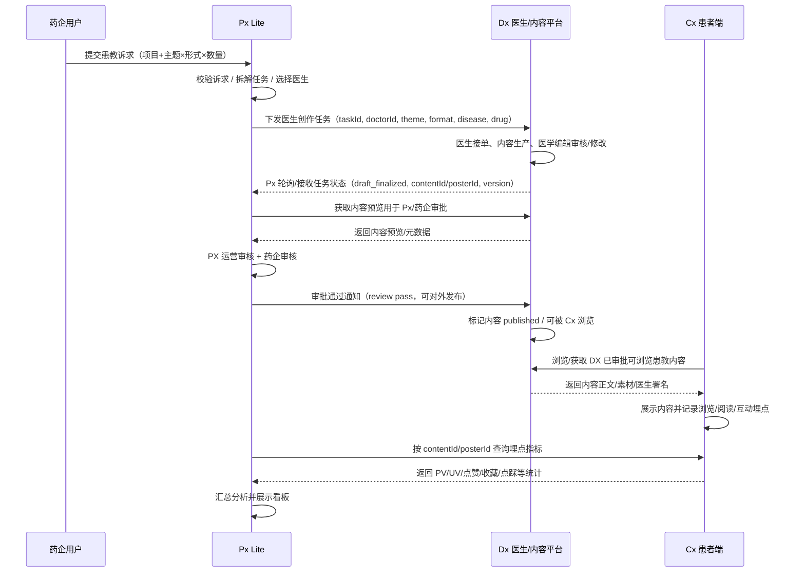
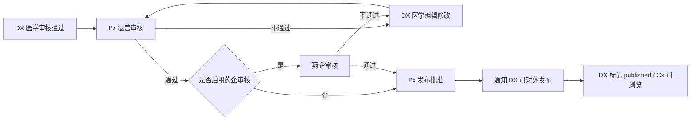
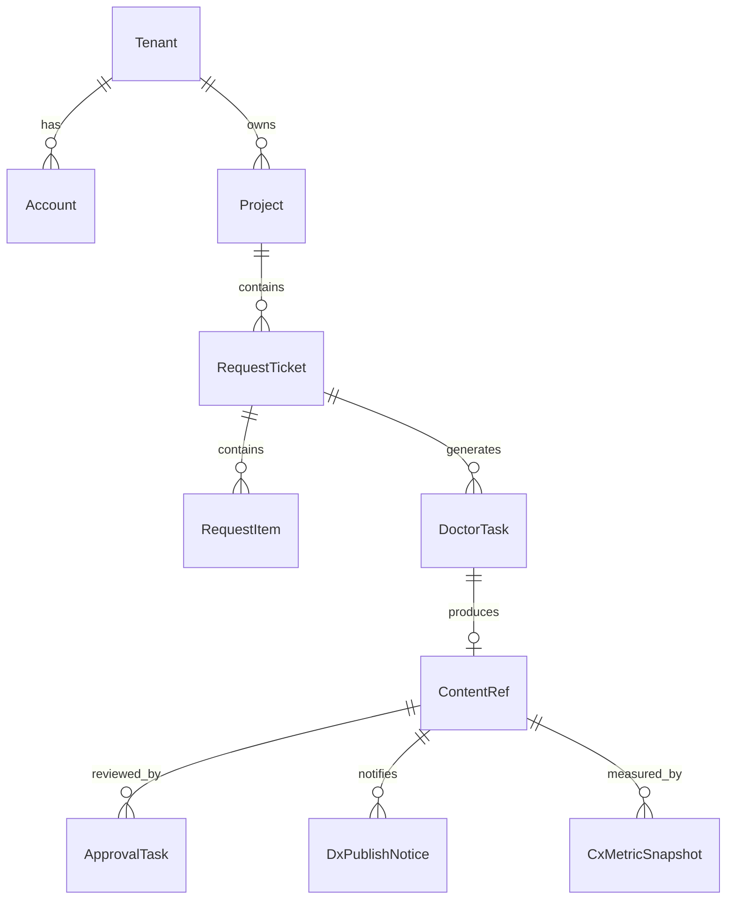

# Px Lite 开发版 PRD（瀑布流式）

> 文档版本：v1.0（开发版 / Waterfall）  
> 更新日期：2026-05-19  
> 适用对象：产品、项目经理、前端、后端、测试、DX/CX 对接研发、运维  
> 依据文档：`requirements/Px-Lite-业务确认版PRD.md`、`requirements/doc_DaOndYwFao5ljbxms5McLXhEnhf.md`、`requirements/doc_MwPddmxEtohzpuxaTmtcjTe3nvf.md`  
> 核心变更口径：**DX 持有患教内容正文、素材、版本与对外发布状态；Px 完成 PX/药企审核后仅通知 DX“已审批通过，可对外发布”；Cx 从 DX 浏览/获取所有已审批通过且可浏览的患教内容；Px 与 Cx 之间不存在内容发布计划推送，仅由 Px 调用 Cx 指标接口获取埋点数据并展示分析。**

---

## 0. 文档控制

### 0.1 文档目标

本文将业务确认版 PRD 转换为可供程序开发、测试与验收使用的瀑布流式需求文档，明确：

| 目标 | 说明 |
|---|---|
| 固定首期范围 | 明确 Px Lite 首期必须实现与明确不实现的能力。 |
| 固定三端职责 | 明确 Px / Dx / Cx 的数据归属、接口边界、状态同步关系。 |
| 固定开发输入 | 输出页面、接口、数据模型、状态机、权限、验收标准。 |
| 支持瀑布交付 | 按“需求冻结 → 设计 → 开发 → 联调 → 测试 → UAT → 上线”组织交付。 |

### 0.2 优先级与冲突处理

| 优先级 | 资料/口径 | 开发处理规则 |
|---|---|---|
| P0 | 本文用户补充的三端数据交互口径 | **最高优先级**：DX 是内容源与对外发布控制点；Px 审批后通知 DX 可发布；Cx 从 DX 获取可浏览内容；Px 只从 Cx 获取指标。 |
| P1 | `Px-Lite-业务确认版PRD.md` 第 25 章 | 首期工程范围、实体、状态机、权限基线。 |
| P2 | Manus 极简页面 PRD | 首期菜单与页面范围。 |
| P3 | 原型字段口径文档 | 字段命名、枚举、原型兼容字段参考。 |
| P4 | 前端原型源码 | 页面结构、组件、mock 数据参考。 |

### 0.3 本开发版冻结结论

| 事项 | 冻结结论 |
|---|---|
| 内容权威源 | DX 持有患教内容正文、素材、版本与医生署名。 |
| Px 内容存储 | Px 存储内容引用、任务状态、审批状态、发布状态、指标数据；不作为内容正文权威库。 |
| Cx 内容存储 | Cx 不接收 Px 发布计划；Cx 从 DX 获取/展示已审批可浏览内容，并记录浏览/互动埋点。 |
| 发布门禁 | 系统级门禁为 `dxReview=approved && pxApproval=approved`；如租户启用药企审核，则药企审核通过后，Px 调用 DX 审核回写/发布通知接口，告知 DX 可对外发布。 |
| 指标获取 | Cx 记录内容浏览/阅读/互动埋点；Px 通过 Cx 提供的指标查询接口按内容 ID 获取统计数据。 |
| 首期页面 | 总览、患教内容工坊、患者行为洞察、分发策略、审批中心、平台管理。 |
| 首期不做 | 财务、患者列表/详情、独立设置、AIGC 独立工坊、AE/临床/用药/归因。 |

### 0.4 与业务确认版 PRD 的一致性结论（按最新三端口径修订）

开发版 PRD 中“DX 持有患教内容正文与素材”的口径不违背 `Px-Lite-业务确认版PRD.md`，但本次进一步修订了 **Px 与 Cx 的关系**：业务确认版中“内容同步至 CX / 患者端发布”的表述，在工程落地中应解释为 **Px 审批通过后通知 DX 可对外发布，CX 从 DX 可浏览内容池获取内容**，而不是 Px 向 Cx 推送发布计划。

| 业务确认版表述 | 最新开发版落地解释 | 结论 |
|---|---|---|
| Px 将审核通过内容同步至 CX | Px 不向 Cx 同步内容或发布计划；Px 向 DX 发送“审批通过/可对外发布”消息。 | 口径修订 / 细节敲定 |
| CX 展示患教内容 | Cx 从 DX 端可浏览内容池查看/获取所有已审批通过内容，内容正文、素材、医生署名仍由 DX 提供。 | 细节敲定 |
| DX 医生创作、DX 医学编辑审核 | DX 是正文、素材、版本、医生署名与对外发布状态的权威源。 | 一致 |
| PX 运营审核、药企审核后患者端发布 | PX 控制审批门禁；审批完成后通知 DX，DX 将内容置为可对外发布/可被 Cx 浏览。 | 口径修订 / 一致 |
| Px 获取患者行为数据 | Px 通过 Cx 提供的指标查询接口拉取埋点指标，进入 Px 看板。 | 一致 |

> 开发约束：本期不得建设 Px→Cx 发布计划、Px→Cx 内容推送、Cx 发布计划接收、Cx 下架同步等接口。若后续业务需要 Px 控制 Cx 触达策略，应作为后续版本重新评审。

### 0.5 外部对接文档评估结论（DX / CX）

| 对接方 | 已提供文档 | 当前满足度 | 可直接复用 | 主要缺口 | 本期处理结论 |
|---|---|---|---|---|---|
| DX | `requirements/dx/dx-px-collab-api.md` | **基本满足主链路，需补字段/语义确认** | 医生列表、派单、任务查询/轮询、内容列表/详情、PX 审核回写；其中 `POST /api/px/tasks/{px_task_id}/review` 的 `verdict=pass` 可作为“Px 审批通过，可对外发布”的通知。 | 无 DX→PX webhook；医生 ID 同时存在 UUID/BIGINT/phone；派单缺少项目/诉求/主题/病种/形式标准 metadata；内容接口未明确版本冻结查询；需确认 `pass` 后 DX published 即 Cx 可浏览。 | 本期按 DX 现有接口做适配层：Px/P药企全链路审批通过后才调用 DX review pass；驳回调用 reject。 |
| CX | `requirements/cx/doc_MgQowMJbqiARSykx7AccUS71nrg.md` | **部分满足 Px 指标获取** | 按 `poster_id/itemId` 查询累计 like/dislike/favorite/pv/uv；按医生拉统计。 | 缺少日期范围/日维度、项目/诉求/租户维度、内容版本、渠道、推送/触达指标；鉴权 token 需确认是否给 Px 服务端使用。 | 本期不要求 CX 接收发布计划；Px 仅调用 CX 指标接口拉取埋点统计。若看板需要日趋势/触达指标，CX 需扩展指标查询接口。 |

---

## 1. 产品与系统概述

### 1.1 产品定位

Px Lite 是面向药企患教业务的轻量 SaaS 系统，定位为 **药企诉求承接、DX 内容生产协同、Px 审批枢纽、DX 对外发布通知与 CX 指标分析平台**。

### 1.2 三端系统职责

| 系统 | 系统职责 | 数据主权 | 对外提供 | 接收 |
|---|---|---|---|---|
| Px | 承接药企诉求、拆解任务、分发至 DX、审批、通知 DX 可发布、指标展示 | 诉求、项目、任务引用、审批、DX 发布通知、指标快照 | 任务下发给 DX；审批通过/驳回结果回写 DX；看板给药企/PX | DX 任务/内容状态；Cx 指标数据 |
| Dx | 医生接单、患教内容生产、医学编辑审核、内容接口服务 | **患教内容正文、素材、版本、医生署名** | 内容接口；任务状态回传；内容审核结果 | Px 医生创作任务 |
| Cx | 展示/浏览 DX 已审批可浏览内容、埋点采集 | 浏览记录、阅读记录、互动事件与统计指标 | 指标查询接口给 Px | DX 可浏览内容池/内容接口 |

#### 1.2.1 三端本期必须提供能力（开发分工冻结）

| 端 | 必须提供能力 | Px 侧依赖 | 明确不依赖/不实现 |
|---|---|---|---|
| Px | 租户/项目/诉求管理、诉求级医生任务分发、PX/药企审批、DX 可发布通知、CX 指标拉取与看板聚合、RBAC 与审计 | 作为三端协同编排中心，保存引用、状态、审批、指标快照 | 不保存 DX 内容正文权威副本；不创建 Cx 发布计划/触达计划 |
| Dx | 医生候选池、医生接单与创作、DX 医学编辑审核/二次编辑、任务状态同步、内容预览/版本接口、Px 审批结果回写后置为可对外发布、向 Cx 提供可浏览内容 | Px 下发任务、轮询/接收任务状态、审批预览、最终通知可发布 | 不要求 Cx 从 Px 获取内容；不要求 Px 直接修改 DX 正文 |
| Cx | 从 DX 获取/浏览已审批可浏览内容、展示长图文/海报/手册、记录 PV/UV/点赞/收藏/点踩、向 Px 提供 stats 查询接口 | Px 通过 `itemId/posterId` 拉取累计指标并聚合到项目/诉求/内容 | 不接收 Px 发布计划/触达计划/内容正文；不要求首期向 Px 主动回调 |

### 1.3 三端基础数据交互图

### 1.4 内容数据归属原则

| 数据类型 | 权威系统 | Px 是否存储 | Cx 是否存储 | 说明 |
|---|---|---|---|---|
| 内容正文 | DX | 不存权威正文，可缓存预览快照 | 不存权威正文，可短期缓存展示副本 | 正文以 `contentId + contentVersion` 从 DX 获取。 |
| 内容素材 | DX | 不存权威素材 | 不存权威素材，可缓存 CDN 链接 | 海报/手册/配图由 DX 提供。 |
| 医生署名 | DX | 存引用快照 | 展示时来自 DX | Cx 必须展示医生署名。 |
| 内容审批状态 | Px | 是 | 不从 Px 接收发布计划；按 DX published 可浏览状态展示 | Px 控制审批门禁，审批通过后通知 DX 可对外发布。 |
| 内容浏览/互动数据 | Cx | 通过指标接口拉取后存指标快照/汇总 | 是 | Cx 记录埋点，Px 展示聚合指标。 |
| 行为埋点事件 | Cx | 首期不要求事件级入 Px；可存查询快照/日汇总 | 是 | Px 通过 Cx 指标接口获取统计。 |

---

## 2. 瀑布式交付范围

### 2.1 首期必须实现模块

| 编号 | 模块 | 路由 | 目标用户 | 开发范围 |
|---|---|---|---|---|
| M01 | 总览 | `/` | Px 运营、药企 | KPI、项目卡片、角色入口、越权提示。 |
| M02 | 患教内容工坊 | `/content`, `/content/:contentId` | Px 运营、药企 | 内容引用列表、筛选、分页、详情、药企提交诉求。 |
| M03 | 分发策略 | `/distribute`, `/distribute/:projectId`, `/distribute/request/:requestId` | Px 分发执行员 | 项目列表、项目下诉求列表、诉求级医生分发、批次历史。 |
| M04 | 审批中心 | `/approvals` | Px 审核、药企审核 | 待审、已通过、驳回中、全部任务、按诉求分组、批量处理。 |
| M05 | 患者行为洞察 | `/audience` | Px 运营、药企 | 聚合 KPI、内容 TopN、项目筛选、k 匿名。 |
| M06 | 平台管理 | `/admin/*` | Px 平台管理员 | 租户、账号、项目、审批流最小管理能力。 |
| M07 | 三端接口 | API | 系统 | Px-Dx 任务/内容/审批回写接口、Px-Cx 指标查询接口。 |

### 2.2 首期不实现模块

| 模块 | 结论 |
|---|---|
| 独立设置 `/settings` | 不开发。账号和角色由平台管理承载。 |
| 财务管理 `/finance/*` | 不开发、不验收。 |
| 患者列表/详情 `/patients/*` | 不开发。仅做聚合行为洞察。 |
| AIGC 独立工坊 | 不开发。DX 医生生产为主链路。 |
| AE/临床/用药/依从性/归因 | 不采集、不展示、不接入。 |
| 字段级权限配置 UI | 不开发，仅保留 RBAC 菜单/按钮级权限。 |

### 2.3 瀑布阶段与交付物

| 阶段 | 交付物 | 退出标准 |
|---|---|---|
| 需求冻结 | 本开发版 PRD、接口清单、状态机、验收用例 | 产品/研发/测试/DX/CX 对接方确认。 |
| 概要设计 | 系统架构图、数据库 ERD、接口协议、权限设计 | 技术负责人评审通过。 |
| 详细设计 | 页面交互、API schema、数据字典、错误码、测试计划 | 前后端与测试可据此开发。 |
| 开发实现 | 前端页面、后端服务、接口适配、mock/stub | 单元测试通过，主要流程可跑通。 |
| 联调测试 | Px-Dx、Px-Cx、Cx-Dx 三端联调报告 | 正常流与异常流通过。 |
| SIT | 系统集成测试报告、缺陷清单 | P0/P1 缺陷关闭。 |
| UAT | 业务验收记录 | 业务验收通过。 |
| 上线 | 发布清单、回滚方案、监控告警 | 生产验证通过。 |

### 2.4 技术栈与工程约束（本次补充确认）

原型 `requirements/px-lite-main` 为前端演示工程与 mock 数据，本期正式开发必须补齐后端服务。

| 层级 | 技术要求 | 说明 |
|---|---|---|
| 前端 | React + Vite + TypeScript，沿用原型 UI/路由/组件风格 | 原型作为前端基线，不直接把 mock 数据视为后端事实源。 |
| 后端主方案 | **Python 技术栈** | 默认方案：FastAPI + Pydantic v2 + SQLAlchemy，包管理使用 uv。 |
| 主方案包管理 | **uv** | 使用 `pyproject.toml` + `uv.lock`；统一 `uv run` 执行服务、测试、lint。 |
| 后端备选方案 | **TypeScript + Express** | 备选方案：Node.js + Express + TypeScript；可复用原型技术栈经验，但不得直接把原型 Express demo server 当正式后端。 |
| 备选包管理 | pnpm | 与前端保持一致；使用 `package.json` + `pnpm-lock.yaml`；建议 `tsx`/`ts-node` 开发、`tsup`/`esbuild` 构建。 |
| 备选契约/校验 | Zod + OpenAPI | DTO、外部接口 Adapter、请求响应校验需与 Python 主方案等价；可使用 `zod-to-openapi` 或等价工具生成契约。 |
| 数据库 | **PostgreSQL** | 两种后端方案均使用；存储租户、项目、诉求、任务、内容引用、审批、DX 发布通知、指标快照、审计。 |
| 缓存/队列 | **Redis** | 两种后端方案均使用；幂等键、分布式锁、外部接口轮询游标、异步任务队列、短期缓存。 |
| 迁移 | Alembic（Python）/ Prisma Migrate 或 Drizzle Kit（TypeScript） | 所有表结构变更必须有 migration；二选一后不得混用两套迁移事实源。 |
| 异步任务 | ARQ/RQ/Celery（Python）/ BullMQ（TypeScript） | 用于 DX 任务轮询、CX 指标补拉、DX 发布通知重试、指标聚合。 |
| 契约 | OpenAPI + Pydantic Schema（Python）/ OpenAPI + Zod Schema（TypeScript） | Px 内部 API、DX/CX Adapter DTO 必须独立建模；不得散落使用 any/dict。 |

### 2.5 后端服务边界

| 服务域 | 主要职责 | 依赖 |
|---|---|---|
| Tenant/Auth/RBAC | 登录态、租户范围、角色权限、审计 | PostgreSQL、Redis |
| Request/Project | 项目、药企诉求、主题×形式矩阵、剩余额度 | PostgreSQL |
| Distribution | 医生候选池、指定/策略/混合分发、随机任务生成、DX 派单 | PostgreSQL、Redis、DX Adapter |
| DxSync | DX 任务状态轮询/回调兼容、内容引用同步、版本冻结 | Redis、DX Adapter |
| Approval | PX/药企审批、驳回回写 DX、审批历史、SLA | PostgreSQL、Redis、DX Adapter |
| DxPublishSync | 审批通过后通知 DX 可对外发布、通知状态、失败重试 | PostgreSQL、Redis、DX Adapter |
| Metrics | CX 指标接收/轮询、日聚合、看板查询 | PostgreSQL、Redis |

---

## 3. 角色与权限需求

### 3.1 角色定义

| 角色 Key | 角色名称 | 视图 | 权限摘要 |
|---|---|---|---|
| `px_admin` | 运营·平台管理员 | Ops View | 全部菜单，管理租户/账号/项目/审批流。 |
| `px_distributor` | 运营·分发执行员 | Ops View | 总览、内容工坊、分发策略、行为洞察。 |
| `px_reviewer` | 运营·内容审核员 | Ops View | 内容工坊、审批中心、行为洞察。 |
| `pharma_submitter` | 药企提交人 | Pharma View | 总览、内容工坊提交诉求、查看本租户数据。 |
| `pharma_reviewer` | 药企审核人 | Pharma View | 审批中心药企节点处理、本租户内容查看。 |
| `viewer` | 只读查看者 | Ops/Pharma | 权限范围内只读。 |

### 3.2 菜单权限矩阵

| 菜单 | px_admin | px_distributor | px_reviewer | pharma_submitter | pharma_reviewer | viewer |
|---|---:|---:|---:|---:|---:|---:|
| 总览 | ✅ | ✅ | ✅ | ✅ | ✅ | ✅ |
| 患教内容工坊 | ✅ | ✅ | ✅ | ✅ | ✅ | 只读 |
| 分发策略 | ✅ | ✅ | ❌ | ❌ | ❌ | ❌ |
| 审批中心 | ✅ | ❌ | ✅ | ❌ | ✅ | 只读 |
| 患者行为洞察 | ✅ | ✅ | ✅ | ✅ | ✅ | ✅ |
| 平台管理 | ✅ | ❌ | ❌ | ❌ | ❌ | ❌ |

### 3.3 权限拦截要求

| 场景 | 系统处理 |
|---|---|
| 药企访问 `/distribute/*` | 跳转无权页或回总览，并提示“药企视图无权访问该页”。 |
| 药企访问 `/admin/*` | 阻断，记录越权日志。 |
| 非审批角色处理审批 | 按钮禁用；接口二次校验并返回 `403`。 |
| 药企跨租户访问内容/指标 | 接口返回 `403`，记录审计日志。 |
| Px 用户未授权操作平台管理 | 接口返回 `403`。 |

---

## 4. 核心业务流程需求

## 4.1 流程 F01：药企提交诉求

### 4.1.1 主流程

| 步骤 | 操作 | 系统处理 | 产物 |
|---|---|---|---|
| 1 | 药企进入总览或内容工坊 | 显示“提交选题需求”入口 | 表单入口 |
| 2 | 药企选择已有项目 | 系统仅展示本租户可用项目 | `projectId` |
| 3 | 药企填写诉求名称、优先级、期望上线日、备注 | 前端校验必填与格式 | 表单草稿 |
| 4 | 药企填写主题×形式×数量矩阵 | 合计必须 > 0 | `themeFormatMatrix` |
| 5 | 点击提交 | 后端幂等校验并创建诉求 | `RequestTicket` |
| 6 | 系统生成内容引用占位 | 工坊显示“需求已提交” | `ContentRef/WorkshopExtra` |

### 4.1.2 业务规则

| 编号 | 规则 |
|---|---|
| BR-F01-01 | 药企提交诉求必须关联已有项目；药企端不允许新建项目。 |
| BR-F01-02 | 一个项目可挂载多条诉求；一条诉求只能归属一个项目。 |
| BR-F01-03 | 主题枚举固定 8 项；形式枚举固定 3 项。 |
| BR-F01-04 | `themeFormatMatrix` 单元格必须为非负整数，总和 > 0。 |
| BR-F01-05 | 同一项目同名诉求允许二次确认后提交；接口必须幂等。 |

### 4.1.3 异常流程

| 异常 | 系统处理 | 状态 |
|---|---|---|
| 无可选项目 | 提示联系 Px 运营创建项目 | 不创建诉求 |
| 项目已归档 | 阻止提交 | 不创建诉求 |
| 项目不属于当前租户 | 阻止并记录越权 | 不创建诉求 |
| 矩阵总量为 0 | 阻止提交 | 不创建诉求 |
| 重复点击提交 | 幂等返回同一结果 | 仅创建 1 条诉求 |

---

## 4.2 流程 F02：Px 拆解并分发医生任务

### 4.2.1 主流程

| 步骤 | 操作 | 系统处理 | 产物 |
|---|---|---|---|
| 1 | Px 进入分发策略项目页 | 查看项目卡片和关联诉求数量 | Project 列表 |
| 2 | 进入项目详情 | 展示项目下多条诉求 | RequestTicket 列表 |
| 3 | 选择单条诉求配置分发 | 展示诉求剩余额度矩阵 | 诉求分发页 |
| 4 | 填写本批分发篇数 | 校验 <= 剩余额度 | DistributionBatch 草稿 |
| 5 | 配置指定分发/策略分发/混合分发 | 系统计算医生配额 | 医生配额预览 |
| 6 | 系统随机抽取主题+形式 | 从诉求剩余额度池抽取 N 篇 | 随机任务明细 |
| 7 | 提交分发 | 创建一篇一任务，并下发 DX | DoctorTask / DX task |
| 8 | DX 返回接收结果 | Px 更新批次状态与任务状态 | success / partial_success / failed |

### 4.2.2 医生分发规则

| 分发方式 | 规则 |
|---|---|
| 指定分发 | 在职称命中的候选池中勾选医生，并为每位医生填写本人负责篇数。 |
| 策略分发 | 互动分 = 医生历史内容点赞数 + 收藏数；按互动分 desc 排序后平均派发，余数优先给高分医生。 |
| 混合分发 | 先指定医生，剩余篇数走策略分发；已指定医生不再参与策略分发。 |
| 主题/形式 | 分发阶段不允许手动选择；系统从诉求剩余额度池随机抽取。 |
| 任务颗粒度 | 一篇文章 = 一个 DoctorTask；下发 DX 时 `quantity=1`。 |

### 4.2.3 下发 DX 字段

| 字段 | 必填 | 来源 | 说明 |
|---|---|---|---|
| batchId | 是 | Px | 分发批次 ID。 |
| taskId | 是 | Px | 医生任务 ID。 |
| requestId | 是 | Px | 药企诉求 ID。 |
| projectId | 是 | Px | 项目 ID。 |
| tenantId | 是 | Px | 租户 ID。 |
| doctorId | 是 | Px/Dx 映射 | 被指派医生。 |
| theme | 是 | 随机任务池 | 8 大主题之一。 |
| format | 是 | 随机任务池 | longtext/poster/manual。 |
| disease | 是 | Project | 首期为 breast_cancer。 |
| drug/brand | 否 | Project | 项目创建时带入，可为空。 |
| quantity | 是 | 固定值 | 固定为 1。 |
| deadline | 是 | Px | 期望完成时间。 |
| note/evidence | 否 | Px/药企 | 备注和参考材料。 |
| callbackUrl | 是 | Px | DX 回传任务节点。 |

### 4.2.4 异常流程

| 异常 | 系统处理 |
|---|---|
| 候选医生为空 | 阻止策略分发，提示放宽条件或指定医生。 |
| 指定篇数超额 | 阻止提交。 |
| DX 全部下发失败 | 批次 `failed`，不扣减额度，可重试。 |
| DX 部分失败 | 批次 `partial_success`；成功任务确认，失败任务保留重试。 |
| DX 返回重复任务 | 按幂等键识别，不重复创建。 |
| 医生不可用 | 对应任务失败，Px 运营重选医生。 |

---

## 4.3 流程 F03：DX 内容生产与内容接口

### 4.3.1 主流程

| 步骤 | 操作 | 系统处理 | 同步给 Px |
|---|---|---|---|
| 1 | DX 收到任务 | 创建医生待办 | `task_received` |
| 2 | 医生接收/拒绝 | 接收进入制作；拒绝需原因 | `doctor_accepted` / `doctor_rejected` |
| 3 | 医生制作内容 | 内容正文和素材存储在 DX | `doctor_drafting` |
| 4 | 医生提交 | 进入 DX 医学编辑审核 | `doctor_submitted` |
| 5 | 医学编辑审核/修改 | 通过或修改后通过 | `dx_reviewing` / `editor_editing` |
| 6 | DX 完成 | 生成 `contentId` 与 `contentVersion` | `dx_completed` |

### 4.3.2 DX 内容接口要求

DX 必须提供内容接口供 Px 预览审核，并向 Cx 暴露已审批可浏览内容。

| 接口 | 调用方 | 用途 | 要求 |
|---|---|---|---|
| 获取内容元数据 | Px/Cx | 获取标题、摘要、形式、医生署名、版本、状态 | 支持 `contentId/posterId`，并确认版本冻结语义。 |
| 获取内容预览 | Px | Px/Px 内药企审核查看内容 | 支持只读预览，不暴露编辑能力。 |
| 获取内容正文/素材 | Cx | 患者端浏览/展示内容 | 支持长图文、海报、手册三种形式；仅返回已发布/可浏览内容。 |
| 获取内容版本 | Px/Cx | 避免审批版本与对外版本不一致 | 返回当前版本与指定版本内容，或保证 `poster_id` 对应不可变版本。 |

### 4.3.3 内容版本冻结规则

| 场景 | 规则 |
|---|---|
| DX 完成内容 | 生成 `contentId` 和 `contentVersion`。 |
| Px 审批中 | Px 使用指定 `contentVersion` 预览。 |
| 审批驳回 | DX 修改后生成新版本，旧版本保留但不可发布。 |
| Px 通知 DX 可发布 | Px/P药企审核通过后调用 DX 审核回写 `pass`，告知可对外发布。 |
| Cx 展示 | Cx 从 DX 已发布/可浏览内容池获取内容，不依赖 Px 发布计划。 |

---

## 4.4 流程 F04：Px 审批与发布门禁

### 4.4.1 审批链路

### 4.4.2 审批规则

| 规则 | 说明 |
|---|---|
| DX 未完成 | Px 不允许创建审批任务或发送可发布通知。 |
| Px 审核不通过 | 统一回 DX 医学编辑修改。 |
| 药企审核不通过 | 统一回 DX 医学编辑修改。 |
| 任一驳回 | 必须填写驳回原因与修改建议。 |
| 内容版本变化 | 需重新走 Px 审批；不得发布旧审批结果对应外的新版本。 |
| 发布门禁 | `dxReview=approved && pxApproval=approved` 后，Px 才可通知 DX 对外发布；Px 不直接触发 Cx。 |

---

## 4.5 流程 F05：DX 对外发布、Cx 浏览与指标获取

### 4.5.1 主流程

| 步骤 | 操作 | 系统处理 | 产物 |
|---|---|---|---|
| 1 | Px/P药企审核全部通过 | Px 调用 DX 审核回写/发布通知接口，`verdict=pass` | DxPublishNotice |
| 2 | DX 接收通过通知 | DX 将任务/内容置为 `published` 或可对外浏览状态 | DX published content |
| 3 | Cx 获取可浏览内容 | Cx 从 DX 内容池查看/获取所有已审批通过内容 | 展示内容 |
| 4 | Cx 展示内容 | 患者浏览长图文/海报/手册 | 浏览记录 |
| 5 | Cx 记录埋点 | open/read/like/favorite/dislike 等 | Cx stats |
| 6 | Px 获取指标 | Px 按 `poster_id/contentId` 调用 Cx 指标接口 | CxMetricSnapshot / CxMetricDaily |
| 7 | Px 聚合展示 | 总览、内容详情、行为洞察 | KPI/TopN/趋势 |

### 4.5.2 Px 通知 DX 可发布字段

| 字段 | 必填 | 说明 |
|---|---|---|
| taskId / px_task_id | 是 | Px 医生任务 ID，对应 DX 任务。 |
| contentId / posterId | 条件 | DX 内容 ID；如 DX 以任务维度发布，可由 DX 自行关联。 |
| contentVersion | 建议 | Px 审批通过的内容版本；若 `poster_id` 即版本 ID 可不单独传。 |
| verdict | 是 | 固定 `pass`。 |
| reviewer_node | 是 | 使用 DX 当前接口时传最终审核节点，如 `3=pharma`。 |
| reviewer_label | 是 | Px 系统/审核人标识。 |
| reviewed_at | 是 | 最终审核通过时间。 |
| suggestion | 否 | 通过时为空；驳回时必填。 |

### 4.5.3 Px 从 Cx 获取指标字段

| 字段 | 必填 | 说明 |
|---|---|---|
| itemId / posterId / contentId | 是 | DX 内容 ID；当前 CX 文档中 `itemId = 医生端内容 poster_id`。 |
| contentVersion | 建议 | 若 CX 支持版本维度则必填；当前文档未提供。 |
| pvCount / readTimes | 是 | 详情打开次数 / 阅读次数。 |
| uvCount / readPeople | 是 | 详情打开用户数去重 / 阅读人数。 |
| likeCount | 是 | 点赞人数/次数，按 CX 口径。 |
| favoriteCount | 是 | 收藏人数/次数，按 CX 口径。 |
| dislikeCount | 否 | 点踩人数/次数。 |
| metricDate / dateRange | 后续建议 | 当前 CX 文档未提供日期维度；如需趋势必须扩展。 |

### 4.5.4 指标口径

| 指标 | 口径 |
|---|---|
| 阅读次数 | Cx `pvCount` 或等价阅读/打开事件次数。 |
| 阅读人数 | Cx `uvCount`。 |
| 正向互动数 | `likeCount + favoriteCount`。 |
| 负向互动数 | `dislikeCount` 单列。 |
| 推送次数/触达人数 | 本期若 CX 不提供，则不展示或标记“待接入”。 |
| 分享数/完读率 | CX 支持时再展示，首期非必需。 |

---

## 5. 功能模块开发需求

## 5.1 M01 总览

### 5.1.1 功能说明

总览用于展示当前权限范围内的项目、内容、阅读、互动效果；触达/推送仅在 CX 提供对应指标后展示，不由 Px 计算。

| 功能 | 需求 |
|---|---|
| KPI 卡片 | 项目数、已发布内容、阅读人数、阅读次数、互动数；推送/触达指标待 CX 扩展后再展示。 |
| 项目卡片 | 展示项目名、病种、品牌、内容数量、已发布数量、阅读/互动指标。 |
| 角色入口 | 药企显示“提交选题需求”；运营显示“进入内容工坊”。 |
| 权限隔离 | 药企只看本租户数据；运营按权限看租户范围。 |

### 5.1.2 验收标准

| 编号 | 标准 |
|---|---|
| OV-01 | 药企登录后只展示本租户项目与聚合指标。 |
| OV-02 | 互动数 = 点赞 + 收藏，不含点踩/分享。 |
| OV-03 | 点击项目可带筛选条件进入内容工坊或行为洞察。 |
| OV-04 | 越权访问运营菜单时有明确提示并记录日志。 |

## 5.2 M02 患教内容工坊

### 5.2.1 功能说明

| 功能 | 需求 |
|---|---|
| 内容引用列表 | 展示 Px 保存的内容引用、流程状态、发布状态、阅读/互动指标。 |
| 内容详情 | 通过 DX 内容接口读取内容预览；展示 Px 审批、发布、指标信息。 |
| 诉求提交 | 药企提交项目、诉求名、主题×形式矩阵、期望上线日。 |
| 流程状态 | 需求已提交、医生分发中、医生制作中、三方审核中、内部审核中、已发布。 |
| 搜索筛选 | 按状态、项目、流程、标题/编号筛选。 |

### 5.2.2 关键要求

| 编号 | 要求 |
|---|---|
| CL-01 | Px 不展示未经授权的 DX 内容正文。 |
| CL-02 | 内容详情预览必须携带 `contentId + contentVersion` 调用 DX。 |
| CL-03 | DX 内容接口失败时，详情页展示“内容暂不可预览”，不影响审批记录查询。 |
| CL-04 | 药企提交诉求后，列表出现“需求已提交”记录。 |

## 5.3 M03 分发策略

### 5.3.1 功能说明

| 功能 | 需求 |
|---|---|
| 项目列表 | 展示项目状态、优先级、总量、主题/形式分布、诉求条数、剩余待分发任务量；不展示/配置患者触达上限。 |
| 项目详情 | 展示项目下多条诉求。 |
| 诉求分发 | 对单条诉求填写本批分发篇数，配置医生分发方式。 |
| 随机任务池 | 从诉求剩余额度池随机生成主题/形式任务。 |
| 历史批次 | 展示分发批次、医生配额、DX 下发结果、失败重试。 |

### 5.3.2 验收标准

| 编号 | 标准 |
|---|---|
| DS-01 | 一个项目可显示多条诉求。 |
| DS-02 | 每条诉求可独立配置医生分发策略。 |
| DS-03 | 分发阶段无手动选择主题/形式入口。 |
| DS-04 | 每篇任务下发 DX 时 `quantity=1`。 |
| DS-05 | 部分失败不丢失额度，可重试。 |

## 5.4 M04 审批中心

### 5.4.1 功能说明

| 功能 | 需求 |
|---|---|
| 待我审批 | 当前用户可处理节点。 |
| 已通过 | 全流程通过记录。 |
| 驳回中 | 当前在 DX 医学编辑修改中的记录。 |
| 全部任务 | 权限范围内审批任务。 |
| 内容预览 | 调用 DX 内容预览接口。 |
| 通过/驳回 | 通过推进，驳回统一回 DX 医学编辑修改。 |

### 5.4.2 验收标准

| 编号 | 标准 |
|---|---|
| AP-01 | 未通过 DX 审核的内容不可进入 Px 审批。 |
| AP-02 | 审批预览从 DX 获取指定版本内容。 |
| AP-03 | 任一驳回必须填写原因和建议。 |
| AP-04 | 审批通过后生成可发布状态，不直接修改 DX 内容。 |

## 5.5 M05 患者行为洞察

### 5.5.1 功能说明

| 功能 | 需求 |
|---|---|
| 项目筛选 | 支持按项目多选，未选=全部。 |
| KPI | 阅读人数、阅读次数、互动数；推送/触达指标待 CX 扩展后再展示。 |
| TopN | 按阅读次数、互动数排序。 |
| k 匿名 | 低于阈值的分组隐藏具体数。 |
| 数据更新时间 | 显示 Cx stats 最近成功拉取时间。 |

### 5.5.2 验收标准

| 编号 | 标准 |
|---|---|
| AD-01 | Px 看板数据来自 Cx stats 指标查询，不使用 mock 估算。 |
| AD-02 | 药企不能看到匿名患者明细。 |
| AD-03 | 指标拉取失败时保留上一批数据并提示最近成功更新时间。 |

## 5.6 M06 平台管理

| 子模块 | 开发范围 |
|---|---|
| 租户管理 | 租户列表、新建、启停、可见病种/品牌/区域。 |
| 账号管理 | 邀请、启停、角色分配。 |
| 项目管理 | 新建项目，关联租户、病种、品牌、负责人。 |
| 审批流配置 | 配置租户级 DX/Px/药企审核节点、SLA、提醒。 |

---

## 6. 接口需求

## 6.1 通用接口要求

| 项 | 要求 |
|---|---|
| 协议 | HTTPS REST JSON；内部服务可后续扩展 RPC。 |
| 鉴权 | 服务间 Token + 租户范围校验。 |
| 幂等 | 创建诉求、分发批次、DX 发布通知、指标拉取快照必须支持幂等或去重。 |
| 时间 | ISO 8601，统一保存 UTC，前端按时区展示。 |
| 错误 | 统一错误码、错误消息、traceId。 |
| 版本 | 外部接口路径包含 `/v1`。 |

## 6.2 Px → DX 接口

> 本节为 Px 所需的**逻辑契约**。DX 当前实际路径与字段见 6.6.1，后端必须通过 `DxAdapter` 做路径、字段、状态与 ID 映射，业务代码不得直接散落调用 DX 原始接口。

### 6.2.1 创建医生任务

`POST /dx-api/v1/tasks`

| 字段 | 类型 | 必填 | 说明 |
|---|---|---|---|
| idempotencyKey | string | 是 | 幂等键。 |
| batchId | string | 是 | 分发批次。 |
| taskId | string | 是 | Px 任务 ID。 |
| tenantId | string | 是 | 租户。 |
| projectId | string | 是 | 项目。 |
| requestId | string | 是 | 诉求。 |
| doctorId | string | 是 | 医生。 |
| theme | string | 是 | 主题。 |
| format | string | 是 | 形式。 |
| disease | string | 是 | 病种。 |
| drug | string | 否 | 药品。 |
| brand | string | 否 | 品牌。 |
| quantity | number | 是 | 固定为 1。 |
| deadline | string | 是 | 截止时间。 |
| callbackUrl | string | 是 | Px 回调地址。 |

### 6.2.2 获取内容预览

`GET /dx-api/v1/contents/{contentId}?version={contentVersion}&mode=preview`

| 返回字段 | 说明 |
|---|---|
| contentId | 内容 ID。 |
| contentVersion | 内容版本。 |
| title | 标题。 |
| summary | 摘要。 |
| format | 长图文/海报/手册。 |
| doctorId/doctorName | 医生署名。 |
| body | 长图文正文或结构化内容。 |
| assets | 海报/手册/图片素材 URL。 |
| status | DX 内容状态。 |
| updatedAt | 更新时间。 |

## 6.3 DX → Px 回调接口

`POST /px-api/v1/dx/task-callbacks`

| 字段 | 类型 | 必填 | 说明 |
|---|---|---|---|
| eventId | string | 是 | 事件幂等 ID。 |
| taskId | string | 是 | Px 任务 ID。 |
| dxTaskId | string | 否 | DX 任务 ID。 |
| requestId | string | 是 | 诉求 ID。 |
| doctorId | string | 是 | 医生 ID。 |
| node | string | 是 | 当前节点。 |
| result | string | 否 | pass/reject/fail。 |
| contentId | string | 条件 | 产生内容后必填。 |
| contentVersion | string | 条件 | 产生内容后必填。 |
| rejectReason | string | 条件 | 不通过必填。 |
| editSuggestion | string | 条件 | 不通过必填。 |
| occurredAt | string | 是 | 事件时间。 |

### 6.3.1 DX 节点枚举

| node | 含义 | Px 处理 |
|---|---|---|
| task_received | DX 已收任务 | 更新任务为 assigned。 |
| doctor_accepted | 医生接收 | 更新为 accepted/drafting。 |
| doctor_rejected | 医生拒绝 | 进入待重派。 |
| doctor_submitted | 医生提交 | 进入 DX 审核中。 |
| editor_reviewing | 医学编辑审核中 | 更新进度。 |
| editor_rejected | 医学编辑不通过 | 进入 editor_editing。 |
| editor_editing | 医学编辑修改中 | 更新进度。 |
| dx_completed | DX 完成 | 记录 contentId/contentVersion，进入 Px 审批。 |
| dx_failed | DX 任务失败 | 标记异常，人工处理。 |

## 6.4 Px → DX 审批通过/可发布通知接口

### 6.4.1 目标语义

Px 在 PX 运营审核与药企审核全部通过后，只需通知 DX：该患教内容已完成 Px 侧审批，可由 DX 对外发布。DX 当前文档可用如下接口承载该语义：

`POST /api/px/tasks/{px_task_id}/review`

请求体建议：

| 字段 | 类型 | 必填 | 说明 |
|---|---|---|---|
| reviewer_node | number | 是 | 建议最终药企审核通过时传 `3`；如无药企审核可传约定节点。 |
| reviewer_label | string | 是 | Px 系统/审核人标签。 |
| verdict | string | 是 | 通过通知固定 `pass`；驳回为 `reject`。 |
| suggestion | string | 条件 | `reject` 必填，`pass` 为空。 |
| reviewed_at | string | 是 | 审批完成时间。 |
| submission_id | number | 建议 | 对应 DX 端稿件提交 ID，便于版本定位。 |

响应中的 `new_status=published` 视为 DX 已允许 Cx 浏览该内容。Px 记录 `DxPublishNotice.status=success`。

### 6.4.2 驳回回写

PX 运营或药企审核不通过时，同一接口传 `verdict=reject` 与 `suggestion`，DX 进入返修/医学编辑修改流程。

## 6.5 Px → Cx 指标查询接口

### 6.5.1 当前 CX 已提供：查询指定内容累计统计

`GET /api/pharma-access/health-education/stats?itemIds=197,196,195`

| CX 字段 | Px 映射 | 说明 |
|---|---|---|
| itemId | contentId/posterId | 当前口径：医生端内容 `poster_id`。 |
| pvCount | readTimes | 详情打开次数。 |
| uvCount | readPeople | 详情打开用户数去重。 |
| likeCount | likes | 点赞数。 |
| favoriteCount | favorites | 收藏数。 |
| dislikeCount | dislikes | 点踩数。 |

### 6.5.2 当前 CX 已提供：查询某医生全部内容统计

`GET /api/pharma-access/health-education/stats/by-doctor?limit=100&cursor=0`

请求头包含 `X-Doctor-Id`。Px 可用该接口辅助计算医生历史互动分，但需 CX/DX 确认医生 ID 使用 UUID、BIGINT 还是 phone 映射。

### 6.5.3 建议 CX 扩展字段

| 能力 | 是否本期强依赖 | 说明 |
|---|---|---|
| 日期范围 / 日维度 | 看板趋势需要 | 支持 `from/to` 或返回 `date`，否则 Px 只能存累计快照。 |
| 内容版本 | 建议 | 支持 `contentVersion` 或声明 `poster_id` 即不可变版本。 |
| 租户/项目/诉求维度 | 建议由 Px 侧映射 | CX 可不感知项目/诉求，但返回 itemId 必须稳定。 |
| 推送/触达指标 | 非当前 CX 文档能力 | 若业务仍需要“推送人数/推送次数”，CX 需新增埋点口径。 |
| 幂等批次 | 非当前拉取模式必需 | 若后续改为 Cx 主动提供日汇总/事件流，则必须支持 batchId/eventId 幂等。 |

### 6.5.4 事件级数据接入（后续扩展）

本期不要求 Cx 主动向 Px 推送事件。若后续要做准实时洞察，可新增 `POST /px-api/v1/cx/events/batch` 或等价事件流，但不得与当前“Px 拉取 Cx 指标”口径混淆。

## 6.6 外部 DX/CX 现有接口适配与差距处理

### 6.6.1 DX 现有接口适配

DX 当前提供 `requirements/dx/dx-px-collab-api.md`，本期后端必须通过 `DxAdapter` 层屏蔽路径与字段差异。

| Px 需求 | DX 当前接口 | 适配方式 | 是否满足 | 需 DX 补充/确认 |
|---|---|---|---|---|
| 查询医生候选池 | `GET /api/px/doctors` | 映射为 `DoctorCandidate`。 | 部分满足 | 需补 `doctor_uuid`、病种/专长、历史点赞/收藏或确认由 CX 统计计算；明确 BIGINT、UUID、phone 的主键映射。 |
| PX 派单给 DX | `POST /api/px/tasks` | `DoctorTask.taskId` → `px_task_id`；固定 `count=1`；`doctor_assignment` 用 DX 可识别 ID。 | 部分满足 | 请求体建议支持 `metadata`：`tenantId/projectId/requestId/batchId/themeKey/formatKey/diseaseKey/brand`；`content_format` 需映射 longtext/poster/manual。 |
| PX 跟踪 DX 任务状态 | `GET /api/px/tasks?since=` | Redis 保存轮询游标，周期同步状态。 | 满足首期 | 建议后续新增 webhook 降低延迟。 |
| Px 获取内容预览 | `GET /api/cx-access/contents/{poster_id}` | `poster_id` 映射为 `contentId`，`version` 存 `ContentRef.contentVersion`。 | 部分满足 | 明确 `poster_id` 是否为不可变版本 ID；若不是，需支持 `?version=` 精确取版本。 |
| PX/药企审批回写 DX | `POST /api/px/tasks/{px_task_id}/review` | 审核不通过传 `reject`；全链路通过后传 `pass`。 | 满足主链路 | 确认 `pass` 后 DX 状态 `published` 即 Cx 可浏览。 |

#### DX 状态映射

| DX 状态 | Px DoctorTask/ContentRef 映射 | Px 处理 |
|---|---|---|
| `assigned` | `assigned` | 已下发待医生处理。 |
| `dx_review` | `editor_reviewing` | DX 内部编辑审核中。 |
| `dx_revising` | `editor_editing` | 返修/医学编辑修改或医生改稿中。 |
| `draft_finalized` | `dx_completed` + `ContentRef.pending_px_review` | DX 完稿，Px 可拉内容并进入 PX/药企审批。 |
| `published` | `ContentRef.dx_published` | DX 已对外发布；Cx 可浏览，Px 开始/继续拉取 Cx 指标。 |

### 6.6.2 CX 现有接口适配

CX 当前提供 `requirements/cx/doc_MgQowMJbqiARSykx7AccUS71nrg.md`，定位为内容埋点统计查询接口。由于最新口径下 **Px 不向 Cx 推送发布计划**，该文档不再被视为“缺少发布接口”，而是作为 Px 获取指标的基础接口。

| Px 需求 | CX 当前接口 | 适配方式 | 是否满足 | 需 CX 补充/确认 |
|---|---|---|---|---|
| 指定内容指标 | `GET /api/pharma-access/health-education/stats?itemIds=` | 按 `poster_id/itemId` 拉取累计 pv/uv/like/favorite/dislike，写入 Px 指标快照。 | 满足基础指标 | 需确认 token 是否为 Px 服务端 token；支持批量上限、错误项返回。 |
| 医生维度统计 | `GET /api/pharma-access/health-education/stats/by-doctor` | 辅助计算医生互动分。 | 部分满足 | 明确 `X-Doctor-Id` 与 DX 医生 ID 映射；返回 items 字段需稳定。 |
| 日趋势 | 当前未提供 | Px 只能定时拉累计快照并做差分估算。 | 不满足趋势强需求 | 建议 CX 增加 `from/to` 或按日 stats。 |
| 推送/触达指标 | 当前未提供 | Px 不展示或标记“待接入”。 | 不满足推送指标 | 如业务仍要求推送人数/次数，CX 需新增字段。 |
| 内容版本维度 | 当前未提供 | Px 以 `poster_id` 作为内容版本或最新内容映射。 | 待确认 | 需 CX/DX 确认 `poster_id` 版本语义。 |

### 6.6.3 三方需新增/修改能力清单

| 系统 | 必须新增/修改 | 原因 | 优先级 |
|---|---|---|---|
| Px | 后端、PostgreSQL 数据模型、Redis 幂等/队列、DX Adapter、CX Metrics Adapter、DX 任务轮询、CX 指标轮询 | 当前只有前端与 mock，无法支撑真实闭环。 | P0 |
| Px | `poster_id/contentId/contentVersion` 映射表、医生 ID 映射表 | 解决 DX/CX ID 体系不一致。 | P0 |
| DX | 派单 metadata、三形式枚举映射、版本冻结语义、`pass → published/Cx 可浏览` 语义确认 | 支撑 Px 诉求、审批与对外发布通知。 | P0 |
| DX | webhook 主动通知（可后续） | 降低轮询延迟与复杂度。 | P1 |
| CX | 指标查询接口稳定化：批量 itemIds、医生维度、错误项、鉴权给 Px 服务端 | 支撑 Px 看板。 | P0 |
| CX | 日期维度、推送/触达字段、版本维度（按业务需要） | 支撑趋势与更完整 KPI。 | P1 |

---

## 7. 数据模型需求

### 7.1 核心实体关系

### 7.2 数据实体定义

| 实体 | 说明 | 存储系统 |
|---|---|---|
| Tenant | 租户 | Px |
| Account | 账号与角色 | Px |
| Project | 项目 | Px |
| RequestTicket | 药企诉求 | Px |
| DoctorTask | 医生创作任务 | Px + DX 映射 |
| ContentRef | DX 内容引用 | Px |
| DxContent | 内容正文、素材、版本 | DX |
| ApprovalTask | 审批任务 | Px |
| DxPublishNotice | Px 通知 DX 可对外发布的记录 | Px + DX 映射 |
| CxMetricSnapshot / CxMetricDaily | Px 从 Cx 指标接口获取的累计快照/日指标 | Px |
| AuditLog | 审计日志 | Px |

### 7.3 ContentRef 字段

Px 侧不保存权威正文，使用 ContentRef 关联 DX 内容。

| 字段 | 类型 | 必填 | 说明 |
|---|---|---|---|
| contentRefId | string | 是 | Px 内容引用 ID，可等于 contentId。 |
| contentId | string | 是 | DX 内容 ID。 |
| contentVersion | string | 是 | DX 内容版本。 |
| taskId | string | 是 | 医生任务 ID。 |
| requestId | string | 是 | 诉求 ID。 |
| projectId | string | 是 | 项目 ID。 |
| tenantId | string | 是 | 租户 ID。 |
| title | string | 是 | 标题快照。 |
| summary | string | 否 | 摘要快照。 |
| format | string | 是 | 内容形式。 |
| doctorId | string | 是 | 医生 ID。 |
| doctorName | string | 是 | 医生姓名。 |
| dxContentEndpoint | string | 是 | DX 内容接口地址/服务标识，供 Px 预览与 Cx 从 DX 获取内容。 |
| approvalStatus | string | 是 | 审批状态。 |
| publishStatus | string | 是 | 发布状态。 |
| createdAt/updatedAt | string | 是 | 时间戳。 |

---

## 8. 状态机需求

### 8.1 RequestTicket 状态

| 状态 | 含义 | 进入条件 |
|---|---|---|
| pending | 已提交待受理 | 药企提交成功。 |
| in_progress | 已受理/分发/制作中 | Px 受理或任务分发。 |
| in_review | 审核中 | DX 完成内容后进入 Px 审批。 |
| publishing | 已批准，通知 DX 发布中 | Px 已发送或正在发送 DX 可发布通知。 |
| completed | 完成 | 分发周期结束或内容全部发布。 |
| rejected | 驳回 | 诉求不合规或被退回。 |

### 8.2 DoctorTask 状态

| 状态 | 含义 |
|---|---|
| assigned | 已下发 DX，待医生接收。 |
| accepted | 医生已接收。 |
| doctor_rejected | 医生拒绝。 |
| drafting | 医生制作中。 |
| submitted | 医生已提交。 |
| editor_reviewing | DX 医学编辑审核中。 |
| editor_editing | DX 医学编辑修改中。 |
| dx_completed | DX 制作完成并提供 contentId/version。 |
| failed | DX 任务失败。 |
| closed | 人工关闭。 |

### 8.3 ApprovalTask 状态

| 状态 | 含义 |
|---|---|
| px_reviewing | Px 运营审核中。 |
| pharma_reviewing | 药企审核中，可配置。 |
| editor_editing | 驳回至 DX 医学编辑修改。 |
| approved | Px 发布批准。 |

### 8.4 DxPublishNotice 状态

| 状态 | 含义 |
|---|---|
| not_notified | 未通知 DX 可发布。 |
| notifying | 正在通知 DX 可发布。 |
| notified | DX 已接收可发布通知。 |
| failed | 通知 DX 失败，可重试。 |
| offline | 已下架。 |
| offline_failed | 通知 DX 下架失败。 |

---

## 9. 非功能需求

### 9.1 性能

| 场景 | 指标 |
|---|---|
| 总览/工坊/洞察列表 | P95 ≤ 500ms（不含外部 DX 内容正文拉取）。 |
| 内容预览 | P95 ≤ 1200ms；DX 超时后展示降级提示。 |
| 审批列表 | 单租户 1k 待办下 P95 ≤ 800ms。 |
| Cx 指标查询/拉取 | 单批 10k 指标记录可入库，异步聚合；本期不要求 CX 主动回调/推送指标。 |

### 9.2 可用性与降级

| 外部依赖异常 | 降级策略 |
|---|---|
| DX 内容接口不可用 | 内容详情/审批预览提示不可用；不允许通过审批。 |
| DX 任务接口不可用 | 分发批次失败，可重试。 |
| DX 审批回写/发布通知接口不可用 | DxPublishNotice failed，可重试。 |
| Cx 指标接口不可用/延迟 | 看板展示最近成功拉取时间和上一批数据。 |

### 9.3 安全合规

| 要求 | 说明 |
|---|---|
| 租户隔离 | 所有查询必须带 tenant scope。 |
| 药企脱敏 | 药企不得看到患者明文和个体行为时间线。 |
| 内容审计 | 内容审批、发布、下架必须留痕。 |
| 接口鉴权 | Px/Dx/Cx 服务间接口必须使用服务级 Token。 |
| 幂等防重 | 外部回调和批量导入必须幂等。 |
| 日志保留 | 审计日志保留不少于 180 天。 |

---

## 10. 错误码需求

| 错误码 | 场景 | HTTP |
|---|---|---|
| PX_400_REQUIRED_FIELD | 必填字段缺失 | 400 |
| PX_400_INVALID_MATRIX | 主题×形式矩阵非法 | 400 |
| PX_403_TENANT_FORBIDDEN | 跨租户访问 | 403 |
| PX_403_ROLE_FORBIDDEN | 角色无权限 | 403 |
| PX_404_PROJECT_NOT_FOUND | 项目不存在 | 404 |
| PX_404_REQUEST_NOT_FOUND | 诉求不存在 | 404 |
| PX_409_IDEMPOTENT_REPLAY | 幂等重复请求 | 409/200 |
| PX_409_VERSION_MISMATCH | 内容版本不匹配 | 409 |
| PX_424_DX_UNAVAILABLE | DX 服务不可用 | 424 |
| PX_424_CX_UNAVAILABLE | CX 服务不可用 | 424 |
| PX_500_INTERNAL | 系统异常 | 500 |

---

## 11. 测试与验收需求

### 11.1 端到端验收用例

| 编号 | Given | When | Then |
|---|---|---|---|
| E2E-01 | 药企已有项目 | 提交主题×形式矩阵诉求 | Px 生成 RequestTicket，状态 pending。 |
| E2E-02 | Px 有待分发诉求 | 运营按指定分发提交 | Dx 收到一篇一任务，数量为 1。 |
| E2E-03 | 诉求剩余 70 篇 | 运营本批分发 10 篇 | 系统随机生成 10 个主题/形式任务并扣减剩余额度。 |
| E2E-04 | Dx 完成内容 | 回传 contentId/version | Px 内容工坊出现内容引用，审批中心可预览。 |
| E2E-05 | Px/P药企审批通过 | Px 通知 DX 可对外发布 | DX 状态变为 published，Cx 可浏览该内容。 |
| E2E-06 | Cx 浏览 DX 已发布内容 | 产生阅读/互动 | Px 调用 Cx stats 接口，Px 看板更新。 |
| E2E-07 | 药企访问分发策略 | 打开 `/distribute` | 被阻止并提示无权。 |
| E2E-08 | DX 内容接口超时 | 审批人打开内容预览 | 显示预览失败，不允许通过审批。 |

### 11.2 接口验收

| 编号 | 验收项 | 标准 |
|---|---|---|
| API-01 | Px→DX 下发任务 | 必填字段完整，DX 返回 task accepted。 |
| API-02 | DX→Px 回调 | 重复 eventId 不重复推进状态。 |
| API-03 | Px→DX 获取内容 | 指定 contentVersion 可获取一致内容。 |
| API-04 | Px→DX 发布通知 | 未完成 Px/药企审批的内容不能通知 DX pass。 |
| API-05 | Cx 浏览 DX 内容 | DX published 内容可被 Cx 浏览；Px 不参与发布计划。 |
| API-06 | Px→Cx 指标查询 | 同一累计快照不重复计数，指标口径映射正确。 |
| API-07 | DX 现有轮询接口适配 | `GET /api/px/tasks?since=` 可驱动 Px 任务状态推进，轮询游标存 Redis。 |
| API-08 | DX 审核回写适配 | 驳回可立即回写 DX；通过仅在最终发布门禁满足后回写 DX pass。 |
| API-09 | CX 现有统计接口 | `stats?itemIds=` 可写入累计快照；无日期/推送字段时不得展示相应 KPI。 |
| API-10 | 禁止 Px→Cx 发布接口依赖 | 系统不应调用或等待 Cx 发布计划接口。 |

### 11.3 数据验收

| 编号 | 标准 |
|---|---|
| DATA-01 | `Project 1:N RequestTicket` 关系正确。 |
| DATA-02 | `ContentRef` 指向 DX `contentId + contentVersion`。 |
| DATA-03 | 正向互动数 = likes + favorites。 |
| DATA-04 | 药企端无患者明文字段。 |
| DATA-05 | Cx 指标可按拉取时间形成快照；若 CX 提供日期维度，可按日期重算。 |
| DATA-06 | DX `poster_id/task_id/version` 与 Px `ContentRef` 映射唯一、可追溯。 |
| DATA-07 | DX 医生 UUID/BIGINT/phone 至少一种与 Px `doctorId` 建立稳定映射。 |
| DATA-08 | CX 当前累计统计若用于临时看板，必须标记为“累计快照/非完整日汇总”。 |

---

## 12. 上线与运维需求

### 12.1 上线前检查

| 项 | 检查内容 |
|---|---|
| 配置 | 租户、账号、角色、项目、审批流初始化完成。 |
| DX 联通 | 任务下发、任务轮询/回调、内容接口、审核回写 pass/reject 可用；pass 后 published/Cx 可浏览语义已确认。 |
| CX 联通 | Px 可调用 CX stats 指标接口；Cx 可浏览 DX published 内容由 Cx/DX 自行联通，不需要 Px 发布计划。 |
| 权限 | 药企不可访问分发和平台管理。 |
| 审计 | 关键操作日志可查询。 |
| 回滚 | 分发批次、审批动作、DX 发布通知、指标拉取有回滚/补偿方案。 |

### 12.2 监控告警

| 监控项 | 告警条件 |
|---|---|
| DX 任务下发失败率 | 5 分钟失败率 > 5%。 |
| DX 内容接口失败率 | 5 分钟失败率 > 5%。 |
| DX 发布通知失败率 | 5 分钟失败率 > 5%。 |
| DX 轮询延迟 | 超过约定周期未成功拉取 `/api/px/tasks?since=`。 |
| Cx 指标拉取延迟 | stats 轮询连续失败或超过约定时间未成功拉取。 |
| 越权访问 | 任意跨租户/跨角色访问。 |
| 指标异常突增 | 单日数据超过阈值。 |

---

## 13. 需求追踪矩阵

| 需求来源 | 开发版落点 |
|---|---|
| 药企提交诉求 | 4.1、5.2、6.2 |
| Px 拆解任务给 DX | 4.2、6.2、7.2 |
| DX 持有内容 | 1.4、4.3、6.2、7.3 |
| Px 预览 DX 内容 / Cx 浏览 DX 已发布内容 | 1.3、4.3、4.5、6.2、6.4 |
| Px 审批后通知 DX 对外发布 | 4.4、4.5、6.4 |
| Px 从 Cx 获取埋点指标 | 4.5、6.5、6.6、5.5 |
| Lite 首期菜单 | 2.1、5.1-5.6 |
| 项目-诉求关系 | 4.1、4.2、7.1、11.3 |
| 随机分发与一篇一任务 | 4.2、5.3、6.2 |
| 权限与租户隔离 | 3、9.3、11.1 |
| 后端技术栈与中间件 | 2.4、2.5、9、12 |
| DX/CX 现有接口差距 | 0.5、6.6、11.2、12 |

---

## 14. 开发确认清单

| 确认项 | 结论 |
|---|---|
| DX 是否作为内容正文唯一权威源 | □确认 □调整 |
| Px 是否只存内容引用与审批/指标数据 | □确认 □调整 |
| Cx 是否从 DX 已审批可浏览内容池获取内容，且不依赖 Px 发布计划 | □确认 □调整 |
| Px 审批预览是否通过 DX 内容接口 | □确认 □调整 |
| Px 首期是否通过 Cx stats 查询累计指标，日维度作为 Cx 扩展 | □确认 □调整 |
| 药企审核节点是否默认启用 | □确认 □调整 |
| Px 是否仅通知 DX 可发布，不向 Cx 发送发布计划 | □确认 □调整 |
| 开发版“DX 内容源”是否视为业务确认版细化而非冲突 | □确认 □调整 |
| 后端主方案是否采用 Python + uv + PostgreSQL + Redis，或启用 TypeScript + Express 备选方案 | □确认 Python 主方案 □确认 TS/Express 备选 □调整 |
| DX 是否补充 metadata/版本冻结/两阶段审核，或确认 Px 延迟 pass 适配 | □确认 □调整 |
| CX 是否补充日期维度/推送触达/版本维度指标接口 | □确认 □调整 |
| 分发阶段是否禁止手选主题/形式 | □确认 □调整 |
| 每篇内容是否固定一个 DoctorTask | □确认 □调整 |
| 药企端是否完全不展示患者明文 | □确认 □调整 |
